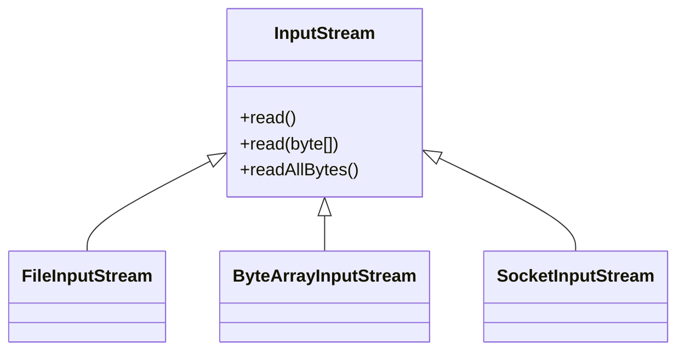
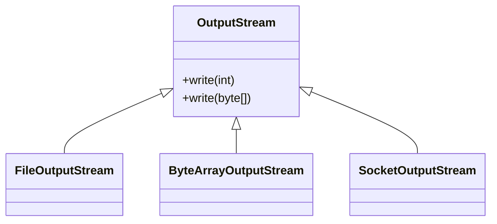

# 스트림 시작 1

자바가 가진 데이터를 `hello.dat`라는 파일에 저장하려면 어떻게 해야 하나?

자바 프로세스가 가지고 있는 데이터를 밖으로 보내려면 출력 스르팀을 사용하면 되고, 반대로 외부 데이터르 자바 프로세스 안으로 가져오려면 입력 스트림을 사용하면 됨

각 스트림은 단방향으로 흐름

## 스트림 시작 - 예제 1

> StreamStartMainV1 참조
> 

**new FileOutputStream("temp/hello.dat")**

- 파일에 데이터를 출력하는 스트림
- 파일이 없으면 파일을 자롱으로 만들고 데이터를 해당 파일에 저장
- 폴더를 만들지는 않기 때문에 폴더는 미리 만들어 두어야함

**write()**

- byte 단위로 값을 출력
- 65, 65, 67 출력

**new FileInputStream("temp/hello.dat")**

- 파일에서 데이터를 읽어오는 스트림

**read()**

- 파일에서 데이터를 byte 단위로 하나씩 읽어옴
- 순서대로 65, 66, 67을 읽어옴
- 파일의 끝에 도달해서 더이상 읽을 내용이 없다면 -1 반환
  - 파일의 끝(EOF, End of File)

**close()**

- 파일에 접근하는 것은 자바 입장에서 외부 자원을 사용하는 것임
- 자바에서 내부 객체는 자동으로 GC가 되지만 외부 자원은 사용 후 반드시 닫아주어야 함

**실행 결과**

```shell
65
66
67
-1
```

- 입력한 순서대로 축력되는 것 확인, 마지막 파일의 끝에 도달해서 -1이 출력

**실행 결과 - temp/hello.dat**

```shell
ABC
```

- `hello.dat`에 분명 byte로 65, 66, 67을 저장, 왜 개발툴이나 텍스트 편집기에서 열어보면 ABC라고 표현되는가?
- read()로 읽어서 출력한 경우에는 65, 66, 67이 정상 출력
- 개발툴이나 텍스트 편집기는 UTF-8 또는 MS949 문자 집합을 사용해서 byte 단위의 데이터를 문자로 디코딩해서 보여줌

**참고: 파일 append옵션**

`FileOutputStream`의 생성자에는 `append` 라는 옵션이 존재

```java
new FileOutputStream("temp/hello.dat", true);
```

- `true`: 기존 파일의 끝에 이어서 씀
- `false`: 기존 파일의 데이터를 지우고 처음부터 다시 씀(기본값)

## 스트림 시작 - 예제 2

파일의 데이터를 읽을 때 파일의 끝까지 읽어야 한다면 다음과 같이 반복문을 사용

> StreamStartMainV2 참조

- 입력 스트림의 read() 메소드는 파일의 끝에 도달하면 -1을 반환, 따라서 -1을 반환할 때까지 반복문을 사용하면 파일의 데이터를 모두 읽을 수 있음

**실행 결과**

```shell
65
66
67
```

**참고 - read()가 int를 반환하는 이유**

- 부호 없는 바이트 표현:
  - 자바에서 byte는 부호 있는 8비트 값(-128 ~ 127)
  - int로 반환함으로써 0에서 255까지의 모든 가능한 바이트 값을 부호 없이 표현할 수 있음
- EOF(End of File)표시:
  - byte를 표현하려면 256 종류의 값을 모두 사용해야 함
  - 자바의 byte는 -128에서 127까지 256종류의 값만 가실 수 있어, EOF를 위한 특별한 값을 할당하기 어려움
  - int는 0-255까지 모든 가능한 바이트 값을 표현하고, 여기에 추가로 -1을 반환하여 스트림의 끝(EOF)를 나타낼수 있음
- 참고로 write()의 경우도 비슷한 이유로 int 타입을 입력 받음

# 스트림 시작 2

## 스트림 시작 - 예제 3

byte를 하나씩 다루는 것이 아니라 byte[]을 사용해서 데이터를 원하는 만큼 더 편리하게 저정하고 읽는 방법을 알아봄

> StreamStartMainV3 참조

**실행 결과**

```shell
readCount = 3
[65, 66, 67, 0, 0, 0, 0, 0, 0, 0]
```

**출력 스트림**

- `write(byte[])`: `byte[]`에 원하는 데이터를 담고 `write()`에 전달하면 해당 데이터를 한 번에 출력할 수 있음

**입력 스트림**

- `read(byte[], offset, length)`: `byte[]`을 미리 만들어두고, 만들어둔 `byte[]`에 한 번에 데이터를 읽어올 수 있음
- `byet[]`: 데이터가 읽혀지는 버퍼
- `offset`: 데이터 기록되는 `byte[]`의 인덱스의 위치
- `length`: 읽어올 byte의 최대 길이
- 반환값: 버퍼에 읽은 총 바이트 수 여기서는 3byte를 읽었으므로 3이 반환, 스트림의 끝에 도달하여 더 이상 데이터가 없는 경우 -1 반환

**read(byte[])**

`offset`, `length`를 생략한 `read(byte[])` 메서드도 있음
  - offset: 0
  - length: byte[].length

## 스트림 시작 - 예제 4

모든 byte 한번에 읽기

> StreamStartMainV4 참조

- `readAllBytes()`를 사용하면 스트림이 끝날 때 까지(파일의 끝에 도달할 때 까지) 모든 데이터를 한 번에 읽음

**실행 결과**

```shell
[65, 66, 67]
```

## 부분으로 나누어 읽기 vs 전체 읽기

- `read(byte[], offset, length)`
  - 스트림의 내용을 부분적으로 읽거나, 읽은 내용을 처리하면서 스트림을 계속해서 읽어야 할 경우 적합
  - 메모리 사용량을 제어 할 수 있음
  - 100M의 파일을 1M 단위로 나누어 읽고 처리하는 방식을 사용하면 한 번에 최대 1M의 메모리만 사용
- `readAllBytes()`
  - 한 번의 호출로 모든 데이터를 읽을 수 있어 편리
  - 작은 파일이나 메모리에 모든 내용을 올려서 처리해야 하는 경우에 적합
  - 메모리 사용량을 제어할 수 없음
  - 큰 파일의 경우 OutOfMemoryError 발생 할 수 있음

# InputStream, OutputStream

현대의 컴퓨터는 대부분 byte 단위로 데이터를 주고 받음(bit 단위는 너무 작기 때문에 byte 단위를 기본으로 사용)

이렇게 데이터를 주고 받는 것을 Input/Output(I/O)라 함

자바 내부에 있는 데이터를 외부에 있는 파일에 저장하거나, 네트워크를 통해 전송하거나 콘솔에 출력할 때 모두 byte 단위로 데이터를 주고 받음

만약 파일, 네트워크, 콘솔 각각 데이터를 주고 받는 방식이 다르다면 상당히 불편할 것임

또한 파일에 저장하던 내용을 네트워크에 전달하거나 콘솔에 출력하도록 변경할 때 너무 많은 코드를 변경해야 할 수 있음

이런 문제를 해결하기 위해 자바는 `InputStream`, `OutputStream`이라는 기본 추상 클래스 제공



- `InputStream`과 상속 클래스
- `read()`, `read(byte[])`, `readAllBytes()` 제공




- `OutputSteram`과 상속 클래스
- `write(int)`, `write(byte[])` 제공

스트림을 사용하면 파일을 사용하든, 소켈을 통해 네트워크를 사용하든 모두 일관된 방식으로 데이터 주고 받음

수많은 기본 구현 클래스도 제공

각각의 구현 클래스들은 자신에게 맞는 추가 기능도 함께 제공

## 메모리 스트림

> ByteArrayStreamMainV1 참조

**실행 결과**

```shell
[1, 2, 3]
```

`ByteArrayOutputStream`, `ByteArrayInputStream`을 사용하면 메모리에 스트림을 쓰고 읽을 수 있음

`OutputStream`, `InputStream`을 상속받기 때문에 부몬의 기능을 모두 사용할 수 있음

코드를 보면 파일 입출력과 비슷한 것을 확인할 수 있음

참고로 메모리에 어떤 데이터를 저장하고 읽을 때는 컬렉션이나 배열을 사용하면 되기 때문에 이 기능은 잘 사용하지 않음

주로 스트림을 간단하게 테스트하거나 스트림의 데이터를 확인하는 용도록 사용

## 콘솔 스트림

> PrintStreamMainV1 참조

**실행 결과**

```shell
Hello!
Print!
```

우리가 자주 사용했던 `System.out`이 사실은 `PrintStream`임

이 스트림은 `Outputstream`을 상속 받음

자바가 시작될 때 자동으로 만들어짐

- `write(byte[])`: `OutputStream` 부모 클래스가 제공하는 기능
- `println(String)`: `PrintStream`이 자체적으로 제공하는 추가 기능

**정리**

`InputStream`과 `OutputStream`이 다양한 스트림을 추상화하고 기능 기능에 대한 표준을 잡아둔 덕분에 개발자는 편리하게 입축력 작업을 수행할 수 있음

이러한 추상화의 장점은 다음과 같음

- 일관성: 모든 종류의 입출력 작업에 대해 동일한 인터페이스를 사용할 수 있어 코드의 일관성이 유지됨
- 유연성: 실제 데이터 소스나 목적지가 무엇인지에 관계없이 동일한 방식으로 코드를 작성할 수 있음
- 확성성: 새로운 유형의 입출력 스트림을 쉽게 추가할 수 있음
- 재사용성: 다양한 스트림 클래스들을 조합하여 복잡한 입출력 작업을 수행할 수 있음, 예를 들어 `BufferedInputStream`을 사용하여 성능을 향상 시키거나 `DataInputStream`을 사용하여 기본 데이터 타입을 쉽게 읽을수 있음
- 에러 처리: 표준화된 예외 처리 메커니즘을 통해 일관된 방식으로 오류 처리할 수 있음

`InputStream`, `OutputStream`은 추상 클래스임

자바 1.0부터 제공되고 일부 작동하는 코드도 들어있기 때문에 인터페이스가 아닌 추상 클래스로 제공됨


