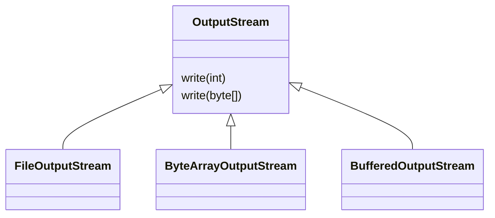
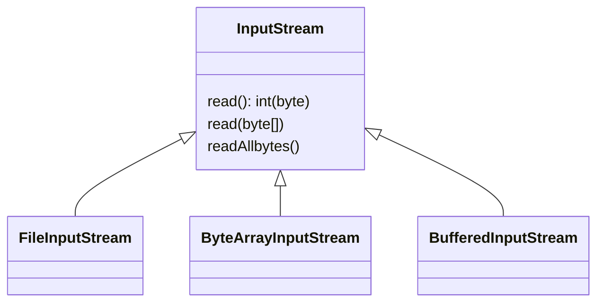
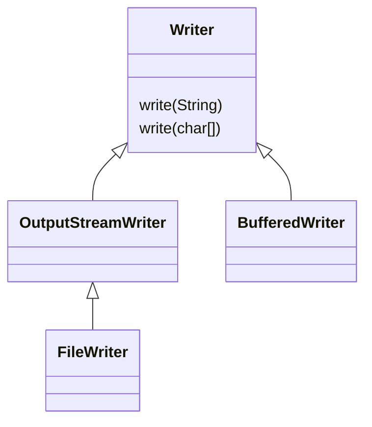
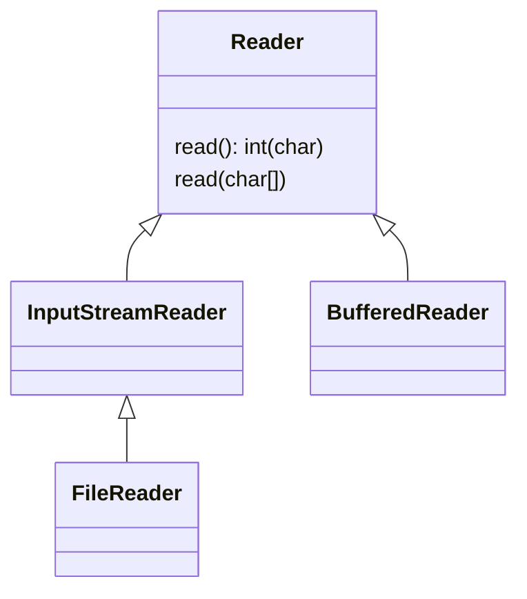

# 문자 다루기1 - 시작

스트림의 모든 데이터는 1byte 단위를 사용함

따라서 byte가 아닌 문자를 스트림에 직접 전달 할 수 없음

String 문자를 스트림을 통해 파일에 저장하려면 String을 byte로 변환한 다음에 저장함

> ReaderWriterMainV1 참조

**byte[] writeBytes = writeString.getBytes(UTF-8)**

- `String`을 `byte`로 변환할 때는 `String.getBytes(Charset)`을 사용
- 이때 문자를 `byte` 숫자로 변경해야 하기 때문에 반드시 문자 집합(인코딩 셋)을 지정해야함
- `UTF-8`을 사용
- `ABC`를 인코딩하면 `65,66,67`이 됨

이렇게 만든 `byte[]`을 `FileOutputStream`에 `write()`로 전달하면 `65, 66, 67`을 파일에 저장

결과적으로 의도한 ABC 문자를 파일에 저장할 수 있음

**String readString = new String(readBytes.UTF_8)**

- 반대의 경우도 비슷, `String` 객체를 생성할 때, 읽어들인 `byte[]`과 디코딩할 문자 집합을 전달함
- `byte[]`를 `String` 문자로 다시 복원할 수 있음

핵심은 스트림은 `byte`만 사용할 수 있으므로 `String`과 같은 문자는 직접 전달할 수 없음

개발자가 번거롭게 다음과 같은 변환 과정을 직접 호출해야 함

- `String` + 문자집합 -> `byte[]`
- `byte[]` + 문자집합 -> `String`

이런 번거로움을 해결할 방안은?

# 문자 다루기2 - 스트림을 문자로

- `OutputStreamWriter`: 스트림에 byte 대신에 문자를 저장할 수 있게 지원
- `InputStreamReader`: 스트림에 byte 대신에 문자를 읽을 수 있게 지원

> text.ReaderWriterMainV2 참조

- 코드를 보면 앞서 작성한 `BufferedXxx`와 비슷한 것을 확인할 수 있음

**OutputStreamWriter**

- `OutputStreamWriter`는 문자를 입력 받고, 받은 문자를 인코딩해서 `byte[]`로 변환
- `OutputStreamWriter`는 변환한 `byte[]`를 전달할 `OutputStream`과 인코딩 문자 집합에 대한 정보가 필요, 두 정보를 생성자를 통해 전달
  - `new OutputStreamWriter(fos, UTF_8)`
- `osw.write(new String)`를 보면 `String`문자를 직접 전달하는 것을 확인
- `OutputStreamWriter`가 문자 인코딩을 통해 `byte[]`로 변환하고, 변환 결과를 `FileOutputStream`에 전달하는 것을 확인

**InputStreamReader**

- 데이터를 읽을 때는 `int ch = read()`를 제공하는데, 여기서는 문자 하나는 `char`형으로 데이터를 받게됨, 실제 반환 타입은 `int`형 이므로 `char`형으로 캐스팅해서 사용
- 자바의 `char` 형은 파일의 끝인 `-1`을 표현할 수 없으므로 `int`를 반환
- 데이터를 읽을 때 `FileInputStream`에서 `byte[]`을 읽은 것을 확인할 수 있음, `InputStreamReader`는 이렇게 읽은 `byte[]`을 문자인 `char`로 변경해서 반환(`byte`를 문자로 변경할 때도 문자 집합 필요)
  - `new InputStreamReader(fis, UTF-8)`

`OutputStreamWriter`, `InputStreamReader` 덕분에 편리하게 문자를 `byte[]`로 변경하고, 그 반대도 가능함

스트림을 배울 때 `byte` 단위로 데이터를 읽고 쓰는 것을 확인

`write()`의 경우에도 `byte` 단위로 데이터를 읽고 씀

최상위 부모인 `OutputSteram`의 경우 분경 `write()`가 `byte` 단위로 입력하도록 되어 있음

하지만 `OutputStreamWriter`의 `write()`는 `byte` 단위가 아니라 `String`이나 `char`를 사용

어떻게 가능한가?

# 문자 다루기3 - Reader, Writer

자바는 byte를 다루는 I/O 클래스와 문자를 다루는 I/O 클래스 둘로 나뉨

**byte를 다루는 클래스**





**문자를 다루는 클래스**





- byte를 다루는 클래스는 `OutputStream`, `InputStream`의 자식임
  - 부모 클래스의 기본 기능도 byte 단위를 다룸
  - 클래스 이름 마지막에 보통 `OutputStream`, `InputStream`이 붙음
- 문자를 다루는 클래스는 `Writer`, `Reader`의 자식
  - 부모 클래스의 기본 기능은 `String`, `char` 같은 문자를 다룸
  - 클래스 이름 마지막에 보통 `Writer`, `Reader`가 붙음

`OutputStreamWriter`는 바로 문자를 다루는 `Writer` 클래스의 자식임, 따라서 `write(String)`이 가능한 것

`OutputStreamWriter`는 문자를 받아서 `byte`로 변경한 다음 `byte`를 다루는 `OutputStream`으로 데이터를 전달하였던 것

> 꼭 기억해야할 중요한 사실은 모든 데이터는 byte단위(숫자)로 저장됨
> 따라서 `Writer`가 아무리 문자를 다룬다고 해도 문자를 바로 저장할 수는 없음
> 클래스에서 문자를 전달하면 결과적으로 내부에서는 지정된 문자 집합을 사용해서 문자를 byte로 인코딩해서 저장

> text.ReaderWriterMainV3 참조

**new FileWriter(FILE_NAME, UTF_8)**

- `FileWriter`에 파일명과 문자 집합(인코딩 셋)을 전달
- `FileWriter`는 사실 내부에서 스스로 `FileOutputStream`을 하나 생성해서 사용
- 모든 데이터는 `byte` 단위로 저장

```java
public FileWriter(String fileName, Charset charset) throws IOException {
    super(new FileOutputStream(fileName), charset);
}
```

**fw.write(writeString)**

- 이 메서드를 사용하면 문자를 파일에 직접 쓸 수 있음(실제 그런것은 아님)
- 문자를 쓰면 `FileWriter` 내부에서 인코딩 셋을 사용해서 문자를 byte로 변경 후, `FileOutputStream`을 사용해서 파일에 저장
- 개발자가 느끼기에 문자를 직접 파일에 쓰는 것 처럼 느껴지지만, 실제로는 내부에서 문자를 byte로 변환함

**new FileReader(FILE_NAME, UTF_8)**

- `FileWriter`와 같은 방식으로 작동
- 내부에서 `FileInputStream`를 생성해서 사용

```java
public FileReader(String fileName, Charset charset) throws IOException {
  super(new FileInputStream(fileName), charset);
}
```

`ch = fr.read()`

- 데이터를 읽을 때도 내부에서는 `FileInputStream`을 사용해서 데이터를 byte 단위로 읽어들임, 문자 집합을 사용하여 `byte[]`을 `char`로 디코딩

**FileWriter와 OutputStreamWriter**

`FileWriter` 코드와 앞서 작성한 `OutputStreamWriter`를 사용한 코드가 뭔가 비슷하다는 점을 알 수 있음

이전 코드에서는 `FileOutputStream`을 직접생성했으나 `FileWriter`는 생성자 내부에서 대신 `FileOutputStream`을 생성

`FileWriter`는 `OutputStreamWriter`을 상속

생성자에서 개발자 대신 `FileInpustStream`을 생성해주는 일만 대시 처리

`FileWriter`는 `OutputStreamWriter`를 조금 편리하게 사용하도록 도움

**정리**

`Writer`, `Reader` 클래스를 사용하면 바이트 변환 없이 문자를 직접 다룰 수 있어서 편리

실제로는 내부에서 byte로 변환해서 저장한다는 점을 기억(모든 데이터는 바이트 단리위로 다룸, 문자를 직접 저장 X)

문자를 byte로 변경하려며 항상 문자 집합(인코딩 셋이 필요)

**참고: 문자 집합을 생략하면 시스템 기본 문자 집합이 사용**

# 문자 다루기4 - BufferedReader

`BufferedOutputStream`, `BufferedInputStream`과 같이 `Reader`, `Writer`에도 보퍼 보조 기능을 제공하는 `BufferedReader`, `BufferedWriter` 클래스 존재

추가로 문자를 다룰 때는 한 줄(라인)단위로 다룰 때가 많음, `BufferedReader`는 한줄 단위로 문자를 읽는 기능 제공

> text.ReaderWriterMainV4 참조

**br.readLine()**

- 한 줄 단위로 문자를 읽고 `String` 반환
- 파일의 끝(EOF)에 도달하면 `null`을 반환
  - 반환 타입이 `String`이기 때문에 EOF를 -1로 표현할 수 없음, 대신 `null` 반환

# 기타 스트림

몇가지 유용한 부가 기능을 제공하는 `PrintStream`, `DataOutputStream`

## PrintStream

`PrintStream`은 우리가 자주 사용해왔던 바로 `System.out`에서 사용되는 스트림

`PrintStream`과 `FileOutputStream`을 조합하면 마치 콘솔에 출력하듯이 파일에 축렬할 수 있음

> text.PrintStreamEtcMain 참조

`PrintStream`의 생성자에 `FileOutputStream`을 전달함

스트림을 통해서 나가는 출력은 파일에 저장됨

마치 콘술에 출력하는 것 처럼 파일이나 다른 스트림에 문자를 출력

## DataOutputStream

`DataOutputStream`을 사용하면 자바의 `String`, `int`, `double`, `boolean` 같은 데이터 형을 편리하게 다룰 수 있음

> text.DataOutputStream 참조

자바 데이터 타입을 사용하면서 데이터를 편리하게 저장하고 불러오는 것을 확인

스트림 사용시 주의할 점은 반드시 저장한 순서대로 읽어야함

`data.dat`파일을 열어보면 제대로 보이지 않음

왜냐면 `writeUTF()`의 경우 UTF-8 형식으로 저장하지만 나머지의 경우 문자가 아니라 각 타입에 맞는 byte 단위로 저장하기 때문임

텍스트 편지기는 자신의 문자 집합을 사용해서 byte를 문자로 표현하려고 시도하지만 문자 집합에 없는 단어이거나 또는 전혀 예상하지 않은 문자로 디코딩 됨


