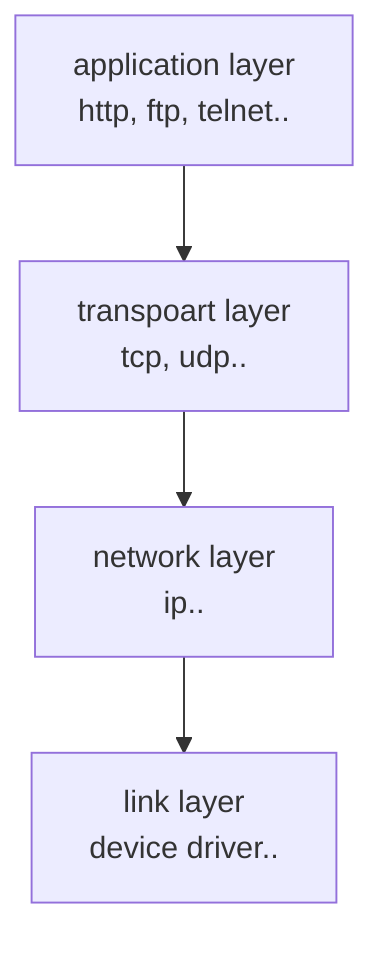

# Socket

네트워킹은 다음과 같은 레이어로 구성됩니다.



application layer 의 대표적인 http, ftp, telnet은 모두 tcp 통신을 합니다.
만약 자바로 TCP 통신을 한다면 자바에서 제공하는 API를 사용하면 됩니다.
그러면 트랜스포트 레이어에서의 처리는 자바에서 다 알아서 처리됩니다.

socket class 는 java.net 패키지에 선언되어있습니다.
데이터를 받는 쪽에서 클라이언트 요청을 받으면, 요청에 대한 socket 객체를 생성하여 데이터를 처리합니다.

Server 에서는 ServerSocket 이라는 클래스를 사용합니다.

| 생성자                                                       | 설명                                                            |
|:----------------------------------------------------------|:--------------------------------------------------------------|
| ServerSocket()                                            | 서버 소켓 객체만 생성한다.                                               |
| ServerSocket(int port)                                    | 지정된 포트를 사용하여 서버 소켓 객체를 생성한다.                                  |
| ServerSocket(int port, int backlog)                       | 지정된 포트와 backlog 개수를 가지는 소켓을 생성한다.                             |
| ServerSocket(int port, int backlog, InetAddress bindAddr) | 지정된 포트와 backlog 개수를 가지는 소켓을 생성하며 bindAddr에 있는 주소에서의 접근만 허용한다. |

## backlog

backlog 란 쉽게 queue 의 개수라고 보면 됩니다.
ServerSocket 객체가 바빠서 연결 요청을 처리 못하고 대기시킬 때가 있는데, 그 때의 최대 대기 개수라고 보면 됩니다.

backlog 지정하지 않을 경우 개수는 50개가 됩니다.

매개 변수가 없는 ServerSocket 클래스를 제외한 나머지 클래스들은 객체가 생성되자 마자 연결을 대기할 수 있는 상태가 됩니다.
반대로 말해 ServerSocket() 생성자는 별도로 연결작업을 해야 대기가 가능합니다.
요청을 대기하는 메소드는 accept() 메소드 이고 소켓을 닫는 메소드는 close() 입니다.

| 리턴 타입  | 메소드      | 설명                                    |
|:-------|:---------|:--------------------------------------|
| Socket | accept() | 새로운 소켓 연결을 기다리고, 연결이 되면 Socket 객체를 리턴 |
| void   | close()  | 소켓 연결을 종료                             |

close() 메소드 처리 하지 않고 jvm 계속 동작 중이라면 해당 포트는 동작하는 서버나 pc의 다른 프로그램이 사용할 수 없습니다.

## Socket

데이터를 받는 서버에서 클라이언트가 접속을 하면 Socket 객체를 생성하지만 데이터를 보내는 클라이언트에서는 Socket 객체를 직접 생성해야 합니다.
Socket 클래스의 생성자는 아래와 같습니다.

| 생성자                                                                                     | 설명                                                                | 
|:----------------------------------------------------------------------------------------|:------------------------------------------------------------------|
| Socket()                                                                                | Socket 객체만 생성                                                     |
| Socket(Proxy proxy)                                                                     | 프록시 관련 설정과 함께 소켓 객체만 생성                                           |
| Socket(SocketImpl impl)                                                                 | 사용자가 지정한 SocketImpl 객체를 사용하여 소켓 객체만 생성                            |
| Socket(InetAddress address, int port)                                                   | 소켓 객체 생성 후 address와 port를 사용하는 서버에 연결                             |
| Socket(InetAddress address, int port, InetAddress localAddr, int port)                  | 소켓 객체 생성 후 host와 port를 사용하는 서버에 열결하며 지정한 localAddr, localport에 접속 |
| Socket(String host, int port)                                                           | 소켓 객체 생성 후 host와 port를 사용하는 서버에 연결                                |
| Socket(String host, int port, InetAddress addresss, int localPort)                      | 소켓 객체 생성 후 host와 port를 사용하는 서버에 연결, 지정된 localAddr와 localport 접속   |

ServerSocket 클래스와 마찬가지로 close() 메소드를 사용하여야 소켓을 닫습니다.

## UDP

TCP와 달리 데이터가 제대로 전달되었다는 보장을 하지 않습니다.
그러므로 데이터의 유실이 있어도 문제가 없을 때만 사용하는게 좋습니다.

TCP와 다르게 DatagramSocket 클래스에서 보내는 역할과 받는 역할을 모두 수행합니다.

그리고 TCP에서는 스트림 객체를 얻어 데이터를 주고 받았지만 UDP 통신은 스트림을 사용하지 않고 DatagramPack 클래스를 사용합니다.

### DatagramSocket

| 생성자                                           | 설명                                     |
|:----------------------------------------------|:---------------------------------------|
| DatagramSocket()                              | 소켓 객체 생성후 사용 가능한 포트로 대기                |
| DatagramSocket(DatagramImpl impl)             | 사용자가 지정한 SocketImpl 객체를 사용하여 소켓 객체만 생성 |
| DatagramSocket(int port)                      | 소켓 객체 생성후 지정된 port로 대기                 |
| DatagramSocket(int port, InetAddress address) | 소켓 객체 생성후 address와 port를 사용하는 서버에 연결   |
| DatagramSocket(SocketAddress address)         | 소켓 객체 생성후 address에 지정된 서버로 연결          |

| 리턴 타입 | 메소드                            | 설명                                                    |
|:------|:-------------------------------|:------------------------------------------------------|
| void  | receive(DatagramPacket packet) | 메소드 호출 시 요청을 대기하고, 만약 데이터를 받았을 때에는 packet 객체에 데이터를 저장 |
| void  | send(DatagramPacket packet)    | packet 객체에 있는 데이터 전송                                  |

### DatagramPacket

| 생성자                                                                               | 설명                                                         |
|:----------------------------------------------------------------------------------|:-----------------------------------------------------------|
| DatagramPacket(byte[] buf, int length)                                            | length의 크기를 갖는 데이터를 '받기'위한 객체 생성                           |
| DatagramPacket(byte[] buf, int length, InetAddress address, int point)            | 지정된 adress와 port로 데이터를 전송하기 위한 객체 생성                       |
| DatagramPacket(byte[] buf, int offset, int length)                                | 버퍼의 offset이 할당되어 있는 데이터를 전송하기 위한 객체 생성                     |
| DatagramPacket(byte[] buf, int offset, int length, InetAddress address, int port) | 버퍼의 offset이 할당되어 있고, 지정된 address와 port로 데이터를 전송하기 위한 객체 생성 |
| DatagramPacket(byte[] buf, int offset, int length, InetAddress address)           | 버퍼의 offset이 할당되어 있고, 지정된 소켓 address로 데이터를 전송하기 위한 객체 생성    |
| DatagramPacket(byte[] buf, int length, SocketAddress address)                     | 지정된 소켓 address로 데이터를 전송하기 위한 객체 생성                         |

# 네트워크 프로그램1 

## 네트워크 프로그램 - 예제 1

자바 네트워크 프로그램 작성

TCP/IP 로 작성 예정

> net.socket.ClientV1
> net.socket.ServerV1

**Server Log**

```shell
01:25:07.927 [     main] Start Server
01:25:07.939 [     main] Server Socket Listening Port: 12345
01:25:13.599 [     main] Connect Socket Socket[addr=/127.0.0.1,port=61051,localport=12345]
01:25:13.600 [     main] server <- client: Hello
01:25:13.601 [     main] server -> client: Hello World
01:25:13.601 [     main] close connection: Socket[addr=/127.0.0.1,port=61051,localport=12345]
```

**Client Log**

```shell
01:25:13.584 [     main] Start Client
01:25:13.598 [     main] Connect Socket: Socket[addr=localhost/127.0.0.1,port=12345,localport=61051]
01:25:13.599 [     main] client -> server: Hello
01:25:13.601 [     main] client <- server: Hello World
01:25:13.601 [     main] close connectionSocket[addr=localhost/127.0.0.1,port=12345,localport=61051]
```

- `localhost` 는 현재 사용 중인 컴퓨터 자체를 가리키는 특별한 호스트 이름임
  - `google.com` , `naver.com` 과 같은 호스트 이름이지만, 자기 자신의 컴퓨터를 뜻하는 이름
- `localhost` 는 127.0.0.1이라는 IP로 매핑됨
-  127.0.0.1은 IP 주소 체계에서 루프백 주소(loopback address)로 지정된 특별한 IP 주소, 이 주소는 컴퓨터가 스스로를 가리킬 때 사용되며, "localhost"와 동일하게 취급
-  127.0.0.1은 컴퓨터가 네트워크 인터페이스를 통해 외부로 나가지 않고, 자신에게 직접 네트워크 패킷을 보낼 수 있도록함

## 네트워크 프로그램1 - 분석

TCP/IP 통신에서는 통신할 대상 서버를 찾을 때 호스트 이름이 아니라, IP 주소가 필요함

네트워크 프로그램을 분석하기 전에 먼저 호스트 이름으로 IP를 어떻게 찾는지 확인해봄

> net.socket.InetAddressMain 참조

```shell
localhost/127.0.0.1
google.com/142.251.42.142
```

`InetAddress` 클래스를 사용하면 호스트 이름으로 대상 IP를 찾을수 있음

1. `InetAddress.getByName("호스트명")` 메소드를 사용해서 해당 IP 주소를 조회
2. 이 과정에서 시스템의 호스트 파일을 먼저 확인
   - `/etc/hosts`(리눅스, mac)
   - `C:\Windows\System32\drivers\etc\hosts`(Windows)
3. 호스트 파일에 정의되어 있지 않다면 DNS 서버에 요청해서 IP 주소를 획득

만약 호스트 파일에 `localhost`가 없다면 `127.0.0.1 localhost`를 추가하거나 또는 `127.0.0.1`과 같은 IP를 직접 사용하면 됨

### 클라이언트 코드 분석

**클라이언트와 서버의 연결은 Socket을 사용**

```java
Socket socket = new Socket("localhost", PORT);
```

- `localhost`를 통해 자신의 컴퓨터에 있는 12345 포트에 TCP 접속을 시도
  - `localhost`는 IP가 아니므로 해당하는 IP를 먼저 찾음, 내부에서 `InetAddress`를 사용
  - `localhost`는 127.0.0.1이라는 IP에 매핑
  - `127.0.0.1:12345`에 TCP 접속을 시도
- 연결에 성공적으로 완료되면 `Socket` 객체를 반환
- `Socket`은 서버와 연결되어 있는 연결점이라고 생각하면 됨
- `Socket` 객체를 통해서 서버와 통신할 수 있음

**클라이언트와 서버간의 데이터 통신은 Socket이 제공하는 스트림을 사용**

```java
DataInputStream input = new DataInputStream(socket.getInputStream);
DataOutputStream output = new DataOutputStream(socket.getOutputStream);
```

- `Socket`은 서버와 데이터를 주고 받기 위한 스트림을 제공
- `InputStream`: 서버에서 전달한 데이터를 클라이언트가 받을 때 사용
- `OutputStream`: 클라이언트에서 서버에 데이터를 전달할 때 사용
- `InputStream`, `OutputStream`을 그대로 사용하면 모든 데이터를 byte로 변환해서 전달해야 하므로 `DataInputStream`, `DataOutputStream` 이라는 보조 스트림 사용

```java
// 서버에게 문자 보내기
String toSend = "Hello";
output.writeUTF(toSend);
```

- `OutputStream`을 통해 서버에 "Hello" 메시지를 전송

```java
// 서버에게 문자 보내기
String toSend = "Hello";
output.writeUTF(toSend);
```

