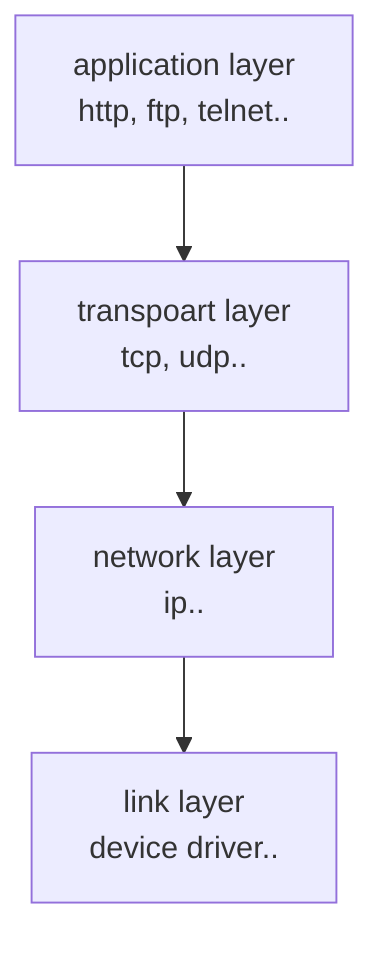

# Socket

네트워킹은 다음과 같은 레이어로 구성됩니다.



application layer 의 대표적인 http, ftp, telnet은 모두 tcp 통신을 합니다.
만약 자바로 TCP 통신을 한다면 자바에서 제공하는 API를 사용하면 됩니다.
그러면 트랜스포트 레이어에서의 처리는 자바에서 다 알아서 처리됩니다.

socket class 는 java.net 패키지에 선언되어있습니다.
데이터를 받는 쪽에서 클라이언트 요청을 받으면, 요청에 대한 socket 객체를 생성하여 데이터를 처리합니다.

Server 에서는 ServerSocket 이라는 클래스를 사용합니다.

| 생성자                                                       | 설명                                                            |
|:----------------------------------------------------------|:--------------------------------------------------------------|
| ServerSocket()                                            | 서버 소켓 객체만 생성한다.                                               |
| ServerSocket(int port)                                    | 지정된 포트를 사용하여 서버 소켓 객체를 생성한다.                                  |
| ServerSocket(int port, int backlog)                       | 지정된 포트와 backlog 개수를 가지는 소켓을 생성한다.                             |
| ServerSocket(int port, int backlog, InetAddress bindAddr) | 지정된 포트와 backlog 개수를 가지는 소켓을 생성하며 bindAddr에 있는 주소에서의 접근만 허용한다. |

## backlog

backlog 란 쉽게 queue 의 개수라고 보면 됩니다.
ServerSocket 객체가 바빠서 연결 요청을 처리 못하고 대기시킬 때가 있는데, 그 때의 최대 대기 개수라고 보면 됩니다.

backlog 지정하지 않을 경우 개수는 50개가 됩니다.

매개 변수가 없는 ServerSocket 클래스를 제외한 나머지 클래스들은 객체가 생성되자 마자 연결을 대기할 수 있는 상태가 됩니다.
반대로 말해 ServerSocket() 생성자는 별도로 연결작업을 해야 대기가 가능합니다.
요청을 대기하는 메소드는 accept() 메소드 이고 소켓을 닫는 메소드는 close() 입니다.

| 리턴 타입  | 메소드      | 설명                                    |
|:-------|:---------|:--------------------------------------|
| Socket | accept() | 새로운 소켓 연결을 기다리고, 연결이 되면 Socket 객체를 리턴 |
| void   | close()  | 소켓 연결을 종료                             |

close() 메소드 처리 하지 않고 jvm 계속 동작 중이라면 해당 포트는 동작하는 서버나 pc의 다른 프로그램이 사용할 수 없습니다.

## Socket

데이터를 받는 서버에서 클라이언트가 접속을 하면 Socket 객체를 생성하지만 데이터를 보내는 클라이언트에서는 Socket 객체를 직접 생성해야 합니다.
Socket 클래스의 생성자는 아래와 같습니다.

| 생성자                                                                                     | 설명                                                                | 
|:----------------------------------------------------------------------------------------|:------------------------------------------------------------------|
| Socket()                                                                                | Socket 객체만 생성                                                     |
| Socket(Proxy proxy)                                                                     | 프록시 관련 설정과 함께 소켓 객체만 생성                                           |
| Socket(SocketImpl impl)                                                                 | 사용자가 지정한 SocketImpl 객체를 사용하여 소켓 객체만 생성                            |
| Socket(InetAddress address, int port)                                                   | 소켓 객체 생성 후 address와 port를 사용하는 서버에 연결                             |
| Socket(InetAddress address, int port, InetAddress localAddr, int port)                  | 소켓 객체 생성 후 host와 port를 사용하는 서버에 열결하며 지정한 localAddr, localport에 접속 |
| Socket(String host, int port)                                                           | 소켓 객체 생성 후 host와 port를 사용하는 서버에 연결                                |
| Socket(String host, int port, InetAddress addresss, int localPort)                      | 소켓 객체 생성 후 host와 port를 사용하는 서버에 연결, 지정된 localAddr와 localport 접속   |

ServerSocket 클래스와 마찬가지로 close() 메소드를 사용하여야 소켓을 닫습니다.

## UDP

TCP와 달리 데이터가 제대로 전달되었다는 보장을 하지 않습니다.
그러므로 데이터의 유실이 있어도 문제가 없을 때만 사용하는게 좋습니다.

TCP와 다르게 DatagramSocket 클래스에서 보내는 역할과 받는 역할을 모두 수행합니다.

그리고 TCP에서는 스트림 객체를 얻어 데이터를 주고 받았지만 UDP 통신은 스트림을 사용하지 않고 DatagramPack 클래스를 사용합니다.

### DatagramSocket

| 생성자                                           | 설명                                     |
|:----------------------------------------------|:---------------------------------------|
| DatagramSocket()                              | 소켓 객체 생성후 사용 가능한 포트로 대기                |
| DatagramSocket(DatagramImpl impl)             | 사용자가 지정한 SocketImpl 객체를 사용하여 소켓 객체만 생성 |
| DatagramSocket(int port)                      | 소켓 객체 생성후 지정된 port로 대기                 |
| DatagramSocket(int port, InetAddress address) | 소켓 객체 생성후 address와 port를 사용하는 서버에 연결   |
| DatagramSocket(SocketAddress address)         | 소켓 객체 생성후 address에 지정된 서버로 연결          |

| 리턴 타입 | 메소드                            | 설명                                                    |
|:------|:-------------------------------|:------------------------------------------------------|
| void  | receive(DatagramPacket packet) | 메소드 호출 시 요청을 대기하고, 만약 데이터를 받았을 때에는 packet 객체에 데이터를 저장 |
| void  | send(DatagramPacket packet)    | packet 객체에 있는 데이터 전송                                  |

### DatagramPacket

| 생성자                                                                               | 설명                                                         |
|:----------------------------------------------------------------------------------|:-----------------------------------------------------------|
| DatagramPacket(byte[] buf, int length)                                            | length의 크기를 갖는 데이터를 '받기'위한 객체 생성                           |
| DatagramPacket(byte[] buf, int length, InetAddress address, int point)            | 지정된 adress와 port로 데이터를 전송하기 위한 객체 생성                       |
| DatagramPacket(byte[] buf, int offset, int length)                                | 버퍼의 offset이 할당되어 있는 데이터를 전송하기 위한 객체 생성                     |
| DatagramPacket(byte[] buf, int offset, int length, InetAddress address, int port) | 버퍼의 offset이 할당되어 있고, 지정된 address와 port로 데이터를 전송하기 위한 객체 생성 |
| DatagramPacket(byte[] buf, int offset, int length, InetAddress address)           | 버퍼의 offset이 할당되어 있고, 지정된 소켓 address로 데이터를 전송하기 위한 객체 생성    |
| DatagramPacket(byte[] buf, int length, SocketAddress address)                     | 지정된 소켓 address로 데이터를 전송하기 위한 객체 생성                         |

# 네트워크 프로그램1 

## 네트워크 프로그램 - 예제 1

자바 네트워크 프로그램 작성

TCP/IP 로 작성 예정

> net.socket.ClientV1
> net.socket.ServerV1

**Server Log**

```shell
01:25:07.927 [     main] Start Server
01:25:07.939 [     main] Server Socket Listening Port: 12345
01:25:13.599 [     main] Connect Socket Socket[addr=/127.0.0.1,port=61051,localport=12345]
01:25:13.600 [     main] server <- client: Hello
01:25:13.601 [     main] server -> client: Hello World
01:25:13.601 [     main] close connection: Socket[addr=/127.0.0.1,port=61051,localport=12345]
```

**Client Log**

```shell
01:25:13.584 [     main] Start Client
01:25:13.598 [     main] Connect Socket: Socket[addr=localhost/127.0.0.1,port=12345,localport=61051]
01:25:13.599 [     main] client -> server: Hello
01:25:13.601 [     main] client <- server: Hello World
01:25:13.601 [     main] close connectionSocket[addr=localhost/127.0.0.1,port=12345,localport=61051]
```

- `localhost` 는 현재 사용 중인 컴퓨터 자체를 가리키는 특별한 호스트 이름임
  - `google.com` , `naver.com` 과 같은 호스트 이름이지만, 자기 자신의 컴퓨터를 뜻하는 이름
- `localhost` 는 127.0.0.1이라는 IP로 매핑됨
-  127.0.0.1은 IP 주소 체계에서 루프백 주소(loopback address)로 지정된 특별한 IP 주소, 이 주소는 컴퓨터가 스스로를 가리킬 때 사용되며, "localhost"와 동일하게 취급
-  127.0.0.1은 컴퓨터가 네트워크 인터페이스를 통해 외부로 나가지 않고, 자신에게 직접 네트워크 패킷을 보낼 수 있도록함

## 네트워크 프로그램1 - 분석

TCP/IP 통신에서는 통신할 대상 서버를 찾을 때 호스트 이름이 아니라, IP 주소가 필요함

네트워크 프로그램을 분석하기 전에 먼저 호스트 이름으로 IP를 어떻게 찾는지 확인해봄

> net.socket.InetAddressMain 참조

```shell
localhost/127.0.0.1
google.com/142.251.42.142
```

`InetAddress` 클래스를 사용하면 호스트 이름으로 대상 IP를 찾을수 있음

1. `InetAddress.getByName("호스트명")` 메소드를 사용해서 해당 IP 주소를 조회
2. 이 과정에서 시스템의 호스트 파일을 먼저 확인
   - `/etc/hosts`(리눅스, mac)
   - `C:\Windows\System32\drivers\etc\hosts`(Windows)
3. 호스트 파일에 정의되어 있지 않다면 DNS 서버에 요청해서 IP 주소를 획득

만약 호스트 파일에 `localhost`가 없다면 `127.0.0.1 localhost`를 추가하거나 또는 `127.0.0.1`과 같은 IP를 직접 사용하면 됨

### 클라이언트 코드 분석

**클라이언트와 서버의 연결은 Socket을 사용**

```java
Socket socket = new Socket("localhost", PORT);
```

- `localhost`를 통해 자신의 컴퓨터에 있는 12345 포트에 TCP 접속을 시도
  - `localhost`는 IP가 아니므로 해당하는 IP를 먼저 찾음, 내부에서 `InetAddress`를 사용
  - `localhost`는 127.0.0.1이라는 IP에 매핑
  - `127.0.0.1:12345`에 TCP 접속을 시도
- 연결에 성공적으로 완료되면 `Socket` 객체를 반환
- `Socket`은 서버와 연결되어 있는 연결점이라고 생각하면 됨
- `Socket` 객체를 통해서 서버와 통신할 수 있음

**클라이언트와 서버간의 데이터 통신은 Socket이 제공하는 스트림을 사용**

```java
DataInputStream input = new DataInputStream(socket.getInputStream);
DataOutputStream output = new DataOutputStream(socket.getOutputStream);
```

- `Socket`은 서버와 데이터를 주고 받기 위한 스트림을 제공
- `InputStream`: 서버에서 전달한 데이터를 클라이언트가 받을 때 사용
- `OutputStream`: 클라이언트에서 서버에 데이터를 전달할 때 사용
- `InputStream`, `OutputStream`을 그대로 사용하면 모든 데이터를 byte로 변환해서 전달해야 하므로 `DataInputStream`, `DataOutputStream` 이라는 보조 스트림 사용

```java
// 서버에게 문자 보내기
String toSend = "Hello";
output.writeUTF(toSend);
```

- `OutputStream`을 통해 서버에 "Hello" 메시지를 전송

```java
// 서버로 부터 문자 받기
String received = input.readUTF();
```

- `InputSteram`을 통해 서버가 전달한 메시지를 받음
- 클라이언트가 "Hello"를 전송하면 서버는 "World!"라는 문제를 붙이서 반환하므로 "Hello World!"라는 문자를 반환 받음

**사용한 자원은 반드시 정리해야함**

- 시스템 자원 해제: InputStream과 OutputStream은 파일, 네트워크 소켓, 또는 기타 외부 자원을 다루기 때문에, 스트림이 닫히지 않으면 해당 자원이 해제되지 않고 남아 있을 수 있음. 이런 자원 누수는 결국 메모리 문제나 파일 핸들 제한에 도달하는 문제를 일으킬 수 있음
- 버퍼 비우기: OutputStream의 경우, 데이터를 버퍼에 저장한 후 한꺼번에 쓰는 경우가 많음. close()를 호출하지 않으면 버퍼에 남아 있는 데이터가 전송되지 않을 수 있음. close()는 버퍼를 비우고 모든 데이터를 전송한 후 스트림을 닫음.
- 안전한 사용 종료: 파일이나 네트워크 스트림은 동시에 여러 프로세스가 접근할 수 없음. 따라서 스트림을 열고 사용을 완료한 후에는 close()를 호출하여 다른 프로세스가 해당 자원에 접근할 수 있도록 해야함.
- 예외 처리를 통한 안전성 확보: 자바에서는 try-with-resources 구문을 사용해 스트림을 자동으로 닫도록 권장함. 이를 통해 예외가 발생하더라도 스트림이 닫히는 것을 보장할 수 있음.

### 서버 코드 분석

**서버 소켓**

서버는 특정 포트를 열어두어야함. 그래야 클라이언트가 해당 포트를 지정해서 접속할 수 있음.

```java
ServerSocket serverSocket = new ServerSocket(PORT);
```

- 서버는 서버 소켓(ServerSocket)이라는 특별한 소켓을 사용
- 지정한 포트를 사용해서 서버 소켓을 생성하면 클라이언트는 해당 포트로 서버에 연결할 수 있음

클라이언트와 서버의 연결 과정을 살펴봄

- 서버가 12345 포트로 서버 소켓을 열어둠. 클라이언트는 이제 12345 포트로 서버에 접속할 수 있음
- 클라이언트가 12345 포트에 연결을 시도
- 이때 OS 계층에서 TCP 3-way handshake가 발생하고 TCP 연결이 완료됨
- TCP 연결이 완료되면 서버는 OS backlog queue라는 곳에 클라이언트와 서버의 TCP 연결 정보를 보관
  - 이 연결 정보를 보면 클라이언트의 IP, PORT, 서버의 IP, PORT 정보가 모두 들어있음

**클라이언트와 랜덤 포트**

TCP 연결시에는 클라이언트 서버 모두 IP, 포트 정보가 필요함

- 클라이언트: localhost(127.0.0.1), 50000(포트 랜덤 생성)
- 서버: localhost(127.0.0.1), 12345

클라이언트는 자신의 포트를 지정하지 않지만 서버의 경우 포트가 명확하게 지정되어야 함

그래야 서버에 어떤 포트로 접속할지 알 수 있음

반면 서버에 접속하는 클라이언트의 경우 자신의 포트가 명확하게 지정되어 있지 않아도 됨

클라이언트는 보통 포트를 생략, 생략할 경우 클라이언트 PC에 남아 있는 포트 중 하나가 랜덤으로 할당됨(클라이언트 포트도 명시적으로 할당 가능함)

**accept()**

```java
Socket socket = serverSocket.accept();
```

- 서버 소켓은 단지 클라이언트와 서버의 TCP 연결만 지원하는 특별한 소켓임
- 실제 클라이언트와 서버가 정보를 주고 받으려면 Socket 객체가 필요(ServerSocket이 아님)
- `serverSocket.accept()` 메소드를 호출하면 TCP 연결 정보를 기반으로, `Socket` 객체를 만들어서 반환

`accept()` 호출 과정을 살펴봄

- `accept()`를 호출하면 backlog queue에서 TCP 연결 정보를 조회
  - 만약 TCP 연결 정보가 없다면, 연결 정보가 생성될 때가지 대기(블로킹)
- 해당 정보를 기반으로 `Socket` 객체를 생성
- 사용한 TCP 연결 정보는 backlog queue에서 제거됨

**Socket 생성 후**

- 클라이언트와 서버의 `Socket`은 TCP로 연결되어 있고, 스트림을 통해 메시지를 주고 받을 수 있음

```java
DataInputStream input = new DataInputStream(socket.getInputStream());
DataOutputStream output = new DataOutputStream(socket.getOutputStream());
```

- `Socket`은 클라이언트와 서버가 데이터를 주고 받기 위한 스트림을 제공
- `InputStream`: 서버 입장에서 보면 클라이언트가 전달한 데이터를 서버가 받을 때 사용
- `OutputStream`: 서버에서 클라이언트에 데이터를 전달할 때 사용

클라이언트의 Output은 서버의 Input이고 반대로 서버의 Output은 클라이언트의 Input

## 네트워크 프로그램2 - 예제

클라이언트와 서버가 메세지를 계속 주고 받다가 "bye"라고 입력하면 클라이언트와 서버를 종료

> net.socket.ClientV2 참조
> net.socket.ServerV2 참조

**문제**

서버는 하나의 클라이언트가 아니라, 여러 클라이언트의 연결을 처리할 수 있어야함

새로운 클라이언트가 접속하면 정상 수행되지 않음

```shell
16:37:49.243 [     main] Start Client
16:37:49.257 [     main] Connect Socket: Socket[addr=localhost/127.0.0.1,port=12345,localport=64975]
Send Message: dt
16:38:14.294 [     main] client -> server: dt
```

소켓은 연결 되었지만 메시지를 전송해도 서버로 부터 아무런 응답이 없음

## 네트워크 프로그램2 - 분석

### 서버 소켓과 연결 더 자세히

여러 클라이언트가 서버에 접속한다고 가정

- 서버는 12345 서버 소켓을 열어 둠
- 50000번 랜덤 포트를 사용하는 클라이언트가 먼저 12345 포트의 서버에 접속을 시도함
- 이때 OS 계층에서 TCP 3-way handshake가 발생하고, TCP 연결이 완료됨
- TCP 연결이 완료되면 서버는 OS backlog queue라는 곳에 클라이언트와 서버의 TCP 연결 정보를 보관함
 
이 시점에서 TCP 3-way handshake가 완료되었기 때문에, 클라이언트와 서버의 TCP 연결은 이미 완료되고, 클라이언트의 소켓 객체도 정상 생성됨(서버의 소켓 객체는 생성되지 않음)

- 이번에는 60000번 랜덤 포트를 사용하는 클라이언트가 12345 포트의 서버에 접속을 시도하고 연결을 완료
- 50000번 클라이언트와 60000번 클라이언트 모두 서버와 연결이 완료되었고, 클라이언트의 소켓도 정상 생성됨

- 서버가 클라이언트와 데이터를 주고 받으려면 소켓을 획득해야함
- `ServerSocket.accpet()` 메소드를 호출하면 backlog 큐의 정보를 기반으로 소켓 객체를 하나 새성
- 큐이므로 순서대로 데이터를 꺼냄. 처음 50000번 클라이언트의 접속 정보를 기반으로 서버에 소켓이 하나 생성됨
- 5000번 클라이언트와 서버는 소켓의 스트림을 통해 서로 데이터를 주고 받을 수 있음

- 60000번 클라이언트도 이미 서버와 TCP 연결은 되어 있음
  - OS 계층에서 TCP 3-way handshake가 발생하고, TCP 연결이 완료
- 60000번 클라이언트도 서버와 TCP 연결이 되었기 때문에 서버로 메시지를 보낼 수 있음
  - 아직 서버에 Socket 객체가 없더라도 메시지는 보낼 수 있음(TCP 연결은 이미 완료 되었음)

### 프로토콜 계층

소켓을 통해 스트림으로 메시지를 주고 받는다는 것은 사실은 이러한 과정을 거침

**애플리케이션**

1. 프로그램이 Hello world! 메시지 생성
2. SOCKET 라이브러리를 통해 전달 

**OS**

3. TCP 정보 생성, 메시지 데이터 포함
4. IP 패킷 생성, TCP 데이터 포함
 
**네트워크 인터페이스**

5. LAN 카드를 통한 네트워크 전달

자바 애플리케이션은 소켓 객체의 스트림을 통해 서버와 데이터를 주고 받음

#### 클라이언트가 "Hello world!"라는 메시지를 서버에 전송하는 경우

- 클라이언트
  - 애플리케이션 -> OS TCP 송신 버퍼 -> 클라이언트 네트워크 카드
- 클라이언트가 보낸 메시지가 서버에 도착했을 때, 서버
  - 서버 네트워크 카드 -> OS TCP 수신 버퍼 -> 애플리케이션

60000번 클라이언트가 보낸 메시지는 서버 애플리케이션에서 아직 읽지 않았기 때문에, 서버 OS의 TCP 수신 버퍼에서 대기하게 됨

**여기서 핵심적인 내용이 있는데, 소켓 객체 없이 서버 소켓만으로도 TCP 연결은 완료된다는 점임(서버 소켓은 연결만 담당)**

**하지만 연결 이후에 서로 메시지를 주고 받으려면 소켓 객체가 필요함**

`accpet()`는 이미 연결된 TCP 연결 정보를 기반으로 서버 측에 소켓 객체를 생성함

그리고 이 소켓 객체가 있어야 스트림을 사용해서 메시지를 주고 받을 수 있음

- 소켓을 연결하면 소켓의 스트림을 통해 OS TCP 수신 버퍼에 있는 메시지를 읽을 수 있고 전송도 할 수 있음

- `accept()` 메소드는 backlog 큐에 새로운 연결 정보가 도착할 때 까지 블로킹 상태로 대기. 새로운 연결 정보가 오지 않으면 계속 대기하는 블로킹 메소드임

### Server V2의 문제

`ServerV2`에 둘 이상의 클라이언트가 작동하지 않은 이유는 다음과 같음

- 새로운 클라이언트가 접속하면?
  - 새로운 클라이언트가 접속했을 때 서버의 `main` 스레드는 `accept()` 메소드를 절대로 호출할 수 없음. 왜냐면 `while` 문으로 기존 클라이언트와 메시지를 주고 받는 부분만 반복하기 때문임
  - `accept()`를 호출해야 소켓 객체를 생성하고 클라이언트와 메시지를 주고 받을 수 있음
- 2개의 블로킹 작업 - 핵심은 별도의 스레드가 필요함
  - `accept()`: 클라이언트와 서버의 연결을 처리하기 위해 대기
  - `readXxx()`: 클라이언트의 메시지를 받아서 처리하기 위해 대기
  - 각각의 블로킹은 별도의 스레드에서 처리해야함. 그렇지 않으면 다른 블로킹 메소드 때문에 계속 대기할 수 있음

#### ServerV2 코드 - 간략

```java
ServerSocket serverSocket = new ServerSocket(PORT);
Socket socket = serverSocket.accept();  // Blocking

while(true) {
    String received = input.readUTF();  // Blocking
    output.writeUTF(toSend);
}
```

## 네트워크 프로그램3

여러 클라이언트가 동시에 접속할 수 있는 서버 프로그램 작성

- 서버의 `main` 스레드는 서버 소켓을 생성하고, 서버 소켓의 `accept()`를 반복해서 호출
- 클라이언트가 서버에 접속하면 서버 소켓의 `accept()` 메소드가 `Socket`을 반환
- `main` 스레드는 이 정보를 기반으로 `Runnable`을 구현한 `Session`이라는 별도의 객체를 만들고, 새로운 스레드에서 객체를 실행함. `Thread-0`이 `Session`을 실행.
- `Session` 객체와 `Thread-0`은 연결된 클라이언트와 메시지를 주고 받음
- 새로운 TCP 연결이 발생하면 `main` 스레드는 새로운 `Session` 객체를 별도의 스레드에서 실행함. 그리고 이과정을 반복함
- `Session` 객체와 `Thread-0`은 연결된 클라이언트와 메시지를 주고 받음

### 역할의 분리

- `main` 스레드
  - `main` 스레드는 새로운 연결이 있을 때 마다 `Session` 객체와 별도의 스레드를 생성하고, 별도의 스레드가 `Session`객체를 실행하도록함
- `Session` 담당 스레드
  - `Session`을 담당하는 스레드는 자신의 소켓이 연결된 클라이언트와 메시지를 반복해서 주고 받는 역할을 담당함

> net.socket.ClientV3 참조
> net.socket.ServerV3 참조

- `Session` 클래스의 목적은 소켓이 연결된 클라이언트와 메시지를 반복해서 주고 받는 것임
- 생성자를 통해 `Socket` 객체를 입력 받음
- `Runnable`을 구현해 별도의 스레드에서 실행

- main 코드는 `main` 스레드가 작동하는 부분
- `main` 스레드는 서버 소켓을 생성하고, `serverSocket.accept()`을 호출해서 연결을 대기함
- 새로운 연결이 추가될 때 마다 `Session` 객체를 생성하고 별도의 스레드에서 `Session` 객체를 실행
- 이 과정을 반복

여러 서버가 접속해도 문제없이 작동하는 것을 확인

서버 소켓을 통해 소켓을 연결하는 부분과 각 클라이언트와 메시지를 주고 받는 부분이 별도의 스레드로 나뉘어 있음

블로킹 되는 부분은 이렇게 별도의 스레드로 나누어 실행됨

### 문제

여기서 실행 중인 클라이언트를 IntelliJ의 빨간색 Stop 버튼을 눌러서 직접 종료한다면

```java
01:02:45.386 [     main] Start Server
01:02:45.393 [     main] Server Socket Listening Port: 12345
01:02:49.580 [     main] Connect Socket Socket[addr=/127.0.0.1,port=59695,localport=12345]
Exception in thread "Thread-0" java.lang.RuntimeException: java.io.EOFException
	at me.net.socket.ServerV3$Session.run(ServerV3.java:61)
	at java.base/java.lang.Thread.run(Thread.java:1583)
Caused by: java.io.EOFException
	at java.base/java.io.DataInputStream.readFully(DataInputStream.java:210)
	at java.base/java.io.DataInputStream.readUnsignedShort(DataInputStream.java:341)
	at java.base/java.io.DataInputStream.readUTF(DataInputStream.java:575)
Caused by: java.io.EOFException

	at java.base/java.io.DataInputStream.readUTF(DataInputStream.java:550)
	at me.net.socket.ServerV3$Session.run(ServerV3.java:43)
	... 1 more
```

클라이언트의 연결을 직접 종료하면 클라이언트 프로세스가 종료되면서, 클라이언트와 서버의 TCP 연결로 함께 종료 됨

이때 서버에서 readUTF()로 클라이언트가 메시지를 읽으려고 하면 `EOFException`이 발생함

소켓의 TCP 연결이 종료되었기 때문에 더는 읽을 수 있는 메시지가 없다는 뜻임

EOF(파일의 끝)가 여기서는 전송의 끝을 의미함

여기서 심각한 문제가 하나 있음. 이렇게 예외가 발생해버리면 서버에서 자원 정리 코드를 호출하지 못한다는 점임

서버 로그를 보면 종료 로그가 없는 것을 확인할 수 있음

자바 객체는 GC가 되지만 자바 외부의 자원은 자동으로 GC 되는게 아님 따라서 꼭 정리를 해주어야함

(TCP 연결의 경우 운영체제가 어느정도 연결을 정리해주지만, 직접 연결을 종료할 때 보다 더 많은 시간이 걸릴수 있음)


# 네트워크 프로그램4 - 자원 정리1

> net.socket.SocketCloseUtil 참조

- 기본적인 `null` 체크와 자원 종료 시 예외를 처리하는 코드 작성(자원 처리 과정 중 발생한 문제는 대응할 수 있는 부분이 거의 없음, 간단히 로그 생성으로 충분)
- `Socket`을 먼저 생성하고, `Socket`을 기반으로 `InputStream`, `OutputStream`을 생성하였으므로 `Socket`을 마지막에 닫아야함

> net.socket.ClientV4 참조

- 자원 정리시 `finally` 코드 블록에서 `SocketCloseUtil.closeAll()`만 호출하면 됨

> net.socket.ServerV4 참조

- 자원 정리시 `finally` 코드 블록에서 `SocketCloseUtil.closeAll()`만 호출하면 됨

# 네트워크 프로그램 5 - 자원 정리 2

`try-with-resources`를 적용

> net.socket.ClientV5 참조
> net.socket.ServerV5 참조

- 서버에`try-with-resources` 를 적용
- `Socket` 객체의 경우 `Session` 에서 직접 생성하는 것이 아니라 외부에서 받아오는 객체 
  - 이 경우 `try` 선언부에 예제와 같이 객체의 참조를 넣어두면 자원 정리 시점에 `AutoCloseable` 이 호출됨
- `AutoCloseable` 이 호출되어서 정말 소켓의 `close()` 메서드가 호출되었는지 확인하기 위해 마지막에 `socket.isClosed()` 를 호출하는 코드 삽입
 
# 네트워크 프로그램 6 - 자원 정리 3

서버를 종료할 때, 서버 소켓과 연결된 모든 소켓 자원을 다 반납하고 서버를 안정적으로 종료해야 함

서버를 종료하려면 서버에 종료라는 신호를 전달해야함

예를 들어 서버도 콜솔 창을 통해서 입력을 받도록 만들고, "종료"라는 메시지를 입력하면 모든 자원을 정리하면서 서버가 종료되도록 하면됨

하지만 보통 서버에는 콘솔 입력은 잘 하지 않으므로, 서버를 직접 종료하면서 자원도 함께 정리하는 방법을 살펴봄

## Shutdown Hook

자바는 프로세스 종료될 때, 자원 정리나 로그 기록과 같은 종료 작업을 마무리할 수 있는 셧다운 훅이라는 기능을 지원함

프로세스의 종료는 크게 2가지로 분류

- 정상 종료
  - 모든 non 데몬 스레드의 실행 완료로 자바 프로세스 정상 종료
  - 사용자가 `Ctrl+C`를 눌러 프로그램 중단
  - `kill` 명령 전달(`kill -9` 제외)
  - Intellij Stop 버튼
- 강제 종료
  - 운영체제에서 프로세스를 더 이상 유지할 수 없다고 판단할 때 사용
  - 리눅스/유닉스의 `kill -9`나 Windows의 `taskkill \F`

정상 종료의 경우에는 셧다운 훅이 작동해서 프로세스 종료 전에 필요한 후 처리를 할 수 있음

반명에 강제 종료의 경우에는 셧다운 훅이 작동하지 않음

> net.socket.ClientV6 참조
> net.socket.ServerV6 참조
> net.socket.SessionManagerV6 참조

서버는 세션을 관리하는 셔션 매니저가 필요

각 세션은 소켓과 연결 스트림을 가지고 있음

따라서 서버를 종료할 때 사용하는 세션들도 함께 종료해야함

모든 세션들을 찾아서 종료하려면 생성한 세션을 보관하고 관리할 객체가 필요

## Session Manager

- `add()`: 클라이언트의 새로운 연결을 통해, 세션이 새로 만들어지는 경우 `add()`를 호출해서 세션 매니저에 세션을 추가
- `remove()`: 클라이언트의 연결이 끊어지면 세션도 함께 정리. `remove()`를 호출해서 세션 매니저에서 세션을 제거
- `closeAll()`: 서버를 종료할 대 사용하는 세션들도 모두 닫고 정리

`Session`은 이제 `try-with-resources`를 사용할 수 없음

왜냐면 서버를 종료하는 시점에도 `Session`의 자원을 정리해야 하기 때문

## try-with-resource는 사용과 해제를 묶아서 처리할 때 사용

`try-with-resources`는 try 선언부에서 사용한 자원을 try가 끝나는 시점에 정리함

따라서 try에서 자원의 선언과 자원 정리를 묶이서 처리할 때 사용할 수 있음

하지만 지금은 서버를 종료하는 시점에도 `Session`이 사용하는 자원을 정리해야하므로 `Session` 안의 `try-with-resources`를 통해 처리할 수 없음

## 동시성 문제

```java
public synchronized void close() {}
```

- 자원을 정리하는 `close()` 메서드는 2곳에서 호출될 수 있음
  - 클라이언트와 연결이 종료되었을 때
  - 서버를 종료할 때
- `close()`가 다른 스레드에서 동시에 중복 호출될 가능성이 있음
- 이런 문제를 막기 위해 `synchronized` 키워드를 사용. 자원 정리 코드가 중복 호출 되는 것을 막기 위해 `closed` 변수를 플래그로 사용

# 네트워크 프로그램6 - 자원 정리4

> net.socket.ServerV6 참조

## Shutdown Hook 등록

```java
    ShutDownHook shutDownHook = new ShutDownHook(serverSocket, sessionManager);
    Runtime.getRuntime().addShutdownHook(new Thread(shutDownHook, "shutdown"));
```

- `Runtime.getRuntime().addShutdownHook()`을 사용하면 자바 종료시 호출되는 셧다운 훅을 등록할 수 있음
- 셧다운이 발생했을 때 처리할 작업과 스레드를 등록 필요

## Shutdown Hook 실행

- 셧다운 훅이 실행될 때 모든 자원을 정리
`sessionManager.closeAll()` : 모든 세션이 사용하는 자원(`Socket` , `InputStream` , `OutputStream` )을 정리
`serverSocket.close()` : 서버 소켓을 닫음

## 자원 정리 대기 이유

```java
Thread.sleep(1000); // 자원 정리 대기
```

보통 모든 non 데몬 스레드의 실행이 완료되면 자바 프로세스가 정상 종료됨. 하지만 다음과 같은 종료도 존재

- 사용자가 Ctrl+C를 눌러서 프로그램을 중단
- `kill` 명령 전달 (`kill -9` 제외)
- IntelliJ의 stop 버튼
 
이런 경우에는 non 데몬 스레드의 종료 여부와 관계없이 자바 프로세스가 종료

단 셧다운 훅의 실행이 끝날 때 까지는 기다려줌

셧다운 훅의 실행이 끝나면 non 데몬 스레드의 실행 여부와 상관 없이 자바 프로세스는 종료

따라서 다른 스레드가 자원을 정리하거나 필요한 로그를 남길 수 있도록 셧다운 훅의 실행을 잠시 대기할 필요가 있음

## 실행 결과

```shell
23:43:58.708 [ shutdown] start to close server socket and session manager
23:43:58.710 [ shutdown] close connection: Socket[addr=/127.0.0.1,port=50703,localport=12345]
23:43:58.710 [ Thread-0] java.net.SocketException: Socket closed
23:43:58.710 [ shutdown] close connection: Socket[addr=/127.0.0.1,port=50709,localport=12345]
23:43:58.710 [ Thread-1] java.net.SocketException: Socket closed
23:43:58.710 [     main] Close Server Socket: java.net.SocketException: Socket closed
```

서버를 종료하면 `shutdown` 스레드가 `shutdownHook` 을 실행하고, 세션의 `Socket` 의 연결을 `close()` 로 닫음.

- `[ Thread-0] java.net.SocketException: Socket closed`
- `Session` 의 `input.readUTF()` 에서 입력을 대기하는 `Thread-0` 스레드는 `SocketException: Socket closed` 예외를 받고 종료. 참고로 이 예외는 자신의 소켓을 닫았을 때 발생.
 
`shutdown` 스레드는 서버 소켓을 `close()`로 닫음.

- `[ main] 서버 소캣 종료: java.net.SocketException: Socket closed`
- `serverSocket.accept();` 에서 대기하고 있던 `main` 스레드는 `java.net.SocketException: Socket closed` 예외를 받고 종료.
- 
