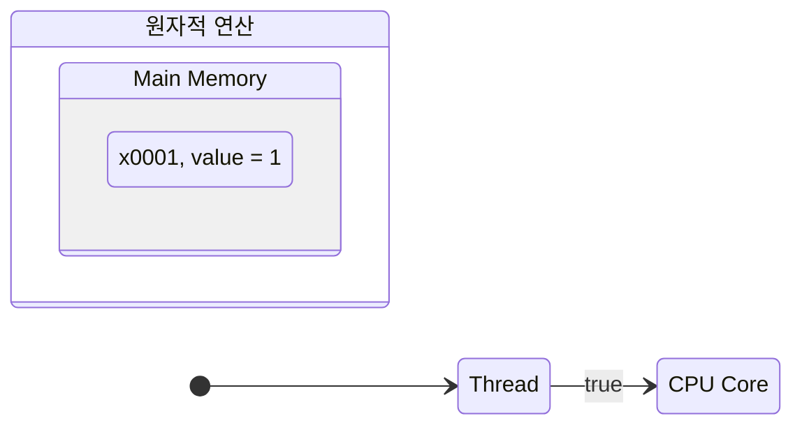
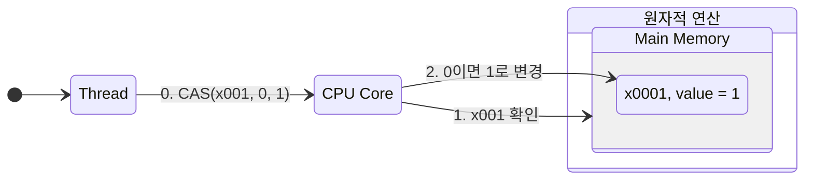
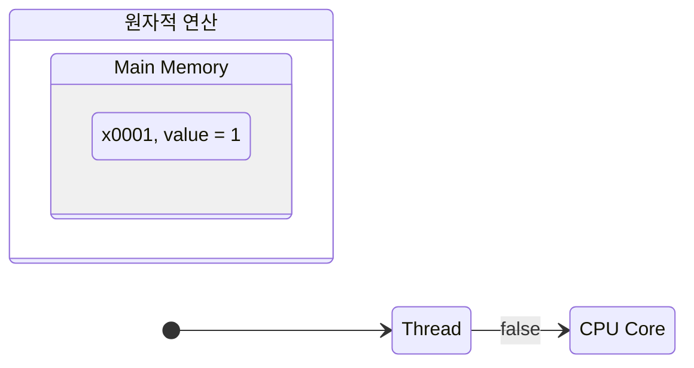

# CAS(Compare And Swap)

## 락 기반 방식의 문제점

`SynchronizedInteger`와 같은 클래스는 데이터를 보호하기 위해 락을 사용

락은 `synchronized`, `Lock(ReentrantLock)`등을 사용하는 것을 의미

락은 특정 자원을 보호하기 위해 스레드가 해당 자원에 대한 접근하는 것을 제한

락이 걸려 있는 동안 다른 스레드는 해당 자원에 접근할 수 없고, 락이 해제될 때까지 대기해야 함

락 기반 접근에서는 락을 획득하고 해제하는 데 시간이 소요됨

락을 사용하는 예
- 락이 있는지 확인
- 락을 획득하고 임계 영역에 들어감
- 작업을 수행
- 락을 반납

락을 획득하고 반납하는 과정을 반복

직관적이지만 상대적으로 무거운 방식

## CAS 연산

락을 걸지 않고 원작적인 연산을 수행하는 방법으로 이를 CAS(Compare And Swap, Compare And Set) 연산이라 함

락을 사용하지 않으므로 락 프리(lock free) 기법이라 함

> **참고**
>
> CAS 연산은 락을 완전히 대체하는 것이 아닌 **작은 단위의 일부 영역**에 적용 가능
>
> 기본은 락을 사하고, 특별한 경우 CAS 적용할 수 있음

**compareAndSet(0, 1)**

`atomicInteger`가 가지고 있는 값이 현재 0이면 이 값을 1로 변경하라는 매운 단순한 메소드
- 만약 `atomicInteger`의 값이 현재 0이라면 `atomicInteger`의 값을 1로 변경하고 `true` 반환
- 만약 `atomicInteger`의 값이 현재 0이 아니라면 `atomicInteger`의 값을 변경하지 않고  `false` 반환
 
가장 중요한 것은 이 메소드는 **원자적으로 실행**된다는 것
이 메소드가 제공하는 기능이 CAS(compareAndSet) 연산

## 실행 순서 분석

### CAS 성공 케이스


- `AtomicInteger` 내부에 있는 `value` 값이 0이라면 1로 변경하고 싶음
- `compareAndSet(0, 1)`을 호출, 매개변수 왼쪽 기대값, 오른쪽 변경값
- `CAS`연산은 메모리에 있는 값이 기대하는 이라면 원하는 값으로 변경
- 메모리에 있는 `value` 값이 0이므로 1로 변경
- 2개의 명령어로 원자적이지 않은 연산으로 보임
  - 먼저 메인 메모리의 값 확인
  - 해당 값이 기대값인 0이라면 1로 변경


### CPU 하드웨어 지원

`CAS`연산은 원자적이지 않은 두개 연산을 CPU 하드웨어 차원에서 특별하게 하나의 원자적인 연산으로 묶어서 제공하는 기능

소프트웨어가 제공하는 것이 아닌 하드웨어에서 제공

현대 CPU 들은 CAS 연산을 위한 명령어를 제공

CPU는 다음 두 과정을 묶어 하나의 원자적 명령어로 만듬

따라서 다른 스레드가 개입할 수 없음

1. x001 값을 확인
2. 읽은 값이 0이면 1로 변경

CPU는 두 과정을 묶어서 하나 원자적인 명령어로 만들기 위해 1번과 2번 사이에 다른 스레드가 x001 값을 변경 못하게 막음

CPU 입장에서 1번과 2번의 과정은 찰나의 순간(성능에 큰영향을 끼치지 않음)



- `value`의 값이 0 -> 1로 변경
- CAS 연산으로 값이 성공적으로 변경되어 `true` 반환

### CAS 실패 케이스



- `CAS` 연산은 메모리 있는 기대값이 원하는 값이라면 변경
- `AtomicInteger` 내부에 있는 `value` 값이 0이라면 1로 변경
- 현재 `value` 값이 기대값 0이 아닌 1이므로 아무 변경을 하지 않음



- CAS 연산 실패하여 `false` 반환

## CAS 연산 2

어떤값을 증가시키는 `value++` 연산은 원자적 연산이 아님

`i = i + 1`은 다음의 순서로 나누어 실행

1. 오른쪽에 있는 `i`의 값을 읽음, `i`의 값은 0
2. 읽은 0에 1을 더해서 1을 만듬
3. 더한 1을 왼쪽의 `i` 변수에 대입

1번과 2번 사이에 다른 스레드가 `i`의 값을 변경할 수 있기에 문제가 될 수 있음

`value++` 연산을 여러 스레드에서 사용한다면 락을 건 후 값을 증가해야 함

`AtomicInteger`가 제공하는 `incrementAngGet()` 메소드가 어떻게 CAS 연산을 활용하여 락 없이 만들어 졌는지 확인

`CAS` 연산을 사용하면 여러 스레드가 같은 값을 사용하는 상황에서도 락을 걸지 않고, 안전하게 값을 증가할 수 있음

- `getValue = atomicIntger.get()`을 사용해서 `value` 값을 읽음
- `compareAndSet(getValue, getValue + 1)`을 사용해서, 방금 읽은 `value` 값이 메모리의 `value`와 같다면 `value` 값을 하나 증가
- `CAS` 연산이 성공한다면 `true`를 반환하고 `do~while`문을 빠져나옴
- `CAS` 연산이 실패한다면 `false`를 반환하고 `do~while`문을 다시 시작

## CAS 연산 3

멀티스레드를 사용해서 중간에 다른 스레드가 먼저 값을 증가시켜 버리는 경우

CAS 연산이 실패하는 경우를 알아보고 이 경우에도 정상적으로 값을 증기 시킬 있는지 살펴봄

```java
public class CasMainV3 {
  private static int THREAD_COUNT = 2;

  public static void main(String[] args) throws InterruptedException {
    AtomicInteger atomicInteger = new AtomicInteger(0);
    System.out.println("Start value = " + atomicInteger.get());

    Runnable runnable = () -> {
      incrementAndGet(atomicInteger);
    };

    List<Thread> threads = new ArrayList<>();
    for (int i = 0; i < THREAD_COUNT; i++) {
      Thread thread = new Thread(runnable);
      threads.add(thread);
      thread.start();
    }

    for (Thread thread : threads) {
      thread.join();
    }

    int result = atomicInteger.get();
    System.out.println("result = " + result);
  }

  private static int incrementAndGet(AtomicInteger atomicInteger) {
    int getValue;
    boolean result;
    do {
      getValue = atomicInteger.get();
      log("getValue: " + getValue);
      result = atomicInteger.compareAndSet(getValue, getValue + 1);
      log("result: " + result);
    } while (!result) ;
    return getValue + 1;
  }
}
```

- 2개의 스레드가 `incrementAndGet()`를 호출해서 `AtomicInteger` 내부의 `value` 값을 동시에 하나씩 증가

### 정리

`AtomicInteger`가 제공하는 `incrementAndGet()` 코드로 앞서 우리가 직접 작성한 `incrementAndGet()` 코드와 똑같이 CAS를 활용하여 작성

CAS를 사용하면 락을 사용하지 않고, 다른 스레드가 값을 먼저 증가해서 문제가 발생하는 경우 루프를 돌며 재시도 하는 방식

- 현재 변수의 값을 읽음
- 변수의 값을 1 증가 시킬 때, 읽은 값과 비교하여 동일한지 확인(CAS 연산)
- 동일하다면 증가된 값을 변수에 저장하고 종료
- 동일하지 않다면 다른 스레드가 값을 변경한 것으로 다시 처음부터 반복
 
장점 : 스레드가 락을 획득하기 위해 대기하지 않기 때문에 대기 시간과 오버헤드가 줄어드는 장점

단점 : CAS는 자주 실패하고 재시도해야 하므로 성능 저하가 발생할 수 있음. 반복문을 계속 돌기 때문에 CPU 자원을 많이 소모

**CAS(Compare-And-Swap)와 락(Lock) 방식의 비교**

**락(Lock) 방식**
- 비관적(pessimistic) 접근법
- 데이터에 접근하기 전에 항상 락을 획득
- 다른 스레드의 접근을 막음
- "다른 스레드가 방해할 것이다"고 가정

**CAS(Compare-And-Swap) 방식
- 낙관적(optimistic) 접근법
- 락을 사용하지 않고 데이터에 바로 접근
- 충돌이 발생하면 그때 재시도
- "대부분의 경우 충돌이 없을 것이다."라고 가정

충돌이 많이 발생하지 않는 연산은 어떤것인가? 언제 CAS 연산을 사용하는가?

간단한 CPU 연산은 너무 빨리 처리되기 때문에 충돌이 자주 발생하지 않음

충돌이 발생하기도 전에 이미 연산을 완료하는 경우가 더 많음

