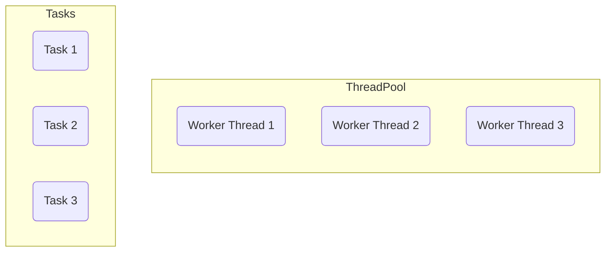
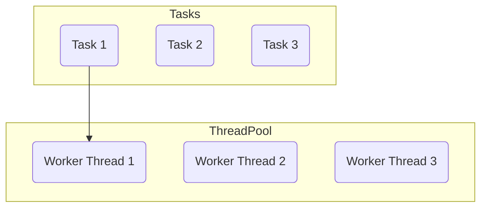
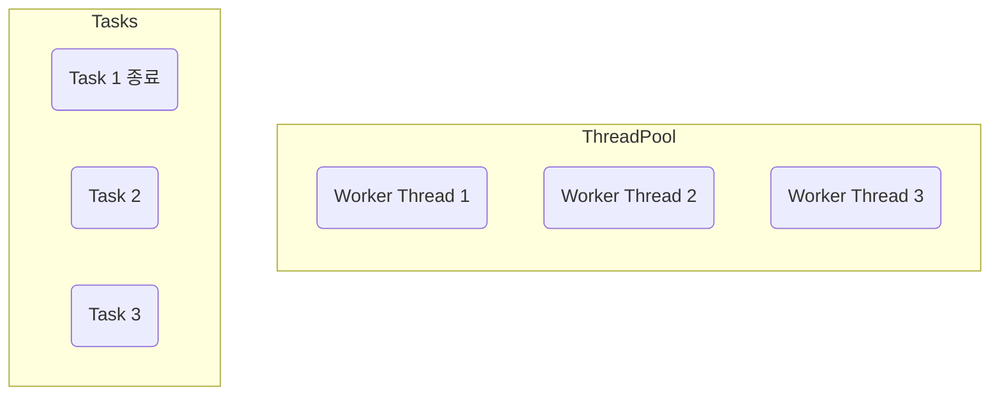
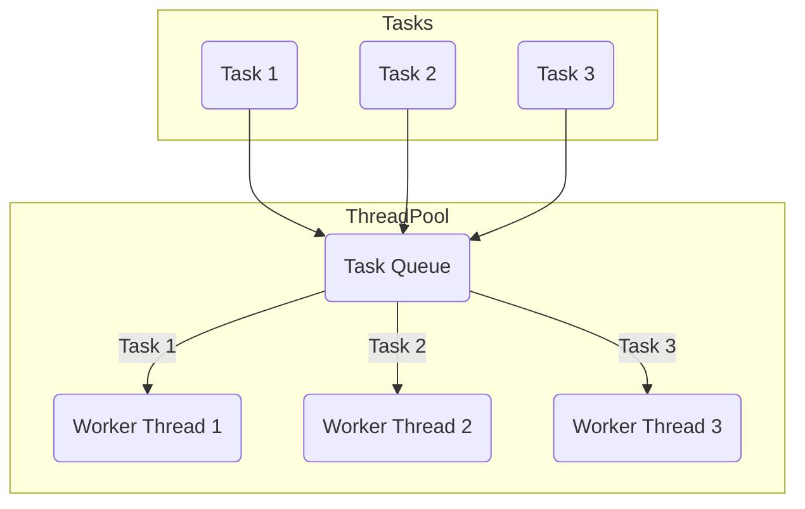

# 스레드의 직접 사용할시 문제점

실무에서 스레드를 직접 사용하는 것은 3 가지 문제가 존재

- 스레드 생성 시간으로 인한 성능 문제
- 스레드 관리 문제
- `Runnable` 인터페이스의 불편함

**1. 스레드 생성 시간으로 인한 성능 문제**

스레드를 사용하려면 먼저 스레드를 생성하여야 하지만 다음과 같은 이유로 매우 무거움

- **메모리 할당**
  - 각 스레드는 자신만의 호출 스택(Call Stack)을 가지고 있어야함. 
  - 이 호출 스택은 스레드가 실행되는 동안 사용하는 메모리 공간
  - 스레드를 생성할 때 이 호출 스택을 위한 메모리 할당
- **운영체제 자원 사용**
  - 스레드를 생성하는 작업은 운영체제 커널 수준에서 이루어지며, 시스템 콜(system call)을 통해 처리
  - CPU와 메모리 리소를 소모하는 작업
- **운영체제 스케줄러 설정**
  - 새로운 스레드가 생성되면 운영체제의 스케줄러는 이 스레드를 관리하고 실행 순서를 조정
  - 운영체제의 스케줄링 알고리즘에 따라 추가적인 오버헤드 발생
- 스레드 하나는 보통 1MB 이상의 메모리 사용

스레드를 생성하는 작업은 상대적으로 무거움(자바 객체를 생성하는 것과 비교할 수 없음)

예를 들어 어떤 하나의 작업을 수행할 때 마다 스레드를 각각 생성하고 실행한다면, 스레드의 생성비용 때문에 많은 시간이 소모

아주 가벼운 작업이라면 작업의 실행 시간보다 스레드의 생성 시간이 더 오래 걸릴 수 있음

이런 문제를 해결하기 위해 생성한 스레드를 재사용하는 방법을 고려할 수 있음

스레드를 재사용하면 처음 생성할 때를 제외하고는 생성을 위한 시간이 들지 않음

따라서 스레드가 아주 빠르게 작업을 수행할 수 있음

**2. 스레드 관리 문제**

서버의 CPU, 메모리는 한정되어 있기에 스레드를 무한히 만들 수 없음

예를 들어 사용자 주문 서비스라고 가정할 때 사용의 주문이 들어올 때 마다 요청을 처리한다면 
평소 동시에 100개의 스레드면 충분했는데, 갑자기 10000개의 스레드가 필요한 상황이 온다면 CPU, 메모리가 버티지 못할 것임

이런 문제를 해결하기위해 최대 스레드의 수 까지만 스레드를 생성할 수 있게 관리해야 함

또한 애플리케이션을 종료한다고 가정했을 때 안전한 스레드 종료를 위해 실행중인 스레드가 남은 작업은 모두 수행한 후 종료하고 싶거나 또는 급하게 종료해야 해서 인터럽트 등의 신호를 주고 스레드를 종료하고 싶다고 가정한다면 스레드가 어딘가에서 관리가 되어야함

**3. Runnable 인터페이스 불편함**

```java
public interface Runnable {
    void run();
}
```

- 반환값이 없음 
  - `run()` 메소드는 반환값을 가지지않음, 따라서 실행 결과를 얻기 위해서는 별도의 메커니즘을 사용해야 함
  - 쉽게 이야기해 스레드의 실행 결과를 작접 받을 수 없음
  - 앞서 `SumTask`를 살펴보면 스레드가 실행한 결과를 멤버 변수에 넣어두고 `join()`등을 사용해서 스레드가 종료되길 기다린 다음 멤버 변수의 값을 받아야함
- 예외 처리
  - `run()` 메소드는 체크 예외(checked exception)을 던질 수 없음
  - 체크 예외의 처리는 메소드 내부에서 처리해야 함

이런 문제를 해결하려면 반환값을 받을 수 있고, 예외도 좀 더 쉽게 처리할 방법이 필요함

추가로 반환 값 뿐만 아니라 해당 스레드에서 발생한 예외도 받을 수 있다면 좋을 것임

**해결**

1, 2번 문제를 해결하기 위해 스레드를 생성하고 관리하는 풀(Pool)이 필요



- 스레드를 관리하는 스레드 풀에 스레드를 미리 필요한 만큼 생성
- 스레드는 스레드 풀에서 대기
- 작업 요청이 옴



- 스레드 풀에서 이미 만들어진 스레드를 조회
- 조회한 스레드1로 작업을 처리



- 스레드 1은 작업을 완료
- 작업을 완료한 스레드는 종료하는 것이 아니라 다시 스레드 풀에 반(스레드1은 재사용될 수 있음)

스레드 풀을 사용할 경우 스레드를 재사용할 수 있어 스레드의 생성 시간을 절약할 수 있음

스레드 풀에서 스레드가 관리되기 때문에 필요한 만큼만 스레드를 만들 수 있고 관리할 수 있음

스레드 풀은 별게 아님, 컬렉션에 스레드를 보관하고 재사용할 수 있게 하면 됨

스레드 풀에 있는 스레드는 처리할 작업이 없다면 대기(WAITING) 상태로 관리해야 하고, 작업이 오면 `RUNNABLE` 상태로 변경해야 함

막상 구현하려면 생각보다 복잡하며 생상자-소비자 문제까지 고려 필요

어떤 생산자가 작업(Task)를 만들것이고, 우리의 스레드 풀에 있는 스레드가 소비자가 되는 것임

이런 문제를 해결해 주는 것이 자바가 제공하는 `Executor` 프레임워크

Executor 프레임워크는 스레드 풀, 스레드 관리, `Runnable`의 문제점은 물론이고 생산자-소비자 문제까지 해결해 주는 자바 멀티스레드의 최고의 도구

스레드를 사용할 때는 생각보다 고려해야 할게 많음. 실무에서 스레드를 하나 하나 생성해서 사용하는 경우는 드뭄

# Executor 프레임워크 소개

자바의 Executor 프레임워크는 멀티스레딩 및 병렬 처리를 쉽게 사용할 수 있도록 돕는 기능의 모음

## Executor 프레임워크의 주요 구성 요소

### Executor 인터페이스

```java
package java.util.concurrent;

public interface Executor {
    void execute(Runnable command);
}
```

- 가장 단순한 작업 실행 인터페이스로 `execute(Runnable Command)` 메소드를 하나 가짐

### ExecutorService 인터페이스 - 주요 메소드

```java
import java.util.concurrent.Callable;

public interface ExecutorService extends Executor, AutoCloseable {
  <T> Future<T> submit(Callable<V> task);
  
  @Override
  default void close() { ... }
  
  ...
}
```

- `Executor` 인터페이스를 확장해서 작업 제출과 제어 기능을 추가로 제공
- 주요 메소드로는 `submit()`, `close()`가 있음
- Executor 프레임워크를 사용할 때는 대부분 이 인터페이스를 사용

`ExecutorService` 인터페이스의 기본 구현체는 `ThreadPoolExecutor`

```java
public abstract class ExecutorUtils {
  public static void printState(ExecutorService executorService) {
    if (executorService instanceof ThreadPoolExecutor poolExecutor) {
      int pool = poolExecutor.getPoolSize();
      int active = poolExecutor.getActiveCount();
      int queued = poolExecutor.getQueue().size();
      long completedTask = poolExecutor.getCompletedTaskCount();
      log("[pool=" + pool + ", active=" + active + ", queued=" + queued + ", completedTask=" + completedTask + "]");
    } else {
      log(executorService);
    }
  }
}
```

- pool: 스레드 풀에서 관리되는 스레드의 숫자
- active: 작업을 수행하는 스레드의 숫자
- queueTasks: 큐에 대기중인 작업의 숫자
- completedTask: 완료된 작업의 숫자

# ExecutorService 시작하기

```java
public class ExecutorBasicMain {
  public static void main(String[] args) {
    ThreadPoolExecutor pool = new ThreadPoolExecutor(2, 2, 0, TimeUnit.MILLISECONDS, new LinkedBlockingQueue<Runnable>());
    log("== 초기 상태 ==");
    printState(pool);
    pool.execute(new RunnableTask("taskA"));
    pool.execute(new RunnableTask("taskB"));
    pool.execute(new RunnableTask("taskC"));
    pool.execute(new RunnableTask("taskD"));
    log("== 작업 수행 중 ==");
    printState(pool);

    sleep(3000);
    log("== 작업 수행 완료 ==");
    printState(pool);

    pool.close();
    log("== shutdown 완료 ==");
    printState(pool);
  }
}
```

`ExecutorService`의 가장 대표적인 구현체는 `ThreadPoolExecutor`




`ThreadPoolExecutor(ExecutorService)`는 크게 2가지 요소로 구성

- 스레드 풀: 스레드를 관리
- `BlockingQueue`: 작업을 보관. 생산자 소비자 문제를 해결하기 위해 단순한 큐가 아닌 `BlockingQueue`를 사용
  
생산자가 `pool.execute(new RunnableTask("taskA"))`를 호출하면, `RunnableTask("taskA")` 인스턴스가 `BlockingQueue`에 보관

- 생산자: `pool.execute(작업)`를 호출하면 내부에서 `BlockingQueue`에 작업을 보관. `main` 스레드가 생산자가 됨
- 소비자: 스레드 풀에 있는 스레드가 소비자. 이후에 소비자 중에 하나가 `BlockingQueue`에 들어있는 작업을 받아서 처리

## TreadPoolExecutor 생성자

`ThreadPoolExecutor`의 생성자는 다음 속성을 사용

- `corePoolSize`: 스레드 풀에서 관리되는 기본 스레드 수
- `maximumPoolSize`: 스레드 풀에서 관리되는 최대 스레드 수
- `keepAliveTime`, `TimeUnit unit`: 기본 스레드 수를 초과해서 만들어진 스레드가 생존할 수 있는 대기 시간, 이 시간 동안 처리할 작업이 없다면 초과 스레드는 제거됨
- `BlockingQueue workQueue`: 작업을 보관할 블로킹 큐

`new ThreadPoolExecutor(2, 2, 0, TimeUnit.MILLISECONDS, new LinkedBlockingQueue<>())`

- `corePoolSize=2`, `maximumPoolSize=2`를 사용해서 기본 스레드와 최대 스레드 수를 맞추었음, 따라서 풀에서 관리되는 스레드는 2개로 고정
- 작업을 보관할 블로킹 큐의 구현체로 `LinkedBlockingQueue`를 사용, 이 블로킹 큐는 작업을 무한대로 저장할 수 있음

# Future1 - 시작

## Runnable & Callable 

```java
package java.lang;

public interface Runnable {
    void run();
}
```

- `Runnable`의 `run()`은 반환 타입이 `void`, 따라서 값을 반환할 수 없음
- 예외가 선언되어 있지 않음, 따라서 해당 인터페이스 구현하는 모든 메소드는 체크 예외를 던질 수 없음
  - 자식은 부모의 예외 범위를 넘어설 수 없음, 부모에 예외가 선언되어 있지 않으므로 예외를 던질 수 없음
  - 런타입(비체크) 예외는 제외

```java
package java.util.concurrent;

public interface Callable<V> {
    V call() throws Exception;
}
```

- `java.util.concurrent`에서 제공되는 기능
- `Callable`의 `call()`은 반환 타입이 제너릭 `V`로 값을 반환할 수 있음
- `throws Exception` 예외가 선언되어 있음, 따라서 해당 인터페이스를 구현하는 모든 메소드는 체크 예외와 그 하위 예외를 모두 던질 수 있음

`MyCallable` 구현 부분

- 숫자를 반환하므로 반환할 제네릭 타입을 `<Integer>`로 선언
- 구현은 `Runnable` 코드와 비슷, 차이는 결과를 반환한다는 점, 결과를 보관할 변도의 필드를 만들지 않아도 됨

### submit()

```java
<T> Future<T> submit(Callable<V> task); // 인터페이스 정의
```

`ExecutorService`가 제공하는 `submit()`을 통해 `Callable`을 작업으로 전달할 수 있음

```java
Future<Integer> future = es.submit(new MyCallable());
```

`MyCallable` 인스턴스가 블로킹 큐에 전달되고, 스레드 풀의 스레드 중 하나가 이 작업을 실행할 것임

이때 작업의 처리 결과는 직접 반환하는 것이 아니라 `Future`라는 특별한 인터페이스를 통해 반환

```java
Integer result = future.get();
```

`future.get()`을 호출하며 `MyCallable`의 `call()`이 반환한 결과를 받을 수 있음

> 참고: `Future.get()`은 `InterruptedException`, `ExecutionException` 체크 예외를 던짐

### Executor 프레임워크의 강점

요청 스레드가 결과를 받아야 하는 상황이면, `Callable`을 사용하는 방식은 `Runnable`을 사용하는 방식보다 훨씬 편리함

코드만 보면 복잡한 멀티스레드를 사용한다는 느낌보다 단순한 싱글 스레드 방식으로 개발한다는 느낌이 듬

내가 스레드를 생성하거나 `join()`으로 스레드를 제어하거나 한 코드는 전혀 없음, `Thread`라는 코드도 없음

단순하게 `ExecutorService`에 필요한 작업을 요청하고 결과를 받아서 쓰면됨

복잡한 멀티스레드를 매우 편리하게 사용할 수 있는 것이 바로 `Executor` 프레임워크의 강점

하지만 기반 원리를 제대로 이해해야 문제없이 사용할 수 있음

여기에서 잘 생각해 보면 한가지 애매한 상황이 존재

`future.get()`을 호출하는 요청 스레드(main)는 `future.get()`을 호출 했을 때 2가지 상황으로 나뉘게 됨

- `MyCallable` 작업을 처리하는 스레드 풀의 스레드가 작업을 완료
- `MyCallable` 작업을 처리하는 스레드 풀의 스레드가 작업을 완료하지 못함

`future.get()`을 호출했을 때 스레드 풀의 스레드가 작업을 완료했다면 반환 받을 결과가 있을 것이나 아직 작업을 처리중 이라면 어떻게 하나?

# Future2 - 분석

`Future`는 번역하면 미래라는 뜻, 즉 미래의 결과를 받을 수 있는 객체라는 의미

누구의 미래의 결과를 말하는 것일까?

```java
Future<Integer> future = es.submit(new MyCallable());
```

- `submit()`의 호출로 `MyCallable`의 인스턴스를 전달
- 이때 `submit()`은 MyCallable.call()이 반환하는 무작위 숫자 대신 `Future`를 반환
- `MyCallable`이 실행되어 즉시 결과를 반환하는 것이 불가능, `MyCallable`은 즉시 실행되는 것이 아님, 스레드 풀의 스레드가 미래의 시점에 코드를 실행
- `MyCallable.call()` 메소드는 호출 스레드가 실행하는 것도 아니고, 스레드 풀의 다른 스레드가 실행하기에 언제 결과를 반환할지 알 수 없음
- 따라서 즉시 결과를 받는 것은 불가능, 따라서 `es.submit()`은 `MyCallable` 결과를 반환하는 대신 `MyCallable`의 결과를 나중에 받을 수 있는 `Future` 객체를 대신 제공
- `Future`는 전달한 작업의 미래, 이 객체를 통해 전달한 작업의 미래 결과를 받을 수 있음

`Future`는 전달한 작업의 미래 결과를 담고 있다고 보면됨

`Future`가 어떻게 동작하는지 살펴보자

```java
public class CallableMainV2 {
  ...
}
```

**실행 결과 분석**

- `MyCallable` 인스턴스를 편의상 `taskA`라고 함
- 편의상 스레드풀에 스레드가 1개 있다고 가정

```java
es.submit(new MyCallable())
```

- `submit()`을 호출해서 `ExecutorService`에 `taskA`를 전달

**Future의 생성**

- 요청 스레드는 `es.submit(taskA)`를 호출하고 있는 중
- `ExecutorService`는 전달한 `taskA`의 미래를 알 수 있는 `Future` 객체를 생성
  - `Future`는 인터페이스, 실제 구현체는 `FutureTask`
- `Future`객체 안에 `taskA`의 인스턴스를 보관
- `Future`는 내부에 `taskA` 작업의 완료 여부와 작업의 결과를 가짐

- `submit()`을 호출할 경우 `Future`가 만들어지고, 전달한 작업인 `taskA`가 바로 블로킹 큐에 담기는 것이 아니라, `taskA`를 감싸고 있는 `Future`가 대신 블로킹 큐에 담김

```java
Future<Integer> future = es.submit(new MyCallable);
```

- `Future`는 내부에 작업의 완료 여부와 작업의 결과 값을 가짐, 작업이 완료되지 않았기에 결과 없음
  - 로그를 보면 `Future`의 구현체는 `FutureTask`임
  - `Future`의 상태는 "Not completed(미완료)"이고, 연관된 작업은 전달한 `taskA(MyCallable 인스턴스)` 임
- 중요한 핵심은 작업을 전달할 때 생성된 `Future`는 즉시 반환된다는 것

- futere의 즉시 반확이라는 로그와, 바로 그 다음인 `future.get()`을 호출하는 로그의 시간을 보면 거의 바로 연속해서 실행되는 것을 확인
- 생성한 `Future`를 즉시 반환하기 때문에 요청 스레드는 대기하지 않고, 자유롭게 본인의 다음 코드를 호출
  - 이것은 마치 `Thread.start()`를 호출한 것과 비슷, `Thread.start()`를 호출하면 스레드의 작업 코드가 별도의 스레드에서 실행됨(요청 스레드를 대기하지 않고, 즉시 다음 코드를 호출)

- 큐에 들어있는 `Future[taskA]`를 꺼내서 스레드 풀의 스레드1이 작업을 시작
- 참고로 `Future`의 구현체인 `FutureTask`는 Runnable 인터페이스도 함께 구현하고 있음
- 스레드1은 `FutureTask`의 `run()` 메소드를 수행
- `run()` 메소드가 `taskA`의 `call()` 메소드를 호출하고 그 결과를 받아서 처리
  - `FutureTask.run()` -> `MyCallable.call()`

---

**스레드1**

- 스레드1은 `taskA`의 작업을 아직 처리 중, 완료하지 않음

**요청 스레드**

- 요청 스레드는 `Future` 인스턴스의 참조를 가짐
- 언제든지 본인이 필요할 때 `Future.get()`을 호출해서 `taskA` 작업의 미래 결과를 받을 수 있음
- 요청 스레드는 작업의 결과가 필요해서 `Future.get()`을 호출
  - `Future`에는 완료 상태가 존재, `taskA`의 작업이 완료되면 `Future`의 상태도 완료로 변경
  - 여기서 `taskA`의 작업이 아직 완료되지 않았다면 `Future`도 완료 상태가 아님
- 요청 스레드가 `Fugure.get()`을 호출하면 `Future`가 완료 상태가 될 때까지 대기, 이때 요청 스레드의 상태는 `RUNNABLE`->`WAITING`이 됨

`Future.get()`을 호출했을 때 

- **Future가 완료 상태**: `Future`가 완료 상태면 `Future`에 결과도 포함되어 있음, 이 경우 요청 스레드는 대기하지 않고, 값을 즉시 반환받음
- **Future가 완료 상태가 아님**: `taskA`가 아직 수행되지 않았거나 또는 수행 중이라는 뜻, 이때는 어쩔수 없이 요청 스레드가 결과를 받기 위해 대기해야함, 요청 스레드가 마치 락을 얻을 때처럼, 결과를 얻기 위해 대기, 이처럼 스레드가 어떤 결과를 얻기 위해 대기하는 것을 블로킹(Blocking)이라 함
 
> 참고: 블로킹 메소드
> `Thread.join()`, `Future.get()`과 같은 메서드는 스레드가 작업을 바로 수행하지 않고, 다른 작업이 완료될 때까지 기다리게 하는 메소드임
> 이러한 메소드를 호출하면 호출한 스레드는 지정된 작업이 완료될 때까지 블록(대기)되어 다른 작업을 수행할 수 없음

**요청 스레드**

- 대기(WAITING) 상태로 `Future.get()`을 호출하고 대기중

**스레드1**

- `taskA` 작업을 완료함
- `Future`에 `taskA`의 반환결과를 담음
- `Future`의 상태를 완료로 변경
- 요청 스레드를 깨움, 요청 스레드는 `WAITING` -> `RUNNABLE` 상태로 변경

---

- `Future`의 인스턴스인 `FutureTask`를 보면 "Completed normally"로 정상 완료된 것을 확인할 수 있음

### 정리

```java
Future<Integer> future = es.submit(new MyCallable());
```

- `Future`는 작업의 미래 결과를 받을 수 있는 객체
- `submit()` 호출시 `future`는 즉시 반환, 덕분에 요청 스레드는 블로킹 되지 않고 필요한 작업을 할 수 있음

```java
Integer result = future.get();
```
- 작업의 결과가 필요하면 `Fugure.get()`을 호출하면 됨
- **Future가 완료 상태**: `Future`가 완료 상태면 `Future`에 결과도 포함되어 있음, 이 경우 요청 스레드는 대기하지 않고, 값을 즉시 반환받음
- **Future가 완료 상태가 아님**: `taskA`가 아직 수행되지 않았거나 또는 수행 중이라는 뜻, 이때는 어쩔수 없이 요청 스레드가 결과를 받기 위해 대기해야함, 요청 스레드가 마치 락을 얻을 때처럼, 결과를 얻기 위해 대기, 이처럼 스레드가 어떤 결과를 얻기 위해 대기하는 것을 블로킹(Blocking)이라 함

### Future가 필요한 이유?

의문사항?

두 코드를 비교

**Future를 반환하는 코드**

```java
Future<Integer> future = es.submit(new MyCallable()); // 여기는 블로킹이 아님
future.get();   // 여기서 블로킹
```

`ExecutorService`를 설계할 때 지금처럼 복잡하게 `Future`를 반환하는게 아니라 다음과 같이 결과를 직접 받아서 설계하는게 더 단순하고 좋지 않을까?

**결과를 직접 반환하는 코드(가정)**

```java
Integer result = es.submit(new MyCallable());
```

물론 이렇게 설계하면 `submit()`을 호출할 때, 작업의 결과가 언제 나올지 알 수 없음

따라서 작업의 결과를 받을 때 까지 요청 스레드는 대기해야 함

이것을 `Future`를 사용할 때도 마찬가지임

`Future`만 즉시 반환 받을 뿐이지, 작업의 결과를 얻으려면 결국 `Future.get()`을 호출해야 함

그리고 이 시점에는 작업의 결과를 받을 때 까지 대기해야함

`Future` 개념이 왜 필요한지 다음 예제를 보면 이해가능함

# Future3 - 분석

이번 예제는 숫자를 나누어 더하는 기능을 멀티스레드로 수행

1~100까지 더하는 경우를 스레드를 사용해서 1~50, 51~100으로 나누어 처리

- 스레드1: 1~50까지 더함
- 스레드1: 51~100까지 더함

## SumTask - Runnable

`ExecutorService` 없이 `Runnable`과 순수 스레드로 구성

```java
public class SumTaskMainV1 {
  public static void main(String[] args) throws InterruptedException {
    SumTask task1 = new SumTask(1, 50);
    SumTask task2 = new SumTask(51, 100);

    Thread thread1 = new Thread(task1, "thread-1");
    Thread thread2 = new Thread(task2, "thread-2");

    thread1.start();
    thread2.start();

    // 스레드가 종료될 때 까지 대기
    log("join() - main 스레드가 thread-1, thread-2 종료까지 대기");
    thread1.join();
    thread2.join();
    log("main 스레드 대기 완료");

    log("task1.sum = " + task1.sum);
    log("task2.sum = " + task2.sum);
    log("task1 + task2 = " + (task1.sum + task2.sum));
    log("enc");
  }

  private static class SumTask implements Runnable {
    private int first;
    private int last;
    private int sum = 0;

    public SumTask(int first, int last) {
      this.first = first;
      this.last = last;
    }

    @Override
    public void run() {
      log("작업 시작");
      for (int i = first; i <= last; i++) {
        sum += i;
      }
      log("작업 완료 = " + sum);
    }
  }
}
```

```java
public class SumTaskMainV2 {
  public static void main(String[] args) throws ExecutionException, InterruptedException {
    SumTask task1 = new SumTask(1, 50);
    SumTask task2 = new SumTask(51, 100);

    ExecutorService es = Executors.newFixedThreadPool(2);
    Future<Integer> future1 = es.submit(task1);
    Future<Integer> future2 = es.submit(task2);

    Integer result1 = future1.get();
    Integer result2 = future2.get();

    log("task1.result=" + result1);
    log("task2.result=" + result2);
    log("task1 + task2 = " + (result1 + result2));
    log("end");
    es.close();
  }

  static class SumTask implements Callable<Integer> {
    private int start;
    private int end;

    public SumTask(int start, int end) {
      this.start = start;
      this.end = end;
    }

    @Override
    public Integer call() throws Exception {
      log("작업 시작");
      int sum = 0;
      for (int i = start; i <= end; i++) {
        sum += i;
      }
      log("작업 완료, result = " + sum);
      return sum;
    }
  }
}
```

`ExecutorService`와 `Callable`을 사용한 덕분에 훨씬 직관적이고 깔끔한 코드 작성

특히 작업의 결과를 반환하고 요청 스레드에서 그 결과를 바로 받아서 처리하는 부분이 직관적

스레드를 생성하고 `Thread.join()`과 같은 스레드를 관리하는 코드도 모두 제거할 수 있음

`Callable.call()`은 `throws InterruptedException`과 같은 체크 예외도 던질 수 있음

# Future 4 - 이유

## Future가 필요한 이유

두 코드를 비교해봄

**Future를 반환하는 코드**

```java
Future<Integer> future1 = es.submit(task1); // 여기는 블로킹이 아님
Future<Integer> future2 = es.submit(task2); // 여기는 블로킹이 아님

future1.get();   // 여기서 블로킹
future2.get();   // 여기서 블로킹
```

**Future 없이 결과를 직접 반환하는 코드(가정)**

```java
Integer sum1 = es.submit(task1); // 여기서 블로킹
Integer sum2 = es.submit(task2); // 여기서 블로킹   
```

**Future 없이 결과를 직접 반환 - 가정**

`ExecutorService`가 `Future` 없이 결과를 직접 반환한다고 가정

- 요청 스레드는 `task1`을 `ExecutorService`에 요청하고 결과를 기다림
  - 작업 스레드가 작업을 수행하는데 2초 걸림
  - 요청 스레드는 결과를 받을 때까지 2초간 대기
  - 결과를 받고 다음 라인을 수행
- 요청 스레드는 `task2`을 `ExecutorService`에 요청하고 결과를 기다림
  - 작업 스레드가 작업을 수행하는데 2초 걸림
  - 요청 스레드는 결과를 받을 때까지 2초 대기
  - 결과를 받고 요청 스레드가 다음 라인 수행

`Future`를 사용하지 않는 경우 결과적으로 `task1`의 결과를 기다린 후 `task2`를 요청

즉 총 4초의 시간이 소요되며 이는 곧 단인 스레드가 작업을 하는 것과 비슷한 결과

**Future를 반환**

`Future`를 반환한다고 가정

- 요청 스레드는 `task1`을 `ExecutorService`에 요청
  - 요청 스레드는 즉시 `Future`를 반환
  - 작업 스레드1은 `task1`을 수행
- 요청 스레드는 `task2`을 `ExecutorService`에 요청
  - 요청 스레드는 즉시 `Future`를 반환
  - 작업 스레드2은 `task2`을 수행

`task1`, `task2`를 동시에 요청하여 동시에 수행됨

- 이후에 요청 스레드는 `future1.get()`을 호출하여 대기
  - 작업 스레드 1이 작업을 진행하는 약 2차간 대기하고 결과를 획득
- 이후에 요청 스레드는 `future2.get()`을 호출하여 대기
  - 작업 스레드 2는 이미 2초간 작업을 완료하였으므로 `future2.get()`은 거의 즉시 결과를 획득
 
## Future를 잘못 사용하는 예

이전 설명과 같은 원리로 `Future`를 호출하자 마자 바로 `get()`을 호출해도 문제가 될 수 있음

**Future를 적절하게 잘 활용**

```java
Future<Integer> future1 = es.submit(task1); // 여기는 블로킹이 아님
Future<Integer> future2 = es.submit(task2); // 여기는 블로킹이 아님

Integer sum1 = future1.get();   // 여기서 블로킹
Integer sum2 = future2.get();   // 여기서 블로킹
```

- 요청 스레드가 필요한 작업을 모두 요청한 다음에 결과 받음
- 총 2초의 시간이 걸림

**Future를 잘못 활용한 예1**

```java
Future<Integer> future1 = es.submit(task1); // 여기는 블로킹이 아님
Integer sum1 = future1.get();   // 여기서 블로킹, 2초 대기

Future<Integer> future2 = es.submit(task2); // 여기는 블로킹이 아님
Integer sum2 = future2.get();   // 여기서 블로킹, 2초 대기
```

- 요청 스레드가 작업을 하나 요청하고 그 결과를 기다림, 다음 요청 또한 요청 후 결과를 기라림
- 총 4초의 시간이 걸림

**Future를 잘못 활용한 예1**

```java
Integer result1 = es.submit(task1).get();
Integer result2 = es.submit(task2).get();
```

- `Future`를 잘못 활용한 예1과 똑같은 코드, `submit()`을 호출하고 연결해서 `get()`을 호출
- 총 4초의 시간이 걸림

## 정리

- `Future`라는 개념이 없다면 결과를 받을 때 까지 요청 스레드는 아무일도 못하고 대기해야함
- `Future`라는 개념 덕분에 요청 스레드는 대기하지 않고, 다른 작업을 수행
  - 다른 작업을 더 요청할 수 있고, 모든 요청이 끝난 다음에 본인이 필요할 때 `Future.get()`을 호출해서 최종 결과를 받을 수 있음
- `Future`를 사용할 경우 결과적으로 `task1`, `task2`를 동시에 요청할 수 있음

`Future`는 요청 스레드를 블로킹(대기) 상태로 만들지 않고, 필요한 요청을 모두 수행할 수 있게 해줌

필요한 모든 요청을 한 다음 `Future.get()`을 통해 블로킹 상태로 대기하며 결과를 받음

이런 이유로 `ExecutorService`는 결과를 직접 반환하지 않고, `Future`를 반환

# Future5 - 정리

`Future`는 작업의 미래 계산의 결과를 나타냄, 계산이 완료되었는지 확인하고, 완료될 때까지 기다릴 수 있는 기능 제공

## Future 인터페이스

```java
import java.util.concurrent.ExecutionException;
import java.util.concurrent.TimeUnit;
import java.util.concurrent.TimeoutException;

public interface Future<V> {
    boolean cancel(boolean mayInterruptIfRunning);

    boolean isCanceled();

    boolean isDone();

    V get() throws InterruptedException, ExecutionException;
    V get(long timeout, TimeUnit unit) throws InterruptedException, ExecutionException, TimeoutException;
    
    enum State {
        RUNNING,
        SUCCESS,
        FAILED,
        CANCELED
    }
  
    default State state() {}
}
```

## 주요 메소드

**boolean cancel(boolean mayInterruptIfRunning)**

- 기능: 아직 완료되지 않은 작업을 취소
- 매개변수: `mayInterruptIfRunning`
  - `cancel(true)`: `Future`를 취소 상태로 변경, 이때 작업이 실행중이라면 `Thread.interrupt()`를 호출해서 작업 중단
  - `cancel(false)`: `Future`를 취소 송태로 변경, 단 이미 실행 중인 작업을 중단하지 않음
- 반환값: 작업이 성공적으로 취소된 경우 `true`, 이미 완료되었거나 취소할 수 없는 경우 `false`
- 설명: 작업이 실행 중이 아니거나 아직 시작되지 않았으면 취소하고, 실행 중인 작업의 경우 `mayInterrupIfRunning`이 `true`이면 중단을 시도
- 참고: 취소 상태의 `Future`에 `Future.get()`을 호출하면 `CancellationException` 런타임 예외가 발생

**boolean isCancelled()**

- 기능: 작업이 취소되었는지 여부를 확인
- 반환값: 작업이 취소된 경우 `true`, 그렇지 않은 경우 `false`
- 설명: 이 메소드는 작업이 `cancel()` 메소드에 의해 취소된 경우에 `true` 반환

**boolean isDone()**

- 기능: 작업이 완료되었는지 여부를 확인
- 반환값: 작업이 완료된 경우 `true`, 그렇지 않은 경우 `false`
- 설명: 작업이 정상적으로 완료되었거나, 취소되었거나, 예외가 발생하여 종료된 경우에 `true`를 반환

**State state()**

- 기능: `Future`의 상태를 반환, 자바 19부터 지원
  - `RUNNING`: 작업 실행 중
  - `SUCCESS`: 성공 완료
  - `FAILED`: 실패 완료
  - `CANCELLED`: 취소 완료

**V get()**

- 기능: 작업이 완료될 때까지 대기하고 완료되면 결과를 반환
- 반환값: 작업의 결과
- 예외
  - `InterruptedException`: 대기 중에 현재 스레드가 인터럽트된 경우 발생
  - `ExecutionException`: 작업 계산 중에 예외가 발생한 경우 발생
- 설명: 작업이 완료될 때까지 get()을 호출한 현재 스레드를 대기(블로킹)함, 작업이 완료되면 결과 반환

**V get(long timeout, TimeUnit unit)**

- 기능: `get()`과 같은데, 시간 초과되면 예외를 발생시킴
- 매개변수:
  - `timeout`: 대기할 최대 시간
  - `unit`: `timeout` 매개변수의 시간 단위 지정
- 반환값: 작업의 결과
- 예외: 
  - `InterruptedException`: 대기 중에 현재 스레드가 인터럽트된 경우 발생
  - `ExecutionException`: 계산 중에 예외가 발생한 경우 발생
  - `TimeoutException`: 주어진 시간 내에 작업이 완료되지 않은 경우 발생
- 설명: 지정된 시간 동안 결과를 기다림, 시간이 초과되면 `TimeoutException`을 발생

# Future6 - 취소

```java
public class FutureCancelMain {
  //    private static boolean mayInterruptIfRunning = true;
  private static boolean mayInterruptIfRunning = false;

  public static void main(String[] args) throws InterruptedException, ExecutionException {
    ExecutorService executorService = Executors.newFixedThreadPool(1);
    Future<String> future = executorService.submit(new MyTask());
    log("Future.state: " + future.state());

    // 일정 시간 후 취소 시도
    sleep(3000);

    // cancel(boolean) 호출
    log("future.cancel(" + mayInterruptIfRunning + ") 호출");
    boolean cancel = future.cancel(mayInterruptIfRunning);
    log("future.cancel(" + mayInterruptIfRunning + "), result: " + cancel);

    // 결과 확인
    try {
      log("Future result: " + future.get());
    } catch (CancellationException e) {
      log("Future는 이미 취소 되었습니다.");
    } catch (InterruptedException | ExecutionException e) {
      e.printStackTrace();
    }

    executorService.close();
  }

  static class MyTask implements Callable<String> {
    @Override
    public String call() {
      try {
        for (int i = 0; i < 10; i++) {
          log("작업 중: " + i);
          Thread.sleep(1000);
        }
      } catch (InterruptedException e) {
        log("Make Interrupted");
        return "Interrupted";
      }
      return "Completed";
    }
  }
}
```

매개변수 `mayInterruptIfRunning`를 변경하면서 어떻게 작동하는지 차이를 살펴봄

- cancel(true): `Future`를 취소 상태로 변경, 이때 작업이 실행중이라면 `Thread.interrup()`를 호출해서 작업을 중다
- cancel(false): `Future`를 취소 상태로 변경, 단 이미 실행 중인 작업을 중단하지 않음

**실행결과 - mayInterruptIfRunning = true**

```bash
01:25:22.556 [pool-1-thread-1] 작업 중: 0
01:25:22.556 [     main] Future.state: RUNNING
01:25:23.564 [pool-1-thread-1] 작업 중: 1
01:25:24.565 [pool-1-thread-1] 작업 중: 2
Disconnected from the target VM, address: 'localhost:50637', transport: 'socket'
01:25:25.568 [     main] future.cancel(true) 호출
01:25:25.569 [pool-1-thread-1] Make Interrupted
01:25:25.575 [     main] future.cancel(true), result: true
01:25:25.575 [     main] Future는 이미 취소 되었습니다.
```

- `cancel(true)`를 호출
- `mayInterruptIfRunning = true`를 사용하면 실행중인 작업에 인터럽트가 발생해서 실행중인 작업을 중시 시도함
- 이후 `Future.get()`을 호출하면 `CancellationException` 런타임 예외가 발생

**실행결과 - mayInterruptIfRunning = false**

```bash
01:33:29.338 [     main] Future.state: RUNNING
01:33:29.338 [pool-1-thread-1] 작업 중: 0
01:33:30.347 [pool-1-thread-1] 작업 중: 1
01:33:31.353 [pool-1-thread-1] 작업 중: 2
01:33:32.350 [     main] future.cancel(false) 호출
01:33:32.354 [pool-1-thread-1] 작업 중: 3
01:33:32.363 [     main] future.cancel(false), result: true
01:33:32.364 [     main] Future는 이미 취소 되었습니다.
01:33:33.360 [pool-1-thread-1] 작업 중: 4
01:33:34.366 [pool-1-thread-1] 작업 중: 5
01:33:35.371 [pool-1-thread-1] 작업 중: 6
01:33:36.374 [pool-1-thread-1] 작업 중: 7
01:33:37.381 [pool-1-thread-1] 작업 중: 8
01:33:38.387 [pool-1-thread-1] 작업 중: 9
```

- `cancel(false)`를 호출함
- `mayInterruptIfRunning=false`를 사용하면 실행중인 작업은 그냥 둠(인터럽트 걸리 않음)
- 실행중인 작업은 그냥 두더라도 cancel()을 호출했기 때문에 `Future`는 `CANCEL` 상태가 됨
- 이후 `Future.get()`을 호출하면 `CancellationException` 런타임 예외 발생

# Future7 - 예외

`Future.get()`을 호출하면 작업의 결과값 뿐아니라 작업 중에 발생한 예외도 받을 수 있음

```java
public class FutureExMain {
  public static void main(String[] args) throws InterruptedException, ExecutionException {
    log("요청 스레드 시작");
    ExecutorService executorService = Executors.newSingleThreadExecutor();
    Future<Integer> future = executorService.submit(new ExCallable());
    log("Future.state: " + future.state());

    // 일정 시간 후 취소 시도
    sleep(1000);

    try {
      log("Future.state: " + future.state());

      // 결과 확인
      Integer result = future.get();

      executorService.close();
      log("요청 스레드 종료");
    } catch (InterruptedException e) {
      throw new RuntimeException(e);
    } catch (ExecutionException e) {
      log("e = " + e);
      Throwable cause = e.getCause();
      log("cause = " + cause);
      Throwable cause1 = cause.getCause();
      log("cause1 = " + cause1);
    }
  }

  static class ExCallable implements Callable<Integer> {
    @Override
    public Integer call() throws Exception {
      try {
        throw new IllegalStateException("ex!");
      } catch (Exception e) {
        throw new RuntimeException(e);
      }
    }
  }
}
```

**실행 결과**

```bash
02:46:30.333 [     main] 요청 스레드 시작
02:46:30.343 [     main] Future.state: RUNNING
02:46:31.348 [     main] Future.state: FAILED
02:46:31.350 [     main] e = java.util.concurrent.ExecutionException: java.lang.RuntimeException: java.lang.IllegalStateException: 
02:46:31.350 [     main] cause = java.lang.RuntimeException: java.lang.IllegalStateException: 
02:46:31.351 [     main] cause1 = java.lang.IllegalStateException: ```bash
```

- 요청 스레드: `es.submit(new ExCallable())`을 호출해서 작업을 전달
- 작업 스레드: `ExCallable`을 실행하는데, `IllegalStateException`예외가 발생함
  - 작업 스레드는 `Future`에 발생한 예외를 담아둠, 예외도 객체임, 잡아서 필드에 보관할 수 있음
  - 예외가 발생했으므로 `Future`의 상태는 `FAILED`가 됨
- 요청 스레드: 결과를 얻기 위해 `future.get()` 호출
  - `Future`의 상태가 `FAILED`이면 `ExecutionException` 예외를 던짐
  - 이 예외는 내부에 `Future`에 저장해둔 `IllegalStateException`을 포함
  - `e.getCause()`을 호출하면 작업에서 발생한 원본 예외를 받을 수 있음

`Future.get()`은 작업의 결과 값을 받을 수 있고 예외를 받을 수도 있음

싱글스레드 상황에서 일반적인 메서드를 호출하는 것과 같음

# ExecutorService - 작업 컬렉션 처리

`ExecutorService`는 여러 작업을 한 번에 편리하게 처리하는 `invokeAll()`, `invokeAny()` 기능을 제공

## 작업 컬렉션 처리

**invokeAll()**

- `<T> List<Future<T>> invokeAll(Collection<? extends Callable<T>> tasks) throws InterruptedException`
  - 모든 `Callable` 작업을 제출하고, 모든 작업이 완료될 때까지 기다림
- `<T> List<Future<T>> invokeAll(Collection<? extends Callable<T>> tasks, long timeout, TimeUnit unit) throws InterruptedException`
  - 지정된 시간 내에 모든 `Callable` 작업을 제출하고 완료될 때까지 기다림

**invokeAny()**

- `<T> T invokeAny(Collection<? extends Callable<T>> tasks) throws InterruptedException, ExecutionException`
  - 하나의 `Callable` 작업이 완료될 때까지 기다리고, 가장 먼저 완료된 작업의 결과를 반환
  - 완료되지 않은 나머지 작업은 취소
- `<T> T invokeAny(Collection<? extends Callable<T>> tasks, long timeout, TimeUnit unit) throws InterruptedException, ExecutionException`
  - 지정된 시간 내에 하나의 `Callable` 작업이 완료될 때까지 기다리고, 가장 먼저 완료된 작업의 결과를 반환
  - 완료되지 않은 작업은 취소

`invokeAll()`, `invokeAny()`를 사용하면 한꺼번에 여러 작업을 요청할 수 있음

```java
public class CallableTask implements Callable<Integer> {
  private final String name;
  private int sleepMs = 1000;

  public CallableTask(String name) {
    this.name = name;
  }

  public CallableTask(String name, int sleepMs) {
    this.name = name;
    this.sleepMs = sleepMs;
  }

  @Override
  public Integer call() throws Exception {
    log(name + " 실행");
    sleep(this.sleepMs);
    log(name + " 완료");
    return sleepMs;
  }
}
```

```java
public class InvokeAllMain {
  public static void main(String[] args) throws InterruptedException, ExecutionException {
    ExecutorService executor = Executors.newFixedThreadPool(10);
    CallableTask task1 = new CallableTask("task1", 1000);
    CallableTask task2 = new CallableTask("task2", 2000);
    CallableTask task3 = new CallableTask("task3", 3000);
    List<Future<Integer>> futures = executor.invokeAll(List.of(task1, task2, task3));
    for (Future<Integer> future : futures) {
      Integer value = future.get();
      log("value = " + value);
    }
    executor.close();
  }
}
```

```java
public class InvokeAnyMain {
  public static void main(String[] args) throws InterruptedException, ExecutionException {
    ExecutorService executor = Executors.newFixedThreadPool(10);
    CallableTask task1 = new CallableTask("task1", 1000);
    CallableTask task2 = new CallableTask("task2", 2000);
    CallableTask task3 = new CallableTask("task3", 3000);
    Integer value = executor.invokeAny(List.of(task1, task2, task3));
    log("value = " + value);
    executor.close();
  }
}
```

# 문제와 풀이

커머스 회사의 주문 팀, 연동하는 시스템이 점점 많아지면서 주문 프로세스가 너무 오래 걸림

하나의 주문 발생 시 3가지 작업이 발생

- 재고를 업데이트, 1초
- 배송 시스템에 알림, 1초
- 회계 시스템에 내용을 업데이트, 1초

각 1초가 걸리기에 고객 입장에서는 보통 3초의 시간을 대기

3가지 업무의 호출 순서는 상관 없음, 기존 코드를 개선하여 주문 시간을 줄여봄

```java
public class OldOrderService {
  public void order(String orderNo) {
    InventoryWork inventoryWork = new InventoryWork(orderNo);
    ShippingWork shippingWork = new ShippingWork(orderNo);
    AccountingWork accountingWork = new AccountingWork(orderNo);

    // 작업 요청
    Boolean inventoryResult = inventoryWork.call();
    Boolean shippingResult = shippingWork.call();
    Boolean accountResult = accountingWork.call();

    // 결과 확인
    if (inventoryResult && shippingResult && accountResult) {
      log("모든 주문 처리 성공적으로 완료");
    }
  }

  private class InventoryWork {
    private String orderNo;

    public InventoryWork(String orderNo) {
      this.orderNo = orderNo;
    }

    public Boolean call() {
      log("재고 업데이트 시작: " + orderNo);
      sleep(1000);
      log("재고 업데이트 종료: " + orderNo);
      return true;
    }
  }

  private class ShippingWork {
    private String orderNo;

    public ShippingWork(String orderNo) {
      this.orderNo = orderNo;
    }

    public Boolean call() {
      log("배송 시스템 알림 시작: " + orderNo);
      sleep(1000);
      log("배송 시스템 알림 종료: " + orderNo);
      return true;
    }
  }

  private class AccountingWork {
    private String orderNo;

    public AccountingWork(String orderNo) {
      this.orderNo = orderNo;
    }

    public Boolean call() {
      log("회계 시스템 업데이트 시작: " + orderNo);
      sleep(1000);
      log("회계 시스템 업데이트 종료: " + orderNo);
      return true;
    }
  }
}
```

# 정리

## Executor 인터페이스

```java
package java.util.concurrent;

public interface Executor {
    void execute(Runnable command);
}
```

- 가장 단순한 작업 실행 인터페이스, `execute(Runnable command)` 메소드 하나를 가지고 있음

## ExecutorService 인터페이스 - 주요 메소드

```java
import java.util.Collection;
import java.util.concurrent.Callable;
import java.util.concurrent.ExecutionException;
import java.util.concurrent.Future;
import java.util.concurrent.TimeoutException;

public interface ExecutorService extends Executor, AutoCloseable {
  // 종료 메소드
  void shutdown();
  List<Runnable> shutdownNow();
  boolean isShutdown();
  boolean isTerminated();
  boolean awaitTermination(long timeout, TimeUnit unit) throws InterruptedException;

  // 단일 실행
  <T> Future<T> submit(Callable<T> task);
  <T> Future<T> submit(Runnable<T> task, T result);
  Future<?> submit(Runnable task);

  // 다수 실행
  <T> List<Future<T>> invokeAll(Collection<? extends Callable<T>> tasks) throws InterruptedException;
  <T> List<Future<T>> invokeAll(Collection<? extends Callable<T>> tasks, long timeout, TimeUnit unit) throws InterruptedException, ExecutionException, TimeoutException;

  @Override
  default void close() {...}
}
```

- `Executor` 인터페이스를 확장하여 작업 제출과 제어 기능을 추가로 제공
- 주요 메소드로 `submit()`, `invokeAll()`, `invokeAny()`, `shutdown()`등이 있음
- `Executor` 프레임워크를 사용할 때는 대부분이 인터페이스를 사용
- `ExecutorService` 인터페이스의 기본 구현체는 `ThreadPoolExecutor`임

## ExecutorService 주요 메소드 정리

###작업 제출 및 실행

- `void execute(Runnable command)`: `Runnable` 작업을 제출, 반환값이 없음
- `<T> Future<T> submit(Callable<T> task)`: `Callable` 작업을 제출하고 결과를 반환받음
- `Future<?> submit(Runnable task)`: `Runnable` 작업을 제출하고 결과를 반환

`ExecutorService.submit()`에는 반환 결과가 있는 `Callable`뿐 아니라 반환 결과가 없는 `Runnable`도 사용 가능

```java
Future<?> future = executor.submit(new MyRunnable());
```

`Runnable`은 반환값이 없기 때문에 `future.get()`을 호출할 경우 `null`을 반환

결과가 없다 뿐이지 나머지는 동일하며 작업이 완료될 때까지 요청 스레드가 블로킹 됨

### ExecutorService 종료

자바 19부터 `close()`가 제공

### 작업 컬렉션 처리

**invokeAll()**

- `<T> List<Future<T>> invokeAll(Collection<? extends Callable<T>> tasks) throws InterruptedException`
  - 모든 `Callable` 작업을 제출하고, 모든 작업이 완료될 때까지 기다림
- `<T> List<Future<T>> invokeAll(Collection<? extends Callable<T>> tasks, long timeout, TimeUnit unit) throws InterruptedException`
  - 지정된 시간 내에 모든 `Callable` 작업을 제출하고 완료될 때까지 기다림

**invokeAny()**
- `<T> T invokeAny(Collection<? extends Callable<T>> tasks) throws InterruptedException, ExecutionException`
  - 하나의 `Callable` 작업이 완료될 때까지 기다리고, 가장 먼저 완료된 작업의 결과를 반환, 완료되지 않은 나머지 작업은 취소
- `<T> T invokeAny(Collection<? extends Callable<T>> tasks, long timeout, TimeUnit unit) throws InterruptedException, ExecutionException, TimeoutException`
  - 지정된 시간 내에 하나의 `Callable` 작업이 완료될 때까지 기다리고, 가장 먼저 완료된 작업의 결과를 반환, 완료되지 않은 나머지 작업은 취소

# ExecutorService 우아한 종료 - 소개

고객의 주문을 처리하는 서버를 운영 중인 경우

만약 서버 기능을 업데이트하기 위해 서버를 재시작해야 한다고 가정

이때 서버 애플리케이션이 고객의 주문을 처리하고 있는 도중에 갑자기 재시작 된다면, 해당 고객의 주문이 제대로 진행되지 못할 것임

가장 이상적인 방법은 새로운 주문 요청은 막고, 이미 진행중인 주문은 모두 완료한 다음에 서버를 재시작하는 것

이처럼 서비스를 안정적으로 종료하는 것도 매우 중요

이렇게 문제 없이 우아하게 종료하는 방식을 `graceful shutdown` 이라함

이런 관점에서 `ExecutorService`의 종료에 대해 알아봄

# ExecutorService의 종료 메소드

`ExecutorService`에는 종료와 관련된 다양한 메소드가 존재
`ExecutorService`를 서비스라고 명명

## 서비스 종료

- `void shutdown()`
  - 새로운 작업을 받지 않고, 이미 제출된 작업을 모두 완료한 후 종료
  - 논 블로킹 메소드(이 메소드를 호출한 스레드는 대기하지 않고 즉시 다음 코드를 호출)
- `List<Runnable> shutdownNow()`
  - 실행 중인 작업을 중단하고, 대기 중인 작업을 반환하며 즉시 종료
  - 실행 중인 작업을 중단하기 위해 인터럽트 발생
  - 논 블로킹 메소드

## 서비스 상태 확인

- `boolean isShutdown()`
  - 서비스가 종료되었는지 확인
- `boolean isTerminated()`
  - `shutdown()`, `shutdownNow()` 호출 후, 모든 작업이 완료되었는지 확인

## 작업 완료 대기

- `boolean awaitTermination(long timeout, TimeUnit unit) throws InterruptedExeception`
  - 서비스 종료시 모든 작업이 완료될 때까지 대기, 이때 지정된 시간까지만 대기
  - 블로킹 메소드

## close()

`close()`는 자바 19부터 지원하는 서비스 종료 메소드임

이 메소드는 `shutdown()`과 같다고 생각하면됨

- 더 정확히는 `shutdown()`을 호출하고, 기다려도 작업이 완료되지 않으면 `shutdownNow()`를 호출
- 호출한 스레드에 인터럽트가 발생해도 `shutdownNow()`를 호출

## shutdown() - 처리중인 작업이 없는 경우

- `ExecutorService`에 아무런 작어이 없고, 스레드만 2개 대기하고 있음

- `shutdown()`을 호출
- `ExecutorService`는 새로운 요청을 거절
  - 거절시 기본적으로 `java.util.concurrent.RejectedExecutionException` 예외가 발생
- 스레드 풀의 자원을 정리

## shutdown() - 처리중인 작업이 있는 경우

- `shutdown`을 호출
- `ExecutorService`는 새로운 요청을 거절
- 스레드 풀의 스레드는 처리중인 작업을 완료
- 스레드 풀의 스레드는 큐에 남아있는 작업도 모두 꺼내서 완료

- 모든 작업을 완료하면 자원을 정리
- 결과적으로 처리중이던 task 및 큐에 대기중인 task도 모두 처리 완료

## shutdownNow() - 처리중인 작업이 있는 경우

- `shutdownNow()`를 호출
- `ExecutorService`는 새로운 요청을 거절
- 큐를 비우면서, 큐에 있는 작업을 모두 꺼내어 컬렉션으로 반환
  - `List<Runnable> runnables = es.shutdownNow()`, Runnable은 Future임
- 작업 중인 스레드에 인터럽트가 발생
  - 작업 중인 `taskA`, `taskB`는 인터럽트가 걸림
  - 큐에 대기중인 `taskC`, `taskD`는 수행되지 않음
- 작업을 완료하면 자원을 정리

# ExecutorService 우아한 종료 - 구현

`shutdown()`을 호출해서 이미 들어온 모든 작업을 다 처리하고 서비스를 우아하게 종료(graceful shutdown)하는 것이 가장 이상적

갑자기 요청이 너무 많이 들어와서 큐에 대기중인 작업이 너무 많아 작업 완료 어렵가나, 작업이 너무 오래 걸리거나, 또는 버그가 발생해서 특정 작업이 끝나지 않을 수 있음

위와 같은 현상이 있는 경우 서비스가 너무 늦게 종료되거나, 종료되지 않는 문제가 발생

이럴 때는 보통 우아하게 종료하는 시간을 정함

예를 들어 60초까지는 작업을 다 처리할 수 있게 기다리는 것, 60초가 지나면, 무언가 문제가 있다고 가정하고 `shutdownNow()`를 호출해서 작업들을 강제로 종료

## close()

`close()`의 경우 `shutdown()`을 호출하고, 하루를 기다려도 작업이 완료되지 않으면 `shutdownNow()`를 호출

하지만 대부분 하루를 기다릴 수 없을 것임

우선 `shutdown()`을 통해 우아한 종료를 시도하고, 10초(60초 실무?)간 종료되지 않으면 `shutdownNow()` 통해 강제 종료하는 방식으로 구현

# ExecutorService 우아한 종료 - 구현

구현할 `shutdownAndAwaitTermination()`은 `ExecutorService` 공식 API 문서에서 제안하는 방식

```java
public class ExecutorShutdownMain {
  public static void main(String[] args) {
    ExecutorService executor = Executors.newFixedThreadPool(2);
    executor.execute(new RunnableTask("taskA"));
    executor.execute(new RunnableTask("taskB"));
    executor.execute(new RunnableTask("taskC"));
    executor.execute(new RunnableTask("longTask", 100_000)); // 100초 대기
    printState(executor);
    log("executor shutdown 시작");
    shutdownAndAwaitTermination(executor);
    log("executor shutdown 종료");
    printState(executor);
  }

  private static void shutdownAndAwaitTermination(ExecutorService pool) {
    pool.shutdown(); // non-blocking, 새로운 작업 받지 않음, 처리중이거나 큐에 이미 대기중인 작업은 처리
    try {
      // 이미 대기중인 작업들을 모두 완료할 때 까지 10초 기다림
      if (!pool.awaitTermination(10, TimeUnit. SECONDS)) {
        log("서비스 정상 종료 실패 -> 강제 종료 시도");
        pool.shutdownNow(); // Cancel currently executing tasks
        // Wait a while for tasks to respond to being cancelled
        if (!pool.awaitTermination(10, TimeUnit. SECONDS))
          System. err. println("서비스가 종료 되지 않았습니다.");
      }
    } catch (InterruptedException ex) {
      // (Re-) Cancel if current thread also interrupted
      pool.shutdownNow();     // Preserve interrupt status
      Thread.currentThread().interrupt();
    }
  }
}
```

```bash
22:43:17.241 [pool-1-thread-1] taskA 시작
22:43:17.241 [pool-1-thread-2] taskB 시작
22:43:17.241 [     main] [pool=2, active=2, queued=2, completedTask=0]
22:43:17.245 [     main] executor shutdown 시작
22:43:18.251 [pool-1-thread-1] taskA 완료
22:43:18.251 [pool-1-thread-2] taskB 완료
22:43:18.253 [pool-1-thread-2] longTask 시작
22:43:18.253 [pool-1-thread-1] taskC 시작
22:43:19.259 [pool-1-thread-1] taskC 완료
Disconnected from the target VM, address: 'localhost:54128', transport: 'socket'
22:43:27.250 [     main] 서비스 정상 종료 실패 -> 강제 종료 시도
22:43:27.251 [pool-1-thread-2] Interrupt 발생, sleep interrupted
22:43:27.252 [     main] executor shutdown 종료
22:43:27.252 [     main] [pool=0, active=0, queued=0, completedTask=4

Exception in thread "pool-1-thread-2" java.lang.RuntimeException: java.lang.InterruptedException: sleep interrupted
	at me.util.ThreadUtils.sleep(ThreadUtils.java:12)
	at me.thread.executor.RunnableTask.run(RunnableTask.java:22)
	at java.base/java.util.concurrent.ThreadPoolExecutor.runWorker(ThreadPoolExecutor.java:1144)
	at java.base/java.util.concurrent.ThreadPoolExecutor$Worker.run(ThreadPoolExecutor.java:642)
	at java.base/java.lang.Thread.run(Thread.java:1583)
Caused by: java.lang.InterruptedException: sleep interrupted
	at java.base/java.lang.Thread.sleep0(Native Method)
	at java.base/java.lang.Thread.sleep(Thread.java:509)
	at me.util.ThreadUtils.sleep(ThreadUtils.java:9)
	... 4 more
```

**작업 처리에 필요한 시간**

- `taskA`, `taskB`, `taskC`: 1초
- `longTask`: 100초

**서비스 종료**

```java
executor.shutdown();
```

- 새로운 작업을 받지 않음, 처리 중이거나, 큐에 이미 대기중인 작업은 처리, 이후에 풀의 스레드를 종료
- `shutdown()`은 블로킹 메소드가 아님, 서비스가 종료될 때까지 `main` 스레드가 대기하지 않음, `main` 스레드는 바로 다음 코드를 호출

```java
if(!executor.awaitTermination(10, TimeUnit.SECONDS)) { ... }
```

- 블로킹 메소드
-  `main` 스레드는 대기하며 서비스 종료를 10초간 대기
  - 만약 10초 안에 모든 작업이 안료된다면 `true`를 반환
- `taskA`, `taskB`, `taskC`의 수행이 완료, 하지만 `longTask`는 10추가 지나도 완료되지 않음
  - 따라서 `false` 반환
 
**서비스 정상 종료 실패 -> 강제 종료 시도**

```java
log("서비스 정상 종료 실패 -> 강제 종료 시도");
executor.shutdownNow(); 
if (!executor.awaitTermination(10, TimeUnit. SECONDS))
    System.err.println("서비스가 종료 되지 않았습니다.");
```

- 정상 종료가 10초 이상 너무 오래 걸림
- `shutdownNow()`를 통해 강제 종료 들어감, `shutdown()`과 마찬가지로 블로킹 메소드가 아님
- 강제 종료를 하면 작업 중인 스레드에 인터럽트가 발생, 로그를 통해 인터럽트 확인
- 언터럽트가 발생하면서 스레드도 작업을 종료, `shutdownNow()`를 통한 강제 shutdown 완료

```bash
22:43:27.250 [     main] 서비스 정상 종료 실패 -> 강제 종료 시도
22:43:27.251 [pool-1-thread-2] Interrupt 발생, sleep interrupted
22:43:27.252 [     main] executor shutdown 종료
```

**서비스 종료 실패**

그런데 마지막에 강제 종료일 `executor.shutdownNow()`를 호출한 다음에 왜 10초간 또 기다릴까?

`shutdownNow()`가 작업 중인 스레드에 인터럽트를 호출하는 것은 맞음

인터럽트를 호출하더라도 여러가지 이유로 작업에 시간이 걸릴수 있음

인터럽트 이후에 자원을 정리하는 어떤 간단한 작업을 수행할 수도 있음

이러한 시간을 기다려 주는 것임

극단적이지만 최악의 경우 스레드가 인터럽트를 받을 수 없는 코드를 수행중일 수 있음

이 경우 인터럽트 예외가 발생하지 않고, 스레드가 계속 수행됨

**인터럽트를 받을수 없는 코드**

```java
while(true) { //Empty }
```

이런 스레드는 자바를 강제 종료해야 제거할 수 있음

이런 경우를 대비해서 강제 종료 후 10초간 대기해도 작업이 완료되지 않으면 "서비스가 종료되지 않았습니다."라고 개발자가 인자할 수 있는 로그를 남겨두어야 함

## 정리

서비스를 종료할 때 생각보다 고려해야 할 점이 많다는 점을 이해

기본적으로 우아한 종료를 선택하고, 우아한 종료가 되지 않으면 무한정 기다릴 수는 없으니, 그 다음으로 강제 종료를 하는 방식으로 접근하는 것이 좋음

# ExecutorService 스레드 풀 관리 - 코드

Executor 프레임워크가 어떤식으로 스레드를 관리하는지 깊이있게 확인

실무에서 대량의 요청을 별도의 스레드에서 어떤식으로 처리해야 하는지에 대한 기본기를 쌓을 수 있음

`ExecutorService`의 기본 구현체인 `ThreadPoolExecutor`의 생성자는 다음 속성을 사용

- `corePoolSize`: 스레드 풀에서 관리되는 기본 스레드의 수
- `maximumPoolSize`: 스레드 풀에서 관리되는 최대 스레드 수
- `keepAliveTime`, `TimeUnit unit`: 기본 스레드 수를 초과해서 만들어진 스레드가 생존할 수 있는 대기시간, 이 시간 동안 처리할 작없이 없다면 초과 스레드는 제거됨
- `BlockingQueue workQueue`: 작업을 보관할 블로킹 큐

`corePoolSize`와 `maximumPoolSize`의 차이를 알아보기 위해 간단한 예제를 생성

```java
public class PoolSizeMainV1 {
  ...
}
```

```java
BlockingQueue<Runnable> workQueue = new ArrayBlockingQueue<>(2);
ExecutorService executor = new ThreadPoolExecutor(2, 4, 3000, TimeUnit.MILLISECONDS, workQueue);
```

- 작업을 보관할 블로킹 큐의 구현체로 `ArrayBlockingQueue(2)`를 사용, 사이즈를 2로 설정했으므로 최대 2개까지 작업을 큐에 보관할 수 있음
- `corePoolSize=2`, `maximumPoolSize=4`를 사용해서 기본 스레드는 2개, 최대 스레드는 4개로 설정
  - 스레드 풀에 기본 2개의 스레드를 운영, 요청이 너무 많거나 급한 경우 스레드 풀은 최대 4개까지 스레드를 증가시켜 사용, 기본 스레드 수를 초과해서 만들어진 스레드를 초과 스레드라함
- `3000`, `TimeUnit.MILLISECONDS`
  - 초과 스레드가 생존할 수 있는 대기 시간을 의미, 이 시간 동안 초과 스레드가 처리할 작업이 없다면 초과 스레드는 제거됨
  - 3000밀리초(3초)를 설정했으므로 초과 스레드가 3초간 작업을 하지 않고 대기한다면 초과 스레드는 스레드 풀에서 제거

**실행 결과**

```bash
23:42:16.961 [     main] [pool=0, active=0, queued=0, completedTask=0]
23:42:16.965 [pool-1-thread-1] task1 시작
23:42:16.970 [     main] task1 -> [pool=1, active=1, queued=0, completedTask=0]
23:42:16.970 [pool-1-thread-2] task2 시작
23:42:16.970 [     main] task2 -> [pool=2, active=2, queued=0, completedTask=0]
23:42:16.970 [     main] task3 -> [pool=2, active=2, queued=1, completedTask=0]
23:42:16.970 [     main] task4 -> [pool=2, active=2, queued=2, completedTask=0]
23:42:16.971 [     main] task5 -> [pool=3, active=3, queued=2, completedTask=0]
23:42:16.971 [pool-1-thread-3] task5 시작
23:42:16.971 [     main] task6 -> [pool=4, active=4, queued=2, completedTask=0]
23:42:16.971 [pool-1-thread-4] task6 시작
23:42:16.971 [     main] task7 실행 거절 예외 발생 java.util.concurrent.RejectedExecutionException: Task me.thread.executor.RunnableTask@2758fe70 rejected from java.util.concurrent.ThreadPoolExecutor@7a5d012c[Running, pool size = 4, active threads = 4, queued tasks = 2, completed tasks = 0]
23:42:17.969 [pool-1-thread-1] task1 완료
23:42:17.970 [pool-1-thread-1] task3 시작
23:42:17.975 [pool-1-thread-2] task2 완료
23:42:17.975 [pool-1-thread-2] task4 시작
23:42:17.976 [pool-1-thread-4] task6 완료
23:42:17.976 [pool-1-thread-3] task5 완료
23:42:18.975 [pool-1-thread-1] task3 완료
23:42:18.981 [pool-1-thread-2] task4 완료
23:42:19.973 [     main] 작업 수행 완료
23:42:19.974 [     main] [pool=4, active=0, queued=0, completedTask=6]
Disconnected from the target VM, address: 'localhost:54299', transport: 'socket'
23:42:22.979 [     main] maximumPoolSize 대기 시간 초과
23:42:22.981 [     main] [pool=2, active=0, queued=0, completedTask=6]
23:42:22.983 [     main] shutdown 완료
23:42:22.984 [     main] [pool=0, active=0, queued=0, completedTask=6
```

# ExecutorService 스레드 풀 관리 - 분석

## 실행 분석

- `task1` 작업 요청
- `Executor`는 스레드 풀에 스레가 core 사이즈 만큼 있는지 확인
  - core 사이즈 만큼 없다면 스레드 하나 생성
  - 작업을 처리하기 위해 스레드를 하나 생성했기 때문에 작업을 큐에 넣을 필요 없이, 해당 스레드가 바로 작업 처리

```bash
23:42:16.965 [pool-1-thread-1] task1 시작
23:42:16.970 [     main] task1 -> [pool=1, active=1, queued=0, completedTask=0]
```

- 새로 만들어진 스레드1이 `task1`을 수행

```bash
23:42:16.970 [pool-1-thread-2] task2 시작
23:42:16.970 [     main] task2 -> [pool=2, active=2, queued=0, completedTask=0]
```

- `task2` 작업 요청
- `Executor`는 스레드 풀에 스레드가 core 사이즈 만큼 있는지 확인
  - core 사이즈 만큼 없으므로 스레드를 하나 생성
- 새로 만들어진 스레드2가 `task2`를 처리

```bash
23:42:16.970 [     main] task3 -> [pool=2, active=2, queued=1, completedTask=0]
```

- `task3` 작업 요청
- `Executor`는 스레드 풀에 스레드가 core 사이즈 만큼 있는지 확인
- core 사이즈 만큼 스레드가 이미 만들어졌고, 스레드 풀에 사용할 수 있는 스레드가 없으므로 이 경우 큐에 작업을 보관


```bash
23:42:16.970 [     main] task4 -> [pool=2, active=2, queued=2, completedTask=0]
```

- `task4` 작업 요청
- `Executor`는 스레드 풀에 스레드가 core 사이즈 만큼 있는지 확인
- core 사이즈 만큼 스레드가 이미 만들어졌고, 스레드 풀에 사용할 수 있는 스레드가 없으므로 이 경우 큐에 작업을 보관

```bash
23:42:16.971 [     main] task5 -> [pool=3, active=3, queued=2, completedTask=0]
23:42:16.971 [pool-1-thread-3] task5 시작
```

- `task5` 작업 요청
- `Executor`는 스레드 풀에 스레드가 core 사이즈 만큼 있는지 확인 -> core 사이즈 만큼 존재
- `Executor`는 큐에 보관을 시도 -> 큐가 가득참
 
큐가 가득차면 긴급 상황, 대기하는 작업이 꽉 찰 정도로 요청이 많다는 뜻

이 경우 `Executor`는 max(maximumPoolSize)사이즈 까지 초과 스레드를 만들어 작업을 수행

- `core=2`: 기본 스레드는 최대 2개
- `maximumPoolSize=4`: 기본 스레드 2개에 초과 스레드 2개 총 4개 스레드 가능(초과 스레드 = max - core)
- `Executor`는 초과 스레드인 스레드3을 생성
- 작업을 처리하기 위해 스레드 하나를 생성했으므로 작업을 큐에 넣을 필요 없이 해당 스레드가 바로 작업을 처리
  - 참고로 이 경우 큐가 가득찼기에 큐에 넣는 것도 불가능
- 스레드3이 `task5` 작업 처리

```bash
23:42:16.971 [     main] task6 -> [pool=4, active=4, queued=2, completedTask=0]
23:42:16.971 [pool-1-thread-4] task6 시작
```

- `task6` 작업 요청
- 큐가 가득참
- `Executor`는 초과 스레드인 스레드4을 생성하여 `task6`을 처리
  - 큐가 가득찼기 때문에 작업을 큐에 넣는 것은 불가능
 
```bash
23:42:16.971 [     main] task7 실행 거절 예외 발생 
java.util.concurrent.RejectedExecutionException: Task me.thread.executor.RunnableTask@2758fe70 rejected from java.util.concurrent.ThreadPoolExecutor@7a5d012c
[Running, pool size = 4, active threads = 4, queued tasks = 2, completed tasks = 0]
```

- `task7` 작업 요청
- 큐가 가득참
- 스레드 풀의 스레드도 max 사이즈 만큼 가득참
- `RejectedExecutionException`이 발생

큐에 넣을 수도 스레드를 만들수도 없음, 따라서 작업을 거절

- 작업들이 수행됨

```bash
23:42:17.969 [pool-1-thread-1] task1 완료
23:42:17.975 [pool-1-thread-2] task2 완료
```

- 스레드1이 `task1`을 스레드2이 `task2`의 작업을 완료하고 스레드 풀에 대기 상태로 돌아감

```bash
23:42:17.970 [pool-1-thread-1] task3 시작
23:42:17.975 [pool-1-thread-2] task4 시작
```
- 스레드 풀의 스레드는 큐의 데이터 획득하기 위해 대기
- 스레드1: `task3`을 획득
- 스레드2: `task4`를 획득

```bash
23:42:19.974 [     main] [pool=4, active=0, queued=0, completedTask=6]
```

- 계속 수행이 되어 모든 작업이 완료됨

```bash
23:42:22.979 [     main] maximumPoolSize 대기 시간 초과
23:42:22.981 [     main] [pool=2, active=0, queued=0, completedTask=6]
```

- 스레드3, 스레드4와 같은 초과 스레드들은 지정된 시간까지 작업을 하지 않고 대기하면 제거(긴급한 작업들이 끝난것으로 이해)
- 여기서느 지정한 3초간 스레드3, 스레드4가 작업을 진행하지 않았기 때문에 스레드 풀에서 제거
- 초과 스레드가 작업을 처리할 때 마다 시간은 계속 초기화 됨
  - 작업 요청이 계속 들어온다면 긴급한 상황이 끝난 것이 아님, 따라서 긴급한 상황이 끝날 때 까지는 초과 스레드를 살려 두는 것이 많은 스레드를 사용해서 작업을 더 빨리 처리할 수 있음

```bash
23:42:22.983 [     main] shutdown 완료
23:42:22.984 [     main] [pool=0, active=0, queued=0, completedTask=6
```

- `shutdown()`이 진행되어 풀의 스레드가 모두 제거

**정리 - Executor 스레드 풀 관리**

1. 작업을 요청하면 core 사이즈 만큼 스레드 생성
2. core 사이즈를 초과하면 큐에 작업을 대기
3. 큐를 초과하면 max 사이즈 만큼 스레드 생성, 임시로 사용되는 초과 스레드
   - 작업을 초과 스레드가 바로 수행
4. 큐도 가득차고 풀에 max 사이즈를 초과하면 작업을 받을 수 없음, 요청을 거절, 예외가 발생

## 스레드 미리 생성하기

응답시간이 아주 중요한 서버라면, 서버가 고객의 처음 요청을 받기 전에 스레드를 스레드 풀에 미리 생성해두고 싶을 수 있음

스레드를 미리 생성해두면 처음 요청에서 사용되는 스레드의 생성 시간을 줄일 수 있음

`TreadPoolExecutor.prestartAllCoreThreads()`를 사용하면 기본 스레드를 미리 생성 가능

`ExecutorService`는 이 메소드를 제공하지 않음

```java
public class PreStartPoolMain {
  ...
}
```

# Executors 전략 - 고정 풀 전략

## Executor 스레드 풀 관리 - 다양한 전략

`ThreadPoolExecutor`를 사용하면 스레드 풀에 사용되는 숫자와 블로킹 큐등 다양한 속성을 조절할 수 있음

- `corePoolSize`: 스레드 풀에서 관리되는 기본 스레드의 수
- `maximumPoolSize`: 스레드 풀에서 관리되는 최대 스레드 수
- `keepAliveTime`, `TimeUnit unit`: 기본 스레드 수를 초과해서 만들어진 스레드가 생존할 수 있는 대기시간, 이 시간 동안 처리할 작없이 없다면 초과 스레드는 제거됨
- `BlockingQueue workQueue`: 작업을 보관할 블로킹 큐

이런 속성들을 조절하면 자신에게 맞는 스레드 풀 전략을 사용할 수 있음

자바는 `Executors` 클래스를 통해 3가지 기본 전략을 제공함

- newSingleThreadPool(): 단일 스레드 풀 전략
- newFixedThreadPool(nThreads): 고정 스레드 풀 전략
- newCachedThreadPool(): 캐시 스레드 풀 전략

**newSingleThreadPool()**: 단일 스레드 풀전략

- 스레드 풀에 기본 스레드 1개만 사용
- 큐 사이즈에 제한이 없음(LinkedBlockingQueue)
- 주로 간단히 사용하거나 테스트 용도로 사용

```java
new ThreadPoolExecutor(1, 1, 0L, TimeUnit.MILLISECONDS, new LinkedBlockingQueue<Runnable>());
```

# Executor 스레드풀 관리 - 고정 풀 전략

**newFixedThreadPool(nThreads)**

- 스레드 풀에 `nThreads` 만큼의 기본 스레드를 생성, 초과 세레드는 생성하지 않음
- 큐 사이즈에 제한 없음(LinkedBlockingQueue)
- 스레드 수가 고정되어 있기 때문에 CPU, 메모리 리소스가 어느정도 예측 가능한 안정적인 방법

```java
new ThreadPoolExecutor(nThreads, nThreads, 0L, TimeUnit.MILLISECONDS, new LinkedBlockingQueue<Runnable>);
```

> poolsize/PoolSizeMainV2 참고

**특징**

스레드 수가 고정되어 있어 CPU, 메모리 리소스가 어느정도 예측 가능한 안정적인 방식

큐 사이즈 제한이 없어 작업을 많이 담아두어도 문제 없음

**주의**

스레드 수가 고정되어 CPU, 메모리가 어느정도 예측 가능하다는 점임

따라서 일반적인 상황에 가장 안정적으로 서비스를 운영

상황에 따라 장점이 가장 큰 단점이 되기도 함

**상황1 - 점진적인 사용자 확대**

- 개발한 서비스가 잘 되어서 사용자가 점점 늘어남
- 고정 스레드 전략을 사용해서 서비스를 안정적으로 잘 운영했으나 사용자들이 서비스 응답이 점점 느려진다고 항의

**상황2 - 갑작스런 요청 증가**

- 마케팅 팀의 이벤트가 대성공 하면서 갑자기 사용자 폭증
- 고객은 응답을 받지 못한다고 항의

**확인**

- 개발자는 급하게 CPU, 메모리 사용량을 확인, 아무런 문제 없이 여유있고, 안정적으로 서비스가 운영되고 있음
- 고정 스레드 전략을 실행되는 스레드 수가 고정되어 있음, 따라서 사용자가 들어나도 CPU, 메모리 사용량이 확 늘어나지 않음
- 큐의 사이즈를 확인해보니 요청 수 만 건이 쌓여 있음. 처리되는 시간보다 쌓이는 시간이 빠름. 고정 풀 전략의 큐 사이즈는 무한
- 큐에 10000건이 쌓여 있는데, 고정 스레드 수가 10이고, 각 스레드 작업을 하나 처리하는데 1초가 걸린다면 모든 작업을 다 처리하는데는 1000초가 걸림, 처리 속도 보다 쌓이는 속도가 더 빠른 경우 더 문제
- 서비스 초기에는 사용자가 적기에 문제 없지만 사용자가 늘면 문제
- 갑작스럽 요청 증가도 마찬가지

결국 서버 자원은 여유가 있으나 사용자는 점점 시스템이 느리다고 느낌


# Executors 전략 - 캐시 풀 전략

**newCachedThreadPool()**

- 기본 드레드를 사용하지 않고, 60초 생존 주기를 가진 초과 스레드만 사용
- 초과 스레드의 수는 제한 없음
- 큐에 작업을 저장하지 않음(SynchronousQueue)
  - 대신 생산자의 요청을 스레드 풀의 소비자 스레드가 직접 받아서 처리
- 모든 요청이 대기하지 않고 스레드가 바로바로 처리, 따라서 빠른 처리가 가능

```java
new ThreadPoolExecutor(0, Integer.MAX_VALUE, 60L, TimeUnit,SECONDS, new SynchronousQueue<Runnable>);
```

`SynchronousQueue`는 특별한 블로킹 큐

- `BlockingQueue` 인터페이스의 구현체 중 하나
- 이 큐는 내부에 저장 공간 없음, 대신 생산자의 작업을 소비자 스레드에게 직접 전달
- 쉽게 이야기해 저장 공간의 크기가 0이고, 생산자 스레드가 큐가 작업을 전달하면 소비자 스레드가 큐에서 작업을 꺼낼 때 까지 대기
- 소비자 작업을 요청하면 기다리던 생산자가 소비자에게 직접 작업을 전달하고 반환, 반대의 경우도 동일
- 생산자와 소비자를 동기화하는 큐
- 중간에 버퍼를 두지 않는 스레드간 직거래

> poolsize.PoolSizeMain3 참조

- 모든 작업이 대기하지 않고 작업의 수 만큼 스레드가 생기면서 바로 실행
- "maximumPoolSize 대기 시간 초과" 로그를 통해 초과 스레드가 대기 시간이 지나서 모두 사라진 것을 확인

**특징**

캐시 스레드 풀 적략은 매우 빠르고 유연한 전략

기본 스레드도 없고, 대기 큐에 작업이 쌓이지도 않음

대신 작업 요청이 오면 초과 스레드로 작업을 바로바로 처리, 따라서 빠른 처리 가능

초과 스레드의 수 제한도 없으므로 CPU, 메모리 지원만 허용한다면 세스템의 자원을 최대로 사용할 수 있음

스레드는 60초간 생존하기 때문에 작업 수에 맞추어 적절한 수의 스레드가 재사용됨

이런 특징 때문에 요청이 갑자기 증가하면 스레드도 갑자기 증가하고, 요청이 줄어들면 스레드도 점점 줄어듬

작업의 요청 수에 따라 스레드도 증가하고 감소하므로 매우 유연한 전략

어떻게 기본 스레드 없이 초과 스레드만 만들수 있나?

**Executor 스레드 풀 관리**

1. 작업을 요청하면 core 사이즈 만큼 스레드를 만듬
   - core 사이즈가 없다면, 바로 core 사이즈를 초과
2. core 사이즈를 초과하면 큐에 작업을 넣음
   - 큐에 작업을 넣을 수 없음(`SynchronousQueue`는 큐의 저장 공간이 0인 특별한 큐)
3. 큐를 초과하면 max 사이즈 만큼 스레드를 만듬, 임시로 사용되는 초과 스레드가 생성
   - 초과 스레드가 생성, 풀에 대기하는 초과 스레드가 있으면 재사용
4. max 사이즈를 초과하면 요청을 거절, 예외 발생
   - max 사이즈는 무제한, 초과 스레드를 무제한으로 만들수 있음

**주의**

작업 수에 맞추어 스레드 수가 변하기 때문에 작업의 처리 속도가 빠르고 CPU, 메모리를 매우 유연하게 사용하는 장점

상황에 따라 장점이 단점이 될 수 있음

**상황1 - 점진적인 사용자 확대

- 개발한 서비스가 잘 되어서 사용자가 점점 늘어남
- 캐시 스레드 전략을 사용하면 이런 경우 크게 문제가 되지 않음
- 캐시 스레드 잔략은 이런 경우 문제를 빠르게 찾을 수 있음, 사용자가 점점 증가하면서 스레드 사용량도 함께 늘어남, CPU, 메모리 사용량도 자연스럽게 증가
- CPU, 메모리 자원은 한계가 있기에 적절한 시점에 시스템 증설이 필요, 그렇지 않으면 시스템 자원을 너무 많이 사용하면서 시스템 다운이 될 수 있음

**상황2 - 갑작스럽 요청 증가

- 마케팅 팀의 이벤트가 대성고 하면서 갑자기 사용자가 폭증
- 고객은 응답을 받지 못하고 항의

**상황2 - 확인**

- 개발자는 급하게 CPU, 메모리 사용량을 확인해 보는데, CPU 사용량이 100%이고, 메모리 사용량도 지나치게 높음
- 스레드를 수를 확인해보니 스레드가 수 천개 실행되고 있으며 너무 많은 스레드가 작업을 처리하면서 시스템 전체가 느려지는 현상 발생
- 캐시 스레드 풀 전략은 스레드가 무한으로 생성
- 수 천개의 스레드가 처리하는 속도보다 더 많은 작업이 들어옴
- 시스템은 너무 많은 스레드에 잠식 당해서 거의 다운됨, 메모리도 거의 다 사용됨
- 시스템이 멈추는 장애가 발생

고정 스레드 풀 전략은 서버 자원은 여유가 있으나 사용자만 점점 느려지는 문제가 발생할 수 있음

반면 캐시 스레드 풀 전략은 서버의 자원을 최대한 사용하지만 서버가 감당할 수 있는 임계점을 넘는 순간 시스템이 다운될 수 있음

# ExecutorService 전략 - 사용자 정의 풀 전략


# Executor 예외 정책


# 정리


