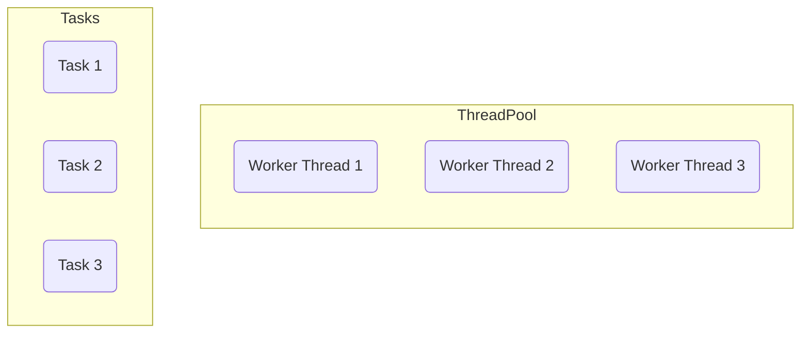
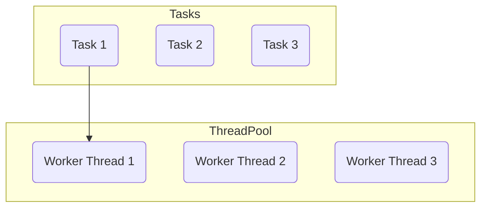
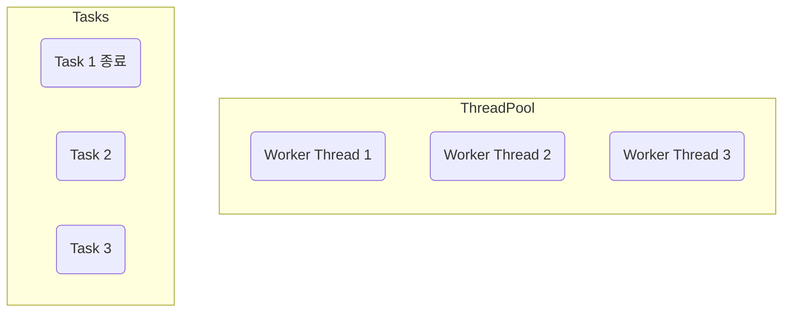
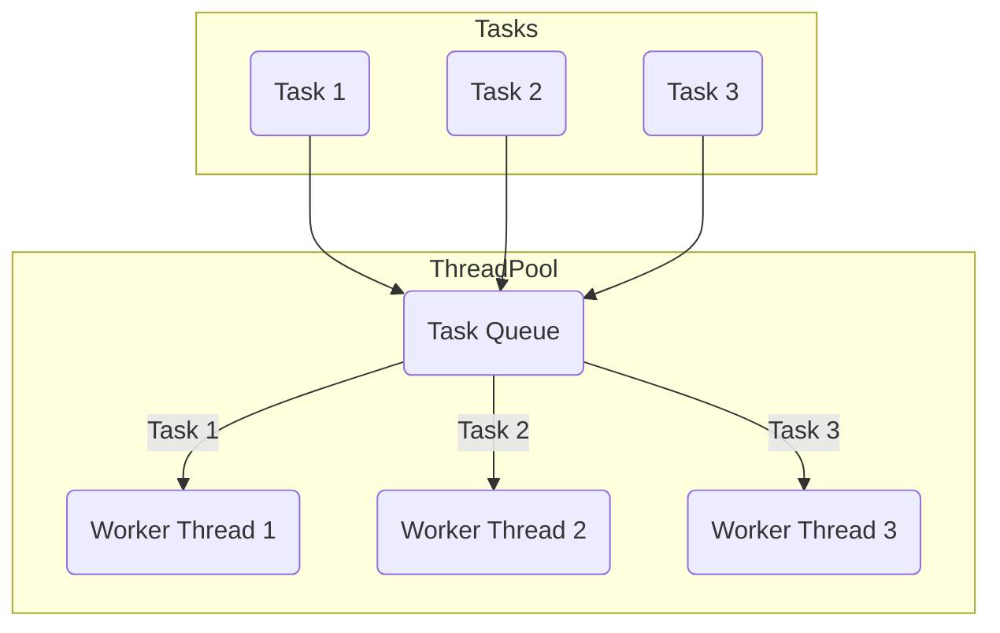

# 스레드의 직접 사용할시 문제점

실무에서 스레드를 직접 사용하는 것은 3 가지 문제가 존재

- 스레드 생성 시간으로 인한 성능 문제
- 스레드 관리 문제
- `Runnable` 인터페이스의 불편함

**1. 스레드 생성 시간으로 인한 성능 문제**

스레드를 사용하려면 먼저 스레드를 생성하여야 하지만 다음과 같은 이유로 매우 무거움

- **메모리 할당**
  - 각 스레드는 자신만의 호출 스택(Call Stack)을 가지고 있어야함. 
  - 이 호출 스택은 스레드가 실행되는 동안 사용하는 메모리 공간
  - 스레드를 생성할 때 이 호출 스택을 위한 메모리 할당
- **운영체제 자원 사용**
  - 스레드를 생성하는 작업은 운영체제 커널 수준에서 이루어지며, 시스템 콜(system call)을 통해 처리
  - CPU와 메모리 리소를 소모하는 작업
- **운영체제 스케줄러 설정**
  - 새로운 스레드가 생성되면 운영체제의 스케줄러는 이 스레드를 관리하고 실행 순서를 조정
  - 운영체제의 스케줄링 알고리즘에 따라 추가적인 오버헤드 발생
- 스레드 하나는 보통 1MB 이상의 메모리 사용

스레드를 생성하는 작업은 상대적으로 무거움(자바 객체를 생성하는 것과 비교할 수 없음)

예를 들어 어떤 하나의 작업을 수행할 때 마다 스레드를 각각 생성하고 실행한다면, 스레드의 생성비용 때문에 많은 시간이 소모

아주 가벼운 작업이라면 작업의 실행 시간보다 스레드의 생성 시간이 더 오래 걸릴 수 있음

이런 문제를 해결하기 위해 생성한 스레드를 재사용하는 방법을 고려할 수 있음

스레드를 재사용하면 처음 생성할 때를 제외하고는 생성을 위한 시간이 들지 않음

따라서 스레드가 아주 빠르게 작업을 수행할 수 있음

**2. 스레드 관리 문제**

서버의 CPU, 메모리는 한정되어 있기에 스레드를 무한히 만들 수 없음

예를 들어 사용자 주문 서비스라고 가정할 때 사용의 주문이 들어올 때 마다 요청을 처리한다면 
평소 동시에 100개의 스레드면 충분했는데, 갑자기 10000개의 스레드가 필요한 상황이 온다면 CPU, 메모리가 버티지 못할 것임

이런 문제를 해결하기위해 최대 스레드의 수 까지만 스레드를 생성할 수 있게 관리해야 함

또한 애플리케이션을 종료한다고 가정했을 때 안전한 스레드 종료를 위해 실행중인 스레드가 남은 작업은 모두 수행한 후 종료하고 싶거나 또는 급하게 종료해야 해서 인터럽트 등의 신호를 주고 스레드를 종료하고 싶다고 가정한다면 스레드가 어딘가에서 관리가 되어야함

**3. Runnable 인터페이스 불편함**

```java
public interface Runnable {
    void run();
}
```

- 반환값이 없음 
  - `run()` 메소드는 반환값을 가지지않음, 따라서 실행 결과를 얻기 위해서는 별도의 메커니즘을 사용해야 함
  - 쉽게 이야기해 스레드의 실행 결과를 작접 받을 수 없음
  - 앞서 `SumTask`를 살펴보면 스레드가 실행한 결과를 멤버 변수에 넣어두고 `join()`등을 사용해서 스레드가 종료되길 기다린 다음 멤버 변수의 값을 받아야함
- 예외 처리
  - `run()` 메소드는 체크 예외(checked exception)을 던질 수 없음
  - 체크 예외의 처리는 메소드 내부에서 처리해야 함

이런 문제를 해결하려면 반환값을 받을 수 있고, 예외도 좀 더 쉽게 처리할 방법이 필요함

추가로 반환 값 뿐만 아니라 해당 스레드에서 발생한 예외도 받을 수 있다면 좋을 것임

**해결**

1, 2번 문제를 해결하기 위해 스레드를 생성하고 관리하는 풀(Pool)이 필요



- 스레드를 관리하는 스레드 풀에 스레드를 미리 필요한 만큼 생성
- 스레드는 스레드 풀에서 대기
- 작업 요청이 옴



- 스레드 풀에서 이미 만들어진 스레드를 조회
- 조회한 스레드1로 작업을 처리



- 스레드 1은 작업을 완료
- 작업을 완료한 스레드는 종료하는 것이 아니라 다시 스레드 풀에 반(스레드1은 재사용될 수 있음)

스레드 풀을 사용할 경우 스레드를 재사용할 수 있어 스레드의 생성 시간을 절약할 수 있음

스레드 풀에서 스레드가 관리되기 때문에 필요한 만큼만 스레드를 만들 수 있고 관리할 수 있음

스레드 풀은 별게 아님, 컬렉션에 스레드를 보관하고 재사용할 수 있게 하면 됨

스레드 풀에 있는 스레드는 처리할 작업이 없다면 대기(WAITING) 상태로 관리해야 하고, 작업이 오면 `RUNNABLE` 상태로 변경해야 함

막상 구현하려면 생각보다 복잡하며 생상자-소비자 문제까지 고려 필요

어떤 생산자가 작업(Task)를 만들것이고, 우리의 스레드 풀에 있는 스레드가 소비자가 되는 것임

이런 문제를 해결해 주는 것이 자바가 제공하는 `Executor` 프레임워크

Executor 프레임워크는 스레드 풀, 스레드 관리, `Runnable`의 문제점은 물론이고 생산자-소비자 문제까지 해결해 주는 자바 멀티스레드의 최고의 도구

스레드를 사용할 때는 생각보다 고려해야 할게 많음. 실무에서 스레드를 하나 하나 생성해서 사용하는 경우는 드뭄

# Executor 프레임워크 소개

자바의 Executor 프레임워크는 멀티스레딩 및 병렬 처리를 쉽게 사용할 수 있도록 돕는 기능의 모음

## Executor 프레임워크의 주요 구성 요소

### Executor 인터페이스

```java
package java.util.concurrent;

public interface Executor {
    void execute(Runnable command);
}
```

- 가장 단순한 작업 실행 인터페이스로 `execute(Runnable Command)` 메소드를 하나 가짐

### ExecutorService 인터페이스 - 주요 메소드

```java
import java.util.concurrent.Callable;

public interface ExecutorService extends Executor, AutoCloseable {
  <T> Future<T> submit(Callable<V> task);
  
  @Override
  default void close() { ... }
  
  ...
}
```

- `Executor` 인터페이스를 확장해서 작업 제출과 제어 기능을 추가로 제공
- 주요 메소드로는 `submit()`, `close()`가 있음
- Executor 프레임워크를 사용할 때는 대부분 이 인터페이스를 사용

`ExecutorService` 인터페이스의 기본 구현체는 `ThreadPoolExecutor`

```java
public abstract class ExecutorUtils {
  public static void printState(ExecutorService executorService) {
    if (executorService instanceof ThreadPoolExecutor poolExecutor) {
      int pool = poolExecutor.getPoolSize();
      int active = poolExecutor.getActiveCount();
      int queued = poolExecutor.getQueue().size();
      long completedTask = poolExecutor.getCompletedTaskCount();
      log("[pool=" + pool + ", active=" + active + ", queued=" + queued + ", completedTask=" + completedTask + "]");
    } else {
      log(executorService);
    }
  }
}
```

- pool: 스레드 풀에서 관리되는 스레드의 숫자
- active: 작업을 수행하는 스레드의 숫자
- queueTasks: 큐에 대기중인 작업의 숫자
- completedTask: 완료된 작업의 숫자

# ExecutorService 시작하기

```java
public class ExecutorBasicMain {
  public static void main(String[] args) {
    ThreadPoolExecutor pool = new ThreadPoolExecutor(2, 2, 0, TimeUnit.MILLISECONDS, new LinkedBlockingQueue<Runnable>());
    log("== 초기 상태 ==");
    printState(pool);
    pool.execute(new RunnableTask("taskA"));
    pool.execute(new RunnableTask("taskB"));
    pool.execute(new RunnableTask("taskC"));
    pool.execute(new RunnableTask("taskD"));
    log("== 작업 수행 중 ==");
    printState(pool);

    sleep(3000);
    log("== 작업 수행 완료 ==");
    printState(pool);

    pool.close();
    log("== shutdown 완료 ==");
    printState(pool);
  }
}
```

`ExecutorService`의 가장 대표적인 구현체는 `ThreadPoolExecutor`




`ThreadPoolExecutor(ExecutorService)`는 크게 2가지 요소로 구성

- 스레드 풀: 스레드를 관리
- `BlockingQueue`: 작업을 보관. 생산자 소비자 문제를 해결하기 위해 단순한 큐가 아닌 `BlockingQueue`를 사용
  
생산자가 `pool.execute(new RunnableTask("taskA"))`를 호출하면, `RunnableTask("taskA")` 인스턴스가 `BlockingQueue`에 보관

- 생산자: `pool.execute(작업)`를 호출하면 내부에서 `BlockingQueue`에 작업을 보관. `main` 스레드가 생산자가 됨
- 소비자: 스레드 풀에 있는 스레드가 소비자. 이후에 소비자 중에 하나가 `BlockingQueue`에 들어있는 작업을 받아서 처리

## TreadPoolExecutor 생성자

`ThreadPoolExecutor`의 생성자는 다음 속성을 사용

- `corePoolSize`: 스레드 풀에서 관리되는 기본 스레드 수
- `maximumPoolSize`: 스레드 풀에서 관리되는 최대 스레드 수
- `keepAliveTime`, `TimeUnit unit`: 기본 스레드 수를 초과해서 만들어진 스레드가 생존할 수 있는 대기 시간, 이 시간 동안 처리할 작업이 없다면 초과 스레드는 제거됨
- `BlockingQueue workQueue`: 작업을 보관할 블로킹 큐

`new ThreadPoolExecutor(2, 2, 0, TimeUnit.MILLISECONDS, new LinkedBlockingQueue<>())`

- `corePoolSize=2`, `maximumPoolSize=2`를 사용해서 기본 스레드와 최대 스레드 수를 맞추었음, 따라서 풀에서 관리되는 스레드는 2개로 고정
- 작업을 보관할 블로킹 큐의 구현체로 `LinkedBlockingQueue`를 사용, 이 블로킹 큐는 작업을 무한대로 저장할 수 있음

