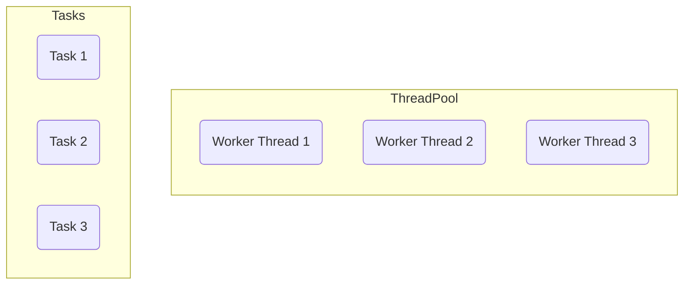
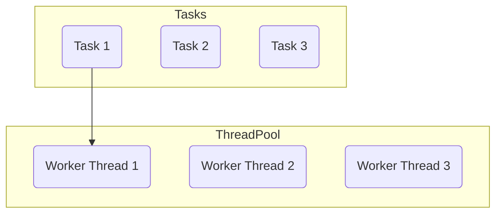
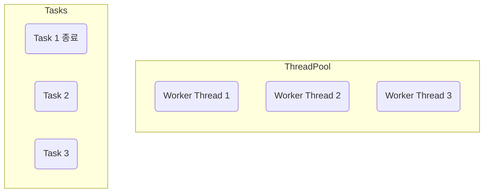
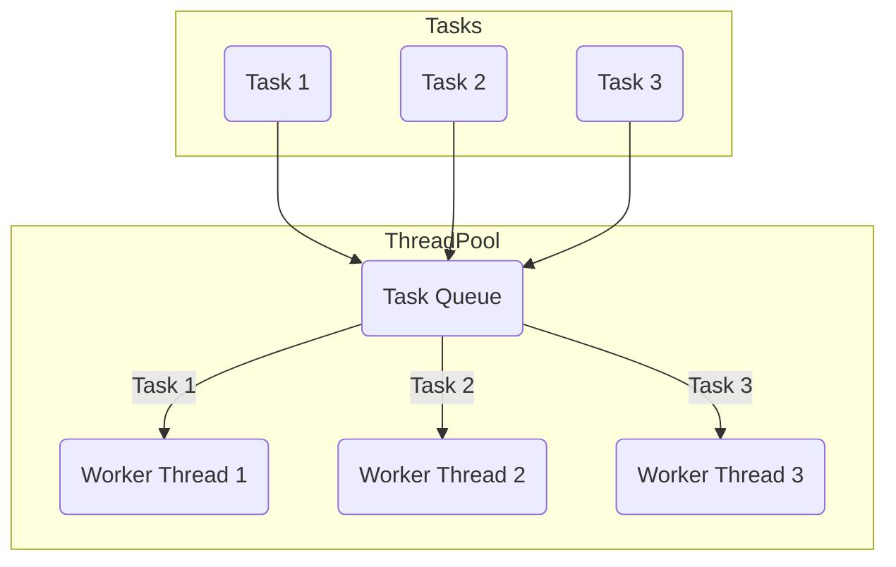

# 스레드의 직접 사용할시 문제점

실무에서 스레드를 직접 사용하는 것은 3 가지 문제가 존재

- 스레드 생성 시간으로 인한 성능 문제
- 스레드 관리 문제
- `Runnable` 인터페이스의 불편함

**1. 스레드 생성 시간으로 인한 성능 문제**

스레드를 사용하려면 먼저 스레드를 생성하여야 하지만 다음과 같은 이유로 매우 무거움

- **메모리 할당**
  - 각 스레드는 자신만의 호출 스택(Call Stack)을 가지고 있어야함. 
  - 이 호출 스택은 스레드가 실행되는 동안 사용하는 메모리 공간
  - 스레드를 생성할 때 이 호출 스택을 위한 메모리 할당
- **운영체제 자원 사용**
  - 스레드를 생성하는 작업은 운영체제 커널 수준에서 이루어지며, 시스템 콜(system call)을 통해 처리
  - CPU와 메모리 리소를 소모하는 작업
- **운영체제 스케줄러 설정**
  - 새로운 스레드가 생성되면 운영체제의 스케줄러는 이 스레드를 관리하고 실행 순서를 조정
  - 운영체제의 스케줄링 알고리즘에 따라 추가적인 오버헤드 발생
- 스레드 하나는 보통 1MB 이상의 메모리 사용

스레드를 생성하는 작업은 상대적으로 무거움(자바 객체를 생성하는 것과 비교할 수 없음)

예를 들어 어떤 하나의 작업을 수행할 때 마다 스레드를 각각 생성하고 실행한다면, 스레드의 생성비용 때문에 많은 시간이 소모

아주 가벼운 작업이라면 작업의 실행 시간보다 스레드의 생성 시간이 더 오래 걸릴 수 있음

이런 문제를 해결하기 위해 생성한 스레드를 재사용하는 방법을 고려할 수 있음

스레드를 재사용하면 처음 생성할 때를 제외하고는 생성을 위한 시간이 들지 않음

따라서 스레드가 아주 빠르게 작업을 수행할 수 있음

**2. 스레드 관리 문제**

서버의 CPU, 메모리는 한정되어 있기에 스레드를 무한히 만들 수 없음

예를 들어 사용자 주문 서비스라고 가정할 때 사용의 주문이 들어올 때 마다 요청을 처리한다면 
평소 동시에 100개의 스레드면 충분했는데, 갑자기 10000개의 스레드가 필요한 상황이 온다면 CPU, 메모리가 버티지 못할 것임

이런 문제를 해결하기위해 최대 스레드의 수 까지만 스레드를 생성할 수 있게 관리해야 함

또한 애플리케이션을 종료한다고 가정했을 때 안전한 스레드 종료를 위해 실행중인 스레드가 남은 작업은 모두 수행한 후 종료하고 싶거나 또는 급하게 종료해야 해서 인터럽트 등의 신호를 주고 스레드를 종료하고 싶다고 가정한다면 스레드가 어딘가에서 관리가 되어야함

**3. Runnable 인터페이스 불편함**

```java
public interface Runnable {
    void run();
}
```

- 반환값이 없음 
  - `run()` 메소드는 반환값을 가지지않음, 따라서 실행 결과를 얻기 위해서는 별도의 메커니즘을 사용해야 함
  - 쉽게 이야기해 스레드의 실행 결과를 작접 받을 수 없음
  - 앞서 `SumTask`를 살펴보면 스레드가 실행한 결과를 멤버 변수에 넣어두고 `join()`등을 사용해서 스레드가 종료되길 기다린 다음 멤버 변수의 값을 받아야함
- 예외 처리
  - `run()` 메소드는 체크 예외(checked exception)을 던질 수 없음
  - 체크 예외의 처리는 메소드 내부에서 처리해야 함

이런 문제를 해결하려면 반환값을 받을 수 있고, 예외도 좀 더 쉽게 처리할 방법이 필요함

추가로 반환 값 뿐만 아니라 해당 스레드에서 발생한 예외도 받을 수 있다면 좋을 것임

**해결**

1, 2번 문제를 해결하기 위해 스레드를 생성하고 관리하는 풀(Pool)이 필요



- 스레드를 관리하는 스레드 풀에 스레드를 미리 필요한 만큼 생성
- 스레드는 스레드 풀에서 대기
- 작업 요청이 옴



- 스레드 풀에서 이미 만들어진 스레드를 조회
- 조회한 스레드1로 작업을 처리



- 스레드 1은 작업을 완료
- 작업을 완료한 스레드는 종료하는 것이 아니라 다시 스레드 풀에 반(스레드1은 재사용될 수 있음)

스레드 풀을 사용할 경우 스레드를 재사용할 수 있어 스레드의 생성 시간을 절약할 수 있음

스레드 풀에서 스레드가 관리되기 때문에 필요한 만큼만 스레드를 만들 수 있고 관리할 수 있음

스레드 풀은 별게 아님, 컬렉션에 스레드를 보관하고 재사용할 수 있게 하면 됨

스레드 풀에 있는 스레드는 처리할 작업이 없다면 대기(WAITING) 상태로 관리해야 하고, 작업이 오면 `RUNNABLE` 상태로 변경해야 함

막상 구현하려면 생각보다 복잡하며 생상자-소비자 문제까지 고려 필요

어떤 생산자가 작업(Task)를 만들것이고, 우리의 스레드 풀에 있는 스레드가 소비자가 되는 것임

이런 문제를 해결해 주는 것이 자바가 제공하는 `Executor` 프레임워크

Executor 프레임워크는 스레드 풀, 스레드 관리, `Runnable`의 문제점은 물론이고 생산자-소비자 문제까지 해결해 주는 자바 멀티스레드의 최고의 도구

스레드를 사용할 때는 생각보다 고려해야 할게 많음. 실무에서 스레드를 하나 하나 생성해서 사용하는 경우는 드뭄

# Executor 프레임워크 소개

자바의 Executor 프레임워크는 멀티스레딩 및 병렬 처리를 쉽게 사용할 수 있도록 돕는 기능의 모음

## Executor 프레임워크의 주요 구성 요소

### Executor 인터페이스

```java
package java.util.concurrent;

public interface Executor {
    void execute(Runnable command);
}
```

- 가장 단순한 작업 실행 인터페이스로 `execute(Runnable Command)` 메소드를 하나 가짐

### ExecutorService 인터페이스 - 주요 메소드

```java
import java.util.concurrent.Callable;

public interface ExecutorService extends Executor, AutoCloseable {
  <T> Future<T> submit(Callable<V> task);
  
  @Override
  default void close() { ... }
  
  ...
}
```

- `Executor` 인터페이스를 확장해서 작업 제출과 제어 기능을 추가로 제공
- 주요 메소드로는 `submit()`, `close()`가 있음
- Executor 프레임워크를 사용할 때는 대부분 이 인터페이스를 사용

`ExecutorService` 인터페이스의 기본 구현체는 `ThreadPoolExecutor`

```java
public abstract class ExecutorUtils {
  public static void printState(ExecutorService executorService) {
    if (executorService instanceof ThreadPoolExecutor poolExecutor) {
      int pool = poolExecutor.getPoolSize();
      int active = poolExecutor.getActiveCount();
      int queued = poolExecutor.getQueue().size();
      long completedTask = poolExecutor.getCompletedTaskCount();
      log("[pool=" + pool + ", active=" + active + ", queued=" + queued + ", completedTask=" + completedTask + "]");
    } else {
      log(executorService);
    }
  }
}
```

- pool: 스레드 풀에서 관리되는 스레드의 숫자
- active: 작업을 수행하는 스레드의 숫자
- queueTasks: 큐에 대기중인 작업의 숫자
- completedTask: 완료된 작업의 숫자

# ExecutorService 시작하기

```java
public class ExecutorBasicMain {
  public static void main(String[] args) {
    ThreadPoolExecutor pool = new ThreadPoolExecutor(2, 2, 0, TimeUnit.MILLISECONDS, new LinkedBlockingQueue<Runnable>());
    log("== 초기 상태 ==");
    printState(pool);
    pool.execute(new RunnableTask("taskA"));
    pool.execute(new RunnableTask("taskB"));
    pool.execute(new RunnableTask("taskC"));
    pool.execute(new RunnableTask("taskD"));
    log("== 작업 수행 중 ==");
    printState(pool);

    sleep(3000);
    log("== 작업 수행 완료 ==");
    printState(pool);

    pool.close();
    log("== shutdown 완료 ==");
    printState(pool);
  }
}
```

`ExecutorService`의 가장 대표적인 구현체는 `ThreadPoolExecutor`




`ThreadPoolExecutor(ExecutorService)`는 크게 2가지 요소로 구성

- 스레드 풀: 스레드를 관리
- `BlockingQueue`: 작업을 보관. 생산자 소비자 문제를 해결하기 위해 단순한 큐가 아닌 `BlockingQueue`를 사용
  
생산자가 `pool.execute(new RunnableTask("taskA"))`를 호출하면, `RunnableTask("taskA")` 인스턴스가 `BlockingQueue`에 보관

- 생산자: `pool.execute(작업)`를 호출하면 내부에서 `BlockingQueue`에 작업을 보관. `main` 스레드가 생산자가 됨
- 소비자: 스레드 풀에 있는 스레드가 소비자. 이후에 소비자 중에 하나가 `BlockingQueue`에 들어있는 작업을 받아서 처리

## TreadPoolExecutor 생성자

`ThreadPoolExecutor`의 생성자는 다음 속성을 사용

- `corePoolSize`: 스레드 풀에서 관리되는 기본 스레드 수
- `maximumPoolSize`: 스레드 풀에서 관리되는 최대 스레드 수
- `keepAliveTime`, `TimeUnit unit`: 기본 스레드 수를 초과해서 만들어진 스레드가 생존할 수 있는 대기 시간, 이 시간 동안 처리할 작업이 없다면 초과 스레드는 제거됨
- `BlockingQueue workQueue`: 작업을 보관할 블로킹 큐

`new ThreadPoolExecutor(2, 2, 0, TimeUnit.MILLISECONDS, new LinkedBlockingQueue<>())`

- `corePoolSize=2`, `maximumPoolSize=2`를 사용해서 기본 스레드와 최대 스레드 수를 맞추었음, 따라서 풀에서 관리되는 스레드는 2개로 고정
- 작업을 보관할 블로킹 큐의 구현체로 `LinkedBlockingQueue`를 사용, 이 블로킹 큐는 작업을 무한대로 저장할 수 있음

# Future1 - 시작

## Runnable & Callable 

```java
package java.lang;

public interface Runnable {
    void run();
}
```

- `Runnable`의 `run()`은 반환 타입이 `void`, 따라서 값을 반환할 수 없음
- 예외가 선언되어 있지 않음, 따라서 해당 인터페이스 구현하는 모든 메소드는 체크 예외를 던질 수 없음
  - 자식은 부모의 예외 범위를 넘어설 수 없음, 부모에 예외가 선언되어 있지 않으므로 예외를 던질 수 없음
  - 런타입(비체크) 예외는 제외

```java
package java.util.concurrent;

public interface Callable<V> {
    V call() throws Exception;
}
```

- `java.util.concurrent`에서 제공되는 기능
- `Callable`의 `call()`은 반환 타입이 제너릭 `V`로 값을 반환할 수 있음
- `throws Exception` 예외가 선언되어 있음, 따라서 해당 인터페이스를 구현하는 모든 메소드는 체크 예외와 그 하위 예외를 모두 던질 수 있음

`MyCallable` 구현 부분

- 숫자를 반환하므로 반환할 제네릭 타입을 `<Integer>`로 선언
- 구현은 `Runnable` 코드와 비슷, 차이는 결과를 반환한다는 점, 결과를 보관할 변도의 필드를 만들지 않아도 됨

### submit()

```java
<T> Future<T> submit(Callable<V> task); // 인터페이스 정의
```

`ExecutorService`가 제공하는 `submit()`을 통해 `Callable`을 작업으로 전달할 수 있음

```java
Future<Integer> future = es.submit(new MyCallable());
```

`MyCallable` 인스턴스가 블로킹 큐에 전달되고, 스레드 풀의 스레드 중 하나가 이 작업을 실행할 것임

이때 작업의 처리 결과는 직접 반환하는 것이 아니라 `Future`라는 특별한 인터페이스를 통해 반환

```java
Integer result = future.get();
```

`future.get()`을 호출하며 `MyCallable`의 `call()`이 반환한 결과를 받을 수 있음

> 참고: `Future.get()`은 `InterruptedException`, `ExecutionException` 체크 예외를 던짐

### Executor 프레임워크의 강점

요청 스레드가 결과를 받아야 하는 상황이면, `Callable`을 사용하는 방식은 `Runnable`을 사용하는 방식보다 훨씬 편리함

코드만 보면 복잡한 멀티스레드를 사용한다는 느낌보다 단순한 싱글 스레드 방식으로 개발한다는 느낌이 듬

내가 스레드를 생성하거나 `join()`으로 스레드를 제어하거나 한 코드는 전혀 없음, `Thread`라는 코드도 없음

단순하게 `ExecutorService`에 필요한 작업을 요청하고 결과를 받아서 쓰면됨

복잡한 멀티스레드를 매우 편리하게 사용할 수 있는 것이 바로 `Executor` 프레임워크의 강점

하지만 기반 원리를 제대로 이해해야 문제없이 사용할 수 있음

여기에서 잘 생각해 보면 한가지 애매한 상황이 존재

`future.get()`을 호출하는 요청 스레드(main)는 `future.get()`을 호출 했을 때 2가지 상황으로 나뉘게 됨

- `MyCallable` 작업을 처리하는 스레드 풀의 스레드가 작업을 완료
- `MyCallable` 작업을 처리하는 스레드 풀의 스레드가 작업을 완료하지 못함

`future.get()`을 호출했을 때 스레드 풀의 스레드가 작업을 완료했다면 반환 받을 결과가 있을 것이나 아직 작업을 처리중 이라면 어떻게 하나?

# Future2 - 분석

`Future`는 번역하면 미래라는 뜻, 즉 미래의 결과를 받을 수 있는 객체라는 의미

누구의 미래의 결과를 말하는 것일까?

```java
Future<Integer> future = es.submit(new MyCallable());
```

- `submit()`의 호출로 `MyCallable`의 인스턴스를 전달
- 이때 `submit()`은 MyCallable.call()이 반환하는 무작위 숫자 대신 `Future`를 반환
- `MyCallable`이 실행되어 즉시 결과를 반환하는 것이 불가능, `MyCallable`은 즉시 실행되는 것이 아님, 스레드 풀의 스레드가 미래의 시점에 코드를 실행
- `MyCallable.call()` 메소드는 호출 스레드가 실행하는 것도 아니고, 스레드 풀의 다른 스레드가 실행하기에 언제 결과를 반환할지 알 수 없음
- 따라서 즉시 결과를 받는 것은 불가능, 따라서 `es.submit()`은 `MyCallable` 결과를 반환하는 대신 `MyCallable`의 결과를 나중에 받을 수 있는 `Future` 객체를 대신 제공
- `Future`는 전달한 작업의 미래, 이 객체를 통해 전달한 작업의 미래 결과를 받을 수 있음

`Future`는 전달한 작업의 미래 결과를 담고 있다고 보면됨

`Future`가 어떻게 동작하는지 살펴보자

```java
public class CallableMainV2 {
  public static void main(String[] args) throws InterruptedException, ExecutionException {
    ExecutorService executorService = Executors.newFixedThreadPool(1);
    MyCallable myCallable = new MyCallable();
    log("submit() 호출");
    Future<Integer> future = executorService.submit(myCallable);
    log("future 즉시 반환, future = " + future);

    log("future.get() [블로킹] 메소드 호출 시작 -> main 스레드 WAITING");
    Integer value = future.get();
    log("future.get() [블로킹] 메소드 호출 완료 -> main 스레드 RUNNABLE");
    log("result value = " + value);
    log("future 완료, future = " + future);
    executorService.close();
  }

  static class MyCallable implements Callable<Integer> {
    @Override
    public Integer call() {
      log("Runnable 시작");
      sleep(2000);
      int value = new Random().nextInt(10);
      log("create value = " + value);
      log("Runnable 완료");
      return value;
    }
  }
}
```

**실행 결과 분석**

- `MyCallable` 인스턴스를 편의상 `taskA`라고 함
- 편의상 스레드풀에 스레드가 1개 있다고 가정

```java
es.submit(new MyCallable())
```

- `submit()`을 호출해서 `ExecutorService`에 `taskA`를 전달

**Future의 생성**

- 요청 스레드는 `es.submit(taskA)`를 호출하고 있는 중
- `ExecutorService`는 전달한 `taskA`의 미래를 알 수 있는 `Future` 객체를 생성
  - `Future`는 인터페이스, 실제 구현체는 `FutureTask`
- `Future`객체 안에 `taskA`의 인스턴스를 보관
- `Future`는 내부에 `taskA` 작업의 완료 여부와 작업의 결과를 가짐

- `submit()`을 호출할 경우 `Future`가 만들어지고, 전달한 작업인 `taskA`가 바로 블로킹 큐에 담기는 것이 아니라, `taskA`를 감싸고 있는 `Future`가 대신 블로킹 큐에 담김

```java
Future<Integer> future = es.submit(new MyCallable);
```

- `Future`는 내부에 작업의 완료 여부와 작업의 결과 값을 가짐, 작업이 완료되지 않았기에 결과 없음
  - 로그를 보면 `Future`의 구현체는 `FutureTask`임
  - `Future`의 상태는 "Not completed(미완료)"이고, 연관된 작업은 전달한 `taskA(MyCallable 인스턴스)` 임
- 중요한 핵심은 작업을 전달할 때 생성된 `Future`는 즉시 반환된다는 것

- futere의 즉시 반확이라는 로그와, 바로 그 다음인 `future.get()`을 호출하는 로그의 시간을 보면 거의 바로 연속해서 실행되는 것을 확인
- 생성한 `Future`를 즉시 반환하기 때문에 요청 스레드는 대기하지 않고, 자유롭게 본인의 다음 코드를 호출
  - 이것은 마치 `Thread.start()`를 호출한 것과 비슷, `Thread.start()`를 호출하면 스레드의 작업 코드가 별도의 스레드에서 실행됨(요청 스레드를 대기하지 않고, 즉시 다음 코드를 호출)

- 큐에 들어있는 `Future[taskA]`를 꺼내서 스레드 풀의 스레드1이 작업을 시작
- 참고로 `Future`의 구현체인 `FutureTask`는 Runnable 인터페이스도 함께 구현하고 있음
- 스레드1은 `FutureTask`의 `run()` 메소드를 수행
- `run()` 메소드가 `taskA`의 `call()` 메소드를 호출하고 그 결과를 받아서 처리
  - `FutureTask.run()` -> `MyCallable.call()`

---

**스레드1**

- 스레드1은 `taskA`의 작업을 아직 처리 중, 완료하지 않음

**요청 스레드**

- 요청 스레드는 `Future` 인스턴스의 참조를 가짐
- 언제든지 본인이 필요할 때 `Future.get()`을 호출해서 `taskA` 작업의 미래 결과를 받을 수 있음
- 요청 스레드는 작업의 결과가 필요해서 `Future.get()`을 호출
  - `Future`에는 완료 상태가 존재, `taskA`의 작업이 완료되면 `Future`의 상태도 완료로 변경
  - 여기서 `taskA`의 작업이 아직 완료되지 않았다면 `Future`도 완료 상태가 아님
- 요청 스레드가 `Fugure.get()`을 호출하면 `Future`가 완료 상태가 될 때까지 대기, 이때 요청 스레드의 상태는 `RUNNABLE`->`WAITING`이 됨

`Future.get()`을 호출했을 때 

- **Future가 완료 상태**: `Future`가 완료 상태면 `Future`에 결과도 포함되어 있음, 이 경우 요청 스레드는 대기하지 않고, 값을 즉시 반환받음
- **Future가 완료 상태가 아님**: `taskA`가 아직 수행되지 않았거나 또는 수행 중이라는 뜻, 이때는 어쩔수 없이 요청 스레드가 결과를 받기 위해 대기해야함, 요청 스레드가 마치 락을 얻을 때처럼, 결과를 얻기 위해 대기, 이처럼 스레드가 어떤 결과를 얻기 위해 대기하는 것을 블로킹(Blocking)이라 함
 
> 참고: 블로킹 메소드
> `Thread.join()`, `Future.get()`과 같은 메서드는 스레드가 작업을 바로 수행하지 않고, 다른 작업이 완료될 때까지 기다리게 하는 메소드임
> 이러한 메소드를 호출하면 호출한 스레드는 지정된 작업이 완료될 때까지 블록(대기)되어 다른 작업을 수행할 수 없음

**요청 스레드**

- 대기(WAITING) 상태로 `Future.get()`을 호출하고 대기중

**스레드1**

- `taskA` 작업을 완료함
- `Future`에 `taskA`의 반환결과를 담음
- `Future`의 상태를 완료로 변경
- 요청 스레드를 깨움, 요청 스레드는 `WAITING` -> `RUNNABLE` 상태로 변경

---

- `Future`의 인스턴스인 `FutureTask`를 보면 "Completed normally"로 정상 완료된 것을 확인할 수 있음

### 정리

```java
Future<Integer> future = es.submit(new MyCallable());
```

- `Future`는 작업의 미래 결과를 받을 수 있는 객체
- `submit()` 호출시 `future`는 즉시 반환, 덕분에 요청 스레드는 블로킹 되지 않고 필요한 작업을 할 수 있음

```java
Integer result = future.get();
```
- 작업의 결과가 필요하면 `Fugure.get()`을 호출하면 됨
- **Future가 완료 상태**: `Future`가 완료 상태면 `Future`에 결과도 포함되어 있음, 이 경우 요청 스레드는 대기하지 않고, 값을 즉시 반환받음
- **Future가 완료 상태가 아님**: `taskA`가 아직 수행되지 않았거나 또는 수행 중이라는 뜻, 이때는 어쩔수 없이 요청 스레드가 결과를 받기 위해 대기해야함, 요청 스레드가 마치 락을 얻을 때처럼, 결과를 얻기 위해 대기, 이처럼 스레드가 어떤 결과를 얻기 위해 대기하는 것을 블로킹(Blocking)이라 함

### Future가 필요한 이유?

의문사항?

두 코드를 비교

**Future를 반환하는 코드**

```java
Future<Integer> future = es.submit(new MyCallable()); // 여기는 블로킹이 아님
future.get();   // 여기서 블로킹
```

`ExecutorService`를 설계할 때 지금처럼 복잡하게 `Future`를 반환하는게 아니라 다음과 같이 결과를 직접 받아서 설계하는게 더 단순하고 좋지 않을까?

**결과를 직접 반환하는 코드(가정)**

```java
Integer result = es.submit(new MyCallable());
```

물론 이렇게 설계하면 `submit()`을 호출할 때, 작업의 결과가 언제 나올지 알 수 없음

따라서 작업의 결과를 받을 때 까지 요청 스레드는 대기해야 함

이것을 `Future`를 사용할 때도 마찬가지임

`Future`만 즉시 반환 받을 뿐이지, 작업의 결과를 얻으려면 결국 `Future.get()`을 호출해야 함

그리고 이 시점에는 작업의 결과를 받을 때 까지 대기해야함

`Future` 개념이 왜 필요한지 다음 예제를 보면 이해가능함

# Future3 - 분석

이번 예제는 숫자를 나누어 더하는 기능을 멀티스레드로 수행

1~100까지 더하는 경우를 스레드를 사용해서 1~50, 51~100으로 나누어 처리

- 스레드1: 1~50까지 더함
- 스레드1: 51~100까지 더함

## SumTask - Runnable

`ExecutorService` 없이 `Runnable`과 순수 스레드로 구성

```java
public class SumTaskMainV1 {
  public static void main(String[] args) throws InterruptedException {
    SumTask task1 = new SumTask(1, 50);
    SumTask task2 = new SumTask(51, 100);

    Thread thread1 = new Thread(task1, "thread-1");
    Thread thread2 = new Thread(task2, "thread-2");

    thread1.start();
    thread2.start();

    // 스레드가 종료될 때 까지 대기
    log("join() - main 스레드가 thread-1, thread-2 종료까지 대기");
    thread1.join();
    thread2.join();
    log("main 스레드 대기 완료");

    log("task1.sum = " + task1.sum);
    log("task2.sum = " + task2.sum);
    log("task1 + task2 = " + (task1.sum + task2.sum));
    log("enc");
  }

  private static class SumTask implements Runnable {
    private int first;
    private int last;
    private int sum = 0;

    public SumTask(int first, int last) {
      this.first = first;
      this.last = last;
    }

    @Override
    public void run() {
      log("작업 시작");
      for (int i = first; i <= last; i++) {
        sum += i;
      }
      log("작업 완료 = " + sum);
    }
  }
}
```

```java
public class SumTaskMainV2 {
  public static void main(String[] args) throws ExecutionException, InterruptedException {
    SumTask task1 = new SumTask(1, 50);
    SumTask task2 = new SumTask(51, 100);

    ExecutorService es = Executors.newFixedThreadPool(2);
    Future<Integer> future1 = es.submit(task1);
    Future<Integer> future2 = es.submit(task2);

    Integer result1 = future1.get();
    Integer result2 = future2.get();

    log("task1.result=" + result1);
    log("task2.result=" + result2);
    log("task1 + task2 = " + (result1 + result2));
    log("end");
    es.close();
  }

  static class SumTask implements Callable<Integer> {
    private int start;
    private int end;

    public SumTask(int start, int end) {
      this.start = start;
      this.end = end;
    }

    @Override
    public Integer call() throws Exception {
      log("작업 시작");
      int sum = 0;
      for (int i = start; i <= end; i++) {
        sum += i;
      }
      log("작업 완료, result = " + sum);
      return sum;
    }
  }
}
```

`ExecutorService`와 `Callable`을 사용한 덕분에 훨씬 직관적이고 깔끔한 코드 작성

특히 작업의 결과를 반환하고 요청 스레드에서 그 결과를 바로 받아서 처리하는 부분이 직관적

스레드를 생성하고 `Thread.join()`과 같은 스레드를 관리하는 코드도 모두 제거할 수 있음

`Callable.call()`은 `throws InterruptedException`과 같은 체크 예외도 던질 수 있음

